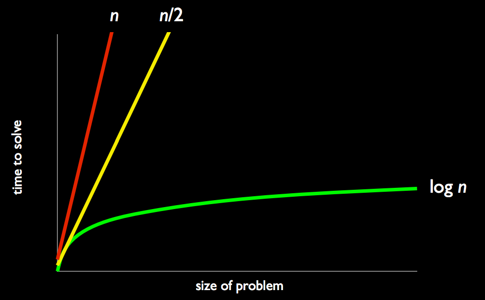

= Week 0
:author: Anna Whitney
:v: agakZz7ksgE

[t=0m0s]
== This is CS50.

* http://www.youtube.com/watch?v=5IssSqvYXwM[This is CS50 2015] gives a little taste of what CS50 is like, including moments from past years' events like the CS50 Fair and the CS50 Hackathon.
* CS50 is an introduction to the intellectual enterprises of computer science and the art of programming.
* CS50 is offered at Yale as well this year for the first time!
* One major goal of this course is to let those of you with no prior CS experience step outside your comfort zone.
* Remember that 72% of students who take CS50 have never taken a CS course before.
** We also provide *hacker editions* of problem sets and *more comfortable* sections for the 28% with prior experience.
* What ultimately matters in this course is not so much where you end up relative to your classmates but where you, in Week 12, end up relative to yourself in Week 0.
* Computer science teaches you *computational thinking*, or problem solving: running some algorithm, or set of instructions, on inputs, to produce some output, or solution.
* We will layer, or *abstract*, from low-level details to build up higher-level concepts.

[t=7m0s]
== Binary

* Although *decimal*, which has 10 digits 0-9, is more familiar to humans, computers only work with binary, which has two digits, 0 and 1.
* With just two digits, we can represent all the same information that we can with ten.
* In decimal, `123` is one hundred and twenty-three, with the rightmost digit representing the "ones column", next digit from the right representing the "tens column", the next the "hundreds column" and so on...
+
[source, subs=quotes]
----
    100         10          1

      *1*          *2*          *3*

100 x 1     10 x 2      1 x 3
----
* Binary uses columns in the same way, but rather than each column representing a power of 10, it instead represents a power of 2: 
+
[source, subs=quotes]
----
      4          2          1

      *0*          *0*          *0*
----
* A 1 is represented by a `1` in the ones column, just like in decimal:
+
[source, subs=quotes]
----
      4          2          1

      *0*          *0*          *1*

			1 x 1
----
* Unlike decimal, though, binary doesn't have a `2` digit, so the number 2 is represented by a `1` in the twos column:
+
[source, subs=quotes]
----
      4          2          1

      *0*          *1*          *0*

             2 x 1
----
* We get to 3 by combining the previous two steps:
+
[source, subs=quotes]
----
      4          2          1

      *0*          *1*          *1*

             2 x 1      1 x 1
----
* Incrementing further...
+
[source, subs=quotes]
----
      4          2          1

      *1*          *0*          *0*

  4 x 1
----
+
[source, subs=quotes]
----
      4          2          1

      *1*          *0*          *1*

  4 x 1                 1 x 1
----
+
[source, subs=quotes]
----
      4          2          1

      *1*          *1*          *0*

  4 x 1      2 x 1
----
+
[source, subs=quotes]
----
      4          2          1

      *1*          *1*          *1*

  4 x 1      2 x 1      1 x 1
----
* But once we have used up all the places, we need more *bits*, or binary digits, each of which stores a `0` or `1` (just as we'd need additional decimal digits to go from representing 999 to 1,000).
* Each `0` or `1` is stored in the state of a *transistor* in a computer, which we can also represented by a light bulb or a switch. A light bulb turned off is like a `0` and a light bulb on is like a `1`.
* TF Michael Ge '18 built a http://cdn.cs50.net/2015/fall/psets/0/pset0/pset0.html[web-based application to demonstrate binary numbers up to 8 bits].
** Emily, a volunteer from the audience, uses the app to represent the numbers 8 and 16.
* Companies now make light bulbs that change color and can be controlled over a network using an *API*, or application programming interface, a way of programming the bulbs. You can send them messages, and even change color based on weather or time.
** Emily lights up the bulbs to represent the number 50 in binary, using an iPad app that talks to the bulbs through their API.
* We can abstract on top of numbers to represent many other kinds of information.
** For example, we can represent letters using *ASCII*, a scheme that maps letters to numbers (which maps `65` to `A`, `66` to `B`, and so on). We can use this to spell out messages like the below:
+
[source, subs=quotes]
----
      *H*          *I*          *!*

    72          73          33
----
** Numbers can also be used to represent audio, video, images, etc - the mapping from numbers to other information is determined by the kind of file (e.g., a file ending in `.jpg` will be interpreted as an image).
** One mapping from numbers to images is known as *RGB*, because it represents each pixel by the intensity of red, green, and blue in that pixel. These values are combined to produce the color that the pixel is displayed.

[t=16m30s]
== Algorithms

* An *algorithm* is a set of instructions to solve a particular problem step by step, taking inputs and producing outputs.
* For example, how might we find someone like Mike Smith in the phone book?
** We can look at each page in order, looking at page one, then page two, and so on... this algorithm is correct (i.e., we will definitely find Mike Smith if he's in the phone book), but it's very slow.
** We could flip two pages at a time instead, which would make it almost twice as fast (since we might have to go back one page if we overshoot).
** But usually, when we're looking for someone in the phone book, we open to the middle, taking advantage of the fact that phone book is *sorted* alphabetically. The middle is the M section, so we can literally tear this problem in half by ripping the phone book in half and keeping only the half that we think Mike Smith is in. If we keep repeating this, keeping only half of the book each time, eventually we're left with a single page containing Mike Smith's phone number.
For a 1,000-page phone book, this only takes about ten steps!
* Let's graph the relative efficiency of these different algorithms. The x axis represents the size of the problem (in this case, represented by the number of pages in the phone book), while the y axis represents how long it will take us to solve the problem using a given algorithm.
+

** The red line is the first algorithm, where the time to find Mike Smith is linearly proportional to the number of pages in the phone book.
** The yellow line is the second algorithm, which, though twice as fast, still increases linearly with the size of the problem.
** The green line, however, is not linear, but is instead  *logarithmic* and increases MUCH more slowly than either of the linear algorithms. With this strategy, even if the size of the phone book doubled, it would only take one more step to solve the problem - and if the phone book contained four billion pages, we'd still only need 32 steps. (Note that this requires that the phone book be alphabetized - if the names were randomly ordered, we might throw away a half of the problem that
actually contained Mike Smith, and then we'd never find him!)
* *Pseudocode* is a way of describing an algorithm using English rather than any particular programming language:
+
[source, pseudocode, numbered]
----
pick up phone book
open to middle of phone book
look at names
if "Smith" is among names
    call Mike
else if "Smith" is earlier in book
    open to middle of left half of book
    go to line 3
else if "Smith" is later in book
    open to middle of right half of book
    go to line 3
else
    give up
----
** Lines 1, 2, 3, 5, 7, and 10 are simple declarative statements, or functions, that describe actions.
** Lines 4, 6, 9, and 12 are *conditional* statements, or branches; note that line 5 is indented to show that we only `call Mike` if that branch is followed. https://www.youtube.com/watch?v=m2Ux2PnJe6E[Bill] describes how conditional statements work.
** With lines 8 and 11, `go to line 3`, a loop is formed to reuse some of the earlier steps. https://www.youtube.com/watch?v=mgooqyWMTxk[Mark] gives a quick intro to loops.
** If we reach line 12, then Mike Smith isn't in the phone book, and we should `give up`.

