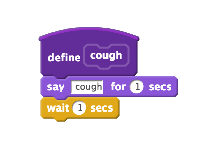

= Week 0, continued
:author: Anna Whitney, Daven Farnham
:v: -eQDF4gumgA

[t=0m0s]
== Introduction

* For this lecture, CS50 comes to https://www.youtube.com/watch?v=3kOeRpzzQPk[Yale]!
* Although most lectures will happen in Cambridge, all students are always able to watch lectures online - which may be a more effective way to absorb the information.

[t=4m23s]
== Algorithms

* We've distilled computer science down to "computational thinking", which we can break down into the process *inputs -> algorithms -> outputs*.
** We won't focus so much on input/output representations (like binary or even ASCII) from here on out, instead emphasizing algorithms to solve problems.
* On Wednesday, we looked at the problem of looking someone up in the phonebook, and found that an intuitive "divide and conquer" algorithm is much more efficient than going through the pages of the phonebook one by one.
+
[source, pseudocode, numbered]
----
pick up phone book
open to middle of phone book
look at names
if "Smith" is among names
    call Mike
else if "Smith" is earlier in book
    open to middle of left half of book
    go to line 3
else if "Smith" is later in book
    open to middle of right half of book
    go to line 3
else
    give up
----
* Where else can we apply a divide-and-conquer algorithm? Taking attendance, for example.
** We can count the students in the room one by one, but that'll be slow.
** Similarly, we can count by twos, but it doesn't get us much of a speedup.
** Instead, we introduce the following algorithm:
+
[source, pseudocode, numbered]
----
stand up and assign yourself the number 1
pair off with someone standing, add your numbers together, and adopt the sum as your new number
one of the pair should sit down; the other goes back to step 2
----
* With this algorithm, we found that the number of people in the lecture hall was 392 (...even though there are 497 seats, all of which are full).
** This is an example of a *bug* in the execution of our algorithm - we'll come back to this idea later.
** In theory, this algorithm leverages the same divide-and-conquer logic as the phonebook example: on each step, half of the remaining people sit down.
** Unlike finding Mike Smith in the phonebook, this requires additional resources: all the people in the audience! This is an example of *parallel processing*, whereby certain problems can be solved much faster by using more computers (or people, in this case).

[t=12m14s]
== PB&J Demonstration

* TF Sam and volunteers Erica and Antonio will try to make a peanut butter and jelly sandwich, following pseudocode instructions from the audience.
+
[source, pseudocode, numbered]
----
open the bag of bread
open the inner bag of bread as well
gently remove two slices of bread
place bread on plate
lightly place hand on top of peanut butter, unscrew and put lid next to peanut butter (or "just open the peanut butter jar!")
take knife and insert into peanut butter jar
remove seal from peanut butter jar
gray computer (Sam) follow other computers (Erica and Antonio)
use knife to gently spread peanut butter on bread
repeat steps 5–9 with the jelly
----
* Only partly successful—computers do EXACTLY what you tell them to, so you need to be very precise!

[t=22m38s]
== Yale Introduction

* Prof. Scassellati (Scaz) and course heads Jason and Andi come up to say hello.
* The team at Yale will be supplementing CS50 with an exploration of "intelligent software", like the algorithms Hulu and Netflix use for recommendations, grounding this in the principles of the course.
* David took a video tour of Yale campus.

[t=27m36s]
== Source Code and Scratch

* So far we've looked at pseudocode, but now we'll transition to actual code, or "source code".
* We briefly showed this example on Wednesday, which is written in a language called *C* and (underwhelmingly) simply prints the words "hello, world" to the screen:
+
[source, c]
----
#include <stdio.h>

int main(void)
{
    printf("hello, world\n");
}
----
* Much of the semester will be spent working with C, and toward the end of the semester we'll build upon it with other languages like PHP, JavaScript, and even a database language called SQL.
* To begin with, we'll work in a programming language called http://scratch.mit.edu[Scratch] from MIT's Media Lab (which you'll use for Problem Set 0). Scratch is a graphical language, in which you can drag around puzzle pieces containing pieces of code that only interlock if they go together programmatically. It contains all the same programming concepts, like loops and conditionals, as any other language, but lets us put off the uninteresting details of syntax for now.
* Volunteer Angela plays David's grad school Scratch project https://scratch.mit.edu/projects/16733/[Oscartime] and an https://scratch.mit.edu/projects/71161586/[updated version] by CS50's own Jordan Hayashi.
* Another game, https://scratch.mit.edu/projects/2016536/[Pikachu's Pastry Catch] (written by a student in a previous year of CS50!), is played by volunteer Lance.
* We've also recreated the https://scratch.mit.edu/projects/26329434/[Binary Bulbs] interface in Scratch.
** Volunteer Mary tries to represent 256 using this interface - but we're one bit short! 255 is the largest number that fits in 8 bits (or one byte) because we start from 0.
* Let's take a look at the pieces that go into the actual implementations of these programs.
* The Scratch interface lets us apply scripts to sprites (characters, objects, etc) by dragging and dropping puzzle pieces.
* The `Control` category of blocks contains familiar structures like `if`, `else`, and `repeat`.
** The  block is what starts the program.
* The `Looks` category has a block named  that has a box for us to type text into, so we can make our sprite say "Hello, Yale" or whatever else we want.
** By dragging that block below the  block, the cat will say the text when the green flag is clicked.
* Some of our control structures, like "if" and "else", require *boolean expressions*, which evaluate to either `true` or `false`. These blocks have hexagonal spaces into which you can drop boolean expression pieces.
** , ,  are all boolean expressions.
** The  block can be used to combine boolean expressions.
** Conditions can also be nested for three possible branches.
* *Loops* include the  and  blocks.
* *Variables* are represented by blocks such as  (where `N` can be replaced with any variable name and `0` can be replaced with any value for that variable).
* *Arrays* let us store more than one piece of information, using blocks like .
* We can also write *functions* in scratch, using a `define` block, in which we'll group together a bunch of commands we often use together into a new reusable block with a name that we assign, like this simple example:
+

** This lets us factor out code rather than copying and pasting - more on this later!
* Scratch also supports fancier features like threads, events, etc, which students more comfortable may want to look into.
* Let's build a sample Scratch program using all of these concepts.
** In http://scratch.mit.edu/projects/12199100/[pet the cat], we combine a loop  and a condition  so that the cat will meow only if the mouse pointer is touching it or, in other words, if we are petting it. In http://scratch.mit.edu/projects/12199106/[don't pet the cat], we add an extra condition (using the else keyword) so that the cat will meow indefinitely, but will roar if we touch it with the mouse pointer.
** If we omit the  block, so we're just telling the cat to meow constantly, the sound gets glitchy because it's not waiting to finish playing the sound before starting it over again. This is a bug you should watch out for in your own code on Problem Set 0!
** We can also make the cat move, using blocks under `Motion` like image:move_t.png[].
** https://scratch.mit.edu/projects/12198996/[Counting sheep] illustrates the use of a variable called .
** http://scratch.mit.edu/projects/12199112/[hi hi hi] keeps track of whether or not the space bar is pressed to mute the barking of a seal, using multiple scripts.
** It's also possible to have multiple sprites in a single project, and they can send each other signals, or *events*, as in https://scratch.mit.edu/projects/12199034/[this example].
* Scratch lets you record your own sounds and draw or upload your own images to use as sprites, in addition to a whole bunch of provided sounds and images.
* One of the fundamental takeaways of the class is good *design*—more than just the correctness of your program, it's important to write elegant, readable, maintainable code.
** For example, if you avoid repeating yourself (instead using loops and functions), changing a minor detail only requires you to make a change in one place rather than several.
** See how we go from https://scratch.mit.edu/projects/12197173/[cough-0] to https://scratch.mit.edu/projects/12197698/[cough-4] by increasingly modularizing and abstracting away details into functions to avoid repeating ourselves.
** On Problem Set 0, you'll likely want to go through multiple versions to improve upon the design of your original program.
