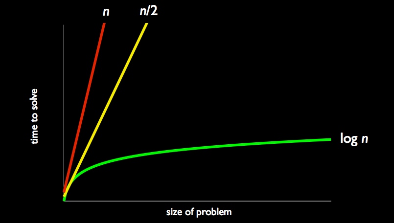
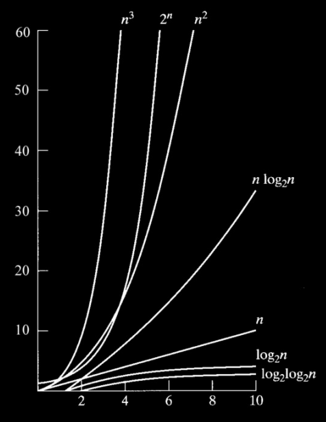

Lecture notes by Andrew Sellergren. [Watch the video.](http://cs50.tv/2013/fall/lectures/3/w/)

## Announcements and Demos

If you’re struggling with the C syntax, don’t worry, it’s normal! In a few
weeks, you’ll look back on Problem Set 2 and be amazed at how far you’ve come.

## Searching

Imagine there are 7 doors with numbers behind them and you want to find the
number 50. If you know nothing about the numbers, you might just have to open
the doors one at a time until you find 50 or until all the doors are opened.
That means it would take 7 steps, or more generally, *n* steps, where *n* is
the number of doors. We might call this a linear algorithm.

How might our approach change if we know that the numbers are sorted? Think
back to the phonebook problem. We can continually divide the problem in half!
First we open the middle door. Let’s say it’s 16. Then we know that 50 should
be in the doors to the right of the middle, so we can throw away the left. We
then look at the middle door in the right half and so on until we find 50!
This algorithm has *logarithmic* running time, the green line in the graph
below:

Note that there are plenty of algorithms that are much worse than linear, as
this graph shows:

Although it looks like $$n^3$$ is the worst, $$2^n$$ is much worse for large
inputs.

## Sorting

### Bubble Sort

If the numbers aren’t sorted to begin with, how much time will it take to
sort them before we search?

To start figuring this out, let’s bring 7 volunteers on stage and have them
hold pieces of paper with the numbers 1 through 7 on them. If we ask them to
sort themselves, it seems to only take 1 step as they apply an algorithm
something like "if there’s a smaller number to my right, move to the right of
it." In reality, though, it takes more than 1 step as there are multiple
moves going on.

In order to count the number of steps this algorithm takes, we’ll slow it
down and allow only 1 move to happen at a time. So walking left to right
among the volunteers, we examine the two numbers next to each other and if
they’re out of order, we swap them. We may have to walk left to right more
than 1 time in order to finish sorting. How do we know when they’re sorted?
As a human, you can look at it and know, but we need a way for the computer
to know. If we walk left to right among the volunteers and make 0 swaps, then
we can be sure that all the numbers are in the right order. That means we’ll
need to store the number of swaps made in a variable that we check after each
walkthrough.

This algorithm we just described is called *bubble sort*. To describe its
running time, let’s generalize and say that the number of volunteers is
$$n$$. Each time we walk through the volunteers, we’re taking $$n-1$$ steps.
Let’s just round that up and call it $$n$$. How many times do we walk left to
right through the volunteers? In the worst case scenario, the numbers will be
perfectly out of order, that is, arranged left to right largest to smallest.
In order to move the 1 from the right side all the way to the left side,
we’re going to have to walk through the volunteers $$n$$ times. So that’s
$$n$$ steps per walkthrough and $$n$$ walkthroughs, so the running time is
$$n^2$$.

### Selection Sort

Another approach we might take is to walk through the volunteers left to
right and keep track of the smallest number we find. After each walkthrough,
we then swap that smallest number with the leftmost number that hasn’t been
put in its correct place yet. On each walkthrough, we start one position to
the right of where we started on the walkthrough before so as not to swap out
a number we already put in its correct position.

This algorithm is called selection sort. Here’s what our numbers look like
after each walkthrough:

	4 2 6 1 3 7 5
	1 2 6 4 3 7 5
	1 2 6 4 3 7 5
	1 2 3 4 6 7 5
	1 2 3 4 6 7 5
	1 2 3 4 5 7 6
	1 2 3 4 5 6 7

So which algorithm is faster, bubble sort or selection sort? With selection
sort, we’re again going to have to do n walkthroughs in the worst case. On
the first walkthrough, we take $$n-1$$ steps. On the second walkthrough,
because we know that the leftmost number is in its correct position, we start
at the second lefmost and we take $$n-2$$ steps. On the third walkthrough, we
take $$n-3$$ steps. And so on. So our total running time is $$n-1 + n-2 + n-3
+ n-4 + ...$$ which works out to be $$(n(n-1)) / 2$$. Although this is less
than $$n^2$$, as $$n$$ gets very large, the difference between the two is
negligible. So we say that selection sort’s running time is also $$n^2$$ and
thus it has the same running time as bubble sort.

### Insertion Sort

Our next approach will be to sort the numbers in place. When examining each
element, we place it in its correct position in a smaller list on the left
that we’ll call the sorted list. Observe:

	 4 2 6 1 3 7 5
	4  2 6 1 3 7 5
	2 4  6 1 3 7 5
	2 4 6  1 3 7 5
	1 2 4 6  3 7 5
	1 2 3 4 6  7 5
	1 2 3 4 5 6  7
	1 2 3 4 5 6 7

Note that the space is merely to delimit the sorted list from the rest of the
list, but the total list is still only size 7.

This algorithm might appear to be faster because we only walk through the
list once. However, consider what happens when we have to insert 1 at the
beginning of the sorted list. We have to move 2, 4, and 6 to the right to
make room. In the worst case, we’ll have to shift the entire sorted list
every time we need to insert a number. When you consider this, you can deduce
that the running time of this algorithm, insertion sort, is also $$n^2$$.

To see these algorithms in action, check out [this
visualization](http://www.cs.smith.edu/~thiebaut/java/sort/). You may need to
use Firefox and zoom in to see the control buttons.

### Big O Notation

Let’s summarize the running times of the algorithms we’ve discussed so far
using a table. In so-called big O notation, O represents the worst-case
running time and represents the best-case running time.

|                       | &Omega;    | O          |
|-----------------------|------------|------------|
| linear search         | 1          | $$n$$      |
| binary search         | 1          | $$log n$$  |
| bubble sort           | $$n$$      | $$n^2$$    |
| selection sort        | $$n^2$$    | $$n^2$$    |
| insertion sort        |            | $$n^2$$    |

In the best case for linear and binary search, the number you’re looking for
is the first one you examine, so the running time is just 1. In the best case
for our sorting algorithms, the list is already sorted, but in order to
verify that in bubble sort, we need to walk through the list at least once.
Unfortunately, to verify that in selection sort, we still have to do $$n^2$$
walkthroughs, each of which confirms that the smallest number is in the
correct position.

What about the best case for insertion sort? We’ll fill in that blank next
time.

Are we doomed to $$n^2$$ running time for sorting? Definitely not. Check out
this visualization to see how fast merge sort is compared to bubble sort,
selection sort, and insertion sort. Merge sort leverages the same "divide and
conquer" technique that binary search does.
