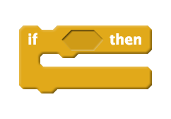
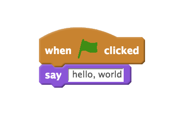
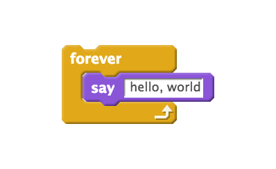
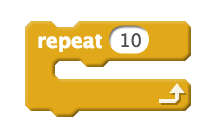
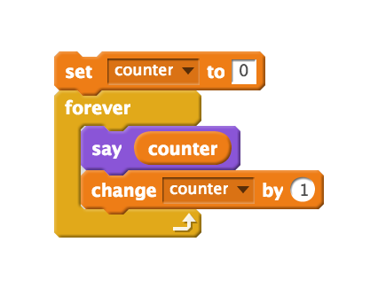
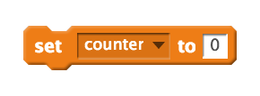
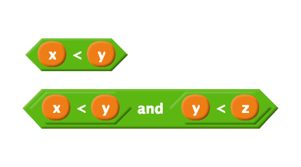
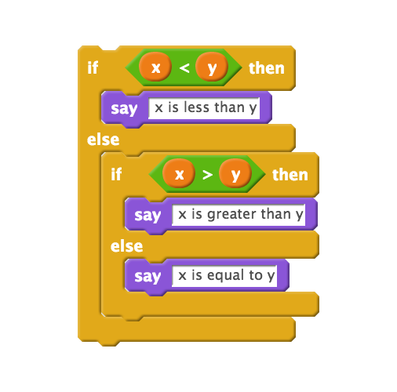

= Week 1
:author: Anna Whitney, Daven Farnham
:v: YiiHNiSfmKI 

[t=0m0s]
== Introduction

* The https://www.youtube.com/watch?v=SaFQAoYV1Nw[Harvard Mark I] was an early computer, now on display in the Science Center.
* In addition to these notes, http://cdn.cs50.net/2015/fall/lectures/1/w/week1w.pdf[slides], https://cs50.harvard.edu/lectures/1/w/src[source code], and https://youtu.be/YiiHNiSfmKI[video] from each lecture are available online; plus walkthroughs associated with each problem set, which are included in the problem set specifications.
* Starting this week, we'll look at a lower level programming language called C, relying on some of the concepts we introduced with Scratch last week:
** The  block is an example of a statement or *function*.
**  and image:forever_t.png[] are types of loops.
** Hexagon blocks are *boolean expressions* inside *conditions* like . Nested conditions can allow for three, four, or more branches.

[t=4m30s]
== Announcements

* Sectioning Wednesday through Friday; you can select a less comfortable, more comfortable, or in-between section.
* *Supersections* take place in Week 2, to cover the early material while we get sections worked out (which takes a while in a course this large!).
* *Sections* will start Week 3 (two weeks from now).
* *Problem Set 0* has been posted.
* This semester, students have nine late days, and only one can be used per problem set. This does essentially mean that all the problem sets are due Fridays, but you should try to finish by Thursdays, if only because everything in the software world takes longer than you expect it to!
* In-person support available at *office hours* in Annenberg and Widener, as well as at Yale.

[t=6m43s]
== C

* Last week we started working with pictoral, puzzle-piece based code.
* Today we'll start to look at source code that looks like this:
+
[source, c]
----
#include <stdio.h>

int main(void)
{
    printf("hello, world\n");
}
----

* Let's open a blank file and save it as `hello.c`. We'll type in that code example above that we keep using.
* We can then run our program like so (more on the purpose of this first "make" step in a bit!):
+
[source]
----
jharvard@ide50:~/workspace $ make hello
clang -ggdb3 -O0 -std=c99 -Wall -Werror    hello.c  -lcs50 -lm -o hello
jharvard@ide50:~/workspace $ ./hello
hello, world
jharvard@ide50:~/workspace $
----
* To turn the source code into a piece of software that we can run, we use a program called a *compiler*. A compiler converts *source code* to *object code*, or 0s and 1s that a computer can understand.
** C source code may look esoteric, but it's much more friendly to humans than if we had to program in 0s and 1s directly, as our predecessors once did!
* To bridge between the puzzle pieces we used in Scratch and the C syntax we'll be using moving forward, let's break down this example and compare it to the way we would express the same idea in Scratch:
+
[.clearfix]
--
[.left]

[.left]
[source, c]
----
#include <stdio.h>

int main(void)
{
    printf("hello, world\n");
}
----
--
** Just as the  block represents a function in Scratch that prints text to the screen, `printf` is a function in C that does the same. Just like Scratch had a little white text box placeholder where you could type an input, `printf` takes input in between the parentheses.
** `main` is equivalent to  - it indicates where the program should start. More on what the `int` and `(void)` in that line signify later.
+
[.clearfix]
--
[.left]

[.left]
[source, c]
----
while (true)
{
    printf("hello, world\n");
}
----
--
** In this case, `while (true)` works the same way as the image:forever_t.png[] block in Scratch. A `while` loop continues executing as long as its condition evaluates to `true`, so if we give it just the expression `true` (which will always evaluate to `true`), the loop will run forever.
+
[.clearfix]
--
[.left]
image::scratch_repeat.png[align="center"]
[.left]
[source, c]
----
for (int i = 0; i < 10; i++)
{
    printf("hello, world!\n");
}
----
--
** When you want to repeat something a finite number of times, `for (int i = 0; i < 10; i++)` is equivalent to  in Scratch.
+
[.clearfix]
--
[.left]

[.left]
[source, c]
----
int counter = 0;
while (true)
{
    printf("%i\n",  counter); // <4>
    counter++;
}
----
--
** A variable stores a value in C just as in Scratch, and in C we can say `int counter = 0` instead of . We label our variable declaration with `int` to signify that we want to store an integer, or number.
** The `%i` that we use in our printf statement in line 4 acts as a placeholder to print a decimal number, and we tell printf to replace the placeholder with the value of the variable `counter`.
+
[.clearfix]
--
[.left]

[.left]
[source, c]
----
(x < y)
((x < y) && (y < z))
----
--
** Boolean expressions look pretty similar, involving more parentheses to ensure that the compiler interprets our expression in the correct order.
+
[.clearfix]
--
[.left]

[.left]
[source, c]
----
if (x < y)
{
    printf("x is less than y\n");
}
else if (x > y)
{
    printf("x is greater than y\n");
}
else
{
    printf("x is equal to y\n");
}
----
--
** Conditions, as well, have a lot in common between C and Scratch.

[t=13m38s]
== CS50 IDE

* We've previously used a virtual machine called the CS50 Appliance to make sure that everyone had a consistent setup, but starting this year, you'll instead use a web-based coding environment called the http://cs50.io[*CS50 IDE*] to achieve the same effect. IDE stands for *integrated development environment*.
* The CS50 Appliance took up a lot of space and required a lot of resources on students' computers; instead of living on your computer locally, the CS50 IDE lives in the *cloud*.
** The cloud simply refers to a bunch of computers elsewhere that store data and run software and the like that we can rent.
* Just like Scratch had several panels, so does the CS50 IDE: we have a file browser, a window into which you can actually type your code, and a terminal in which you can run your code.
* Thanks to the efforts of Dan Armendariz and Dan Bradley on the CS50 staff, the CS50 IDE allows you to toggle Less Comfortable mode on or off (on by default) to give less comfortable students sensible defaults and a clear interface while also allowing more comfortable students to fine-tune their environment as they see fit.

[t=17m15s]
== Writing Code

* We can open up the CS50 IDE in a browser and take a look at an actual program - for now, the same `hello, world` example that we've been working with so far:
+
[source, c, numbered]
----
#include <stdio.h>

int main(void)
{
    printf("hello, world"\n);
}
----
* We've discussed the role of `main` and of `printf`, and the curly braces merely serve to enclose the meat of our program (`printf("hello, world"\n);`) and associate it with `main`.
* `#include <stdio.h>` gives us access to a *library*, a collection of functions that someone else wrote, so we don't have to reinvent the wheel. `stdio.h` is the header file for the standard I/O library in C, which includes functions like `printf`.

* Before, we ran `make hello` before running our program, which compiled our source code.
** Under the hood, `make` calls the actual compiler, `clang` - so we could just type `clang hello.c` (although if we don't specify a name for the program the compiler should output using the `-o` option, it will be named `a.out` by default).
** Everything we type on the command line after the program we're running (like `clang`) is a *command-line argument*. When we type `clang -o hello hello.c`, `-o hello` tells `clang` to output a program called `hello` (rather than the default `a.out`), while `hello.c` tells `clang` the name of the file where it will find our source code to compile.
* `make hello` looks in the current directory for a file called `hello.c` and compiles it to a program called `hello`, and we've set up the CS50 IDE to also tell `make` to include various other useful arguments that you don't need to worry about for now.
* You must save your `.c` files and recompile after making a change to your code before being able to see the effect of your change on running the program.

* Let's make this a little more dynamic, by making our program say hello to someone in particular.
+
[source, c, numbered]
----
#include <stdio.h>

int main(void)
{
    string s = "Hannah";
    printf("hello, %s\n", s);
}
----

* We must specify the type of our variable when we declare it—here a `string`, a sequence of characters.
* The equals sign *assigns* the value on the right to the variable name on the left.
* The semicolon we've been placing at the end of each line tells the computer where each command terminates.
* `%s` is a placeholder for a `string`, which will be replaced by `printf` when it runs. We then tell `printf` what to fill in by giving it an additional argument (functions can be given more than one argument using a comma-separated list).

* When we try to compile the above code, we get a ton of errors. The best way to work through these errors is starting at the top, because later errors are often caused by the computer getting confused after encountering the first problem and may refer to lines of code that are actually perfectly fine.
+
[source]
----
jharvard@ide50:~/workspace $ make hello
clang -ggdb3 -O0 -std=c99 -Wall -Werror    hello.c  -lcs50 -lm -o hello-1
hello.c:5:5: error: use of undeclared identifier 'string'; did you mean 'stdin'?
    string s = "David";
    ^~~~~
    stdin
...
----
* This first error, `undeclared identifier 'string'`, is the one we want. `string` doesn't actually exist as a type in C, but for the first few weeks of CS50, we'll provide you some types (such as `string` and `bool` for boolean values, which also don't exist natively in C) and functions to abstract over lower-level features of C we'll examine later. These types and functions are defined in the CS50 Library, which you can use in much the way you'd use the standard I/O library:
+
[source, c]
----
#include <cs50.h>
----
* When we add this line, our program compiles just fine!

* We prepend the name of our program with `./` (as in `./hello`) to tell the computer to run the program named hello in the current directory (similarly, `..` signifies the directory one level above the current directory, also known as the *parent directory*).

* We can change the name manually by editing the line that assigns the value of the string s and recompiling, but what if we want this to be truly dynamic and print the name of the current user? The CS50 Library, in `cs50.h`, contains functions like `GetString`, which let us get input from the user on demand.
+
[source, c, numbered]
----
#include <cs50.h>
#include <stdio.h>

int main(void)
{
    string s = GetString();
    printf("hello, %s\n", s);
}
----
* Note that we have parentheses after `GetString`, signifying that it is a function.
* Now we compile and run our program, and the blinking cursor waits for input.Once we enter a name, the program prints the name as we wanted. 

* We can do more complex things with code as well, as in http://cdn.cs50.net/2015/fall/lectures/1/w/src1w/adder.c[`adder.c`]:
+
[source, c, numbered]
----
#include <cs50.h>
#include <stdio.h>

int main(void)
{
    // ask user for input 
    printf("Give me an integer: ");
    int x = GetInt();
    printf("Give me another integer: ");
    int y = GetInt();

    // do the math
    printf("The sum of %i and %i is %i!\n", x, y, x + y);
}
----
* Just as `GetString` let us get a string from the user, `GetInt` lets us get an integer from the user. If the user does not cooperate - say, by typing something that isn't an integer - `GetInt` will repeatedly prompt the user to retry.
* Note that `printf` allows us to have more than one placeholder, but we must have correspondingly many values in the argument list to fill in.

* Make sure you're in the directory with your `.c` files when you run `make`, using `cd` to switch directories if necessary, otherwise `make` won't know what you're trying to do!

* Another example in http://cdn.cs50.net/2015/fall/lectures/1/w/src1w/conditions-0.c[`conditions-0.c`]:
+
[source, c, numbered]
----
#include <cs50.h>
#include <stdio.h>

int main(void)
{
    // ask user for an integer
    printf("I'd like an integer please: ");
    int n = GetInt();

    // analyze user's input (somewhat inaccurately)
    if (n > 0)
    {
        printf("You picked a positive number!\n");
    }
    else
    {
        printf("You picked a negative number!\n");
    }
}
----
* This is how we represent an if/else construct in C.
* There's a bug in this program: what if the user types in 0? 0 is neither positive nor negative, but this program will say it's a negative number.
* To fix this, we add the following lines above the `else` part of our condition, as in http://cdn.cs50.net/2015/fall/lectures/1/w/src1w/conditions-1.c[`conditions-1.c`]:
+
[source, c]
----
    else if (n == 0)
    {
        printf("You picked zero!\n");
    }
----
* If we use `=` rather than `==`, the compiler complains that we're `using the result of assignment in a condition` - a pretty opaque error message, but it means that a single equals sign is for assigning variable values (as we discussed before), while a double equals sign is for checking equality as in a conditional.
* We should test our code to make sure it works as expected, and the most effective way to test is to try to break down all the cases and test each of them (so here, we should test a positive case, a negative case, and zero.

* Conditionals can combine multiple boolean expressions (as the  block did in Scratch), as illustrated in http://cdn.cs50.net/2015/fall/lectures/1/w/src1w/nonswitch.c[`nonswitch.c`]:
+
[source, c, numbered]
----
#include <cs50.h>
#include <stdio.h>

int main(void)
{
    // ask user for an integer
    printf("Give me an integer between 1 and 10: ");
    int n = GetInt();

    // judge user's input
    if (n >= 1 && n <= 3)
    {
        printf("You picked a small number.\n");
    }
    else if (n >= 4 && n <= 6)
    {
        printf("You picked a medium number.\n");
    }
    else if (n >= 7 && n <= 10)
    {
        printf("You picked a big number.\n");
    }
    else 
    {
        printf("You picked an invalid number.\n");
    }
}
----
* Rather than the word `and`, we use `&&` to indicate boolean and (a single ampersand is used for another purpose that we won't go into for the moment).

* In http://cdn.cs50.net/2015/fall/lectures/1/w/src1w/imprecision.c[`imprecision.c`], we encounter a somewhat troubling phenomenon:
+
[source, c, numbered]
----
#include <stdio.h>

int main(void)
{
    printf("%.29f\n", 1.0 / 10.0);
}
----
* This program prints the result of dividing 1.0 by 10.0 to 29 decimal places (`%f` is the placeholder for a *floating-point* number, and `%.29f` tells `printf` to print the value to 29 decimal places).
* This prints `0.100000000000000000555111512313`, rather than `0.100000000000000000000000000000` as expected. We'll talk about why later!

* As a final note, see http://cdn.cs50.net/2015/fall/lectures/1/w/src1w/thadgavin.c[`thadgavin.c`] for an example of some of the wild and crazy things you can do with your code, both in terms of style (please never hand in a problem set styled like this source code) and output.
