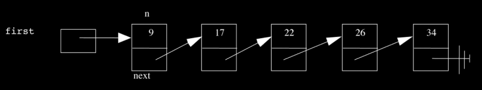

Lecture notes by Andrew Sellergren. [Watch the video.](http://cs50.tv/2013/fall/lectures/5/m/)

## Announcements and Demos

* Sign up for CS50 Lunch this Friday!

* Final Projects are nigh! The specification has already been released, detailing the following checkpoints:

	* Pre-Proposal
	* Proposal
	* Status Report
	* CS50 Hackathon
	* Implementation
	* CS50 Fair

## From Last Time

By now, you’re hopefully getting comfortable with the concept of a pointer, a
memory address.

We learned that Valgrind is a useful tool for detecting memory leaks and
abuses. A lot of its output is cryptic, but you should look for phrases like
"invalid write" and "definitely lost" as hints to your mistakes.

## User Input

`sscanf` is what the CS50 Library uses to get input from the user in
functions like `GetString`.

### `scanf-0.c`

Take a look at a simple example of using `scanf`, which is quite similar to
`sscanf`:

	#include <stdio.h>

	int main(void)
	{
	    int x;
	    printf("Number please: ");
	    scanf("%i", &x);
	    printf("Thanks for the %i!\n", x);
	}

The first argument to `scanf` resembles an argument we might pass to `printf`
(The "f" in both denotes "formatted"). The second argument is the address of
`x`, thus empowering scanf to actually modify the memory in which `x` is
stored.

This program behaves as expected if the user provides a number as input.
However, if the user provides a string or any other non-numeric input, the
program behaves strangely. One of the things the CS50 Library provides is
some error checking so that if the user provides bad input, he or she will be
prompted to retry.

### `scanf-1.c`

`scanf-1.c` closely resembles `scanf-0.c`, but introduces one major bug:

	#include <stdio.h>

	int main(void)
	{
	    char* buffer;
	    printf("String please: ");
	    scanf("%s", buffer);
	    printf("Thanks for the %s!\n", buffer);
	}

A buffer is just a generic name for a chunk of memory, a place to store
information.

The problem here is that buffer is uninitialized. We didn’t ask the operating
system for a chunk of memory in which to store the string the user gives us.
If we run this program, it will probably crash with a segmentation fault.

### `scanf-2.c`

One solution to the bug in `scanf-1.c` would be to allocate memory for buffer
on the stack, as we do in `scanf-2.c`:

	#include <stdio.h>

	int main(void)
	{
	    char buffer[16];
	    printf("String please: ");
	    scanf("%s", buffer);
	    printf("Thanks for the %s!\n", buffer);
	}

Here, you can see that `scanf` treats the array buffer as a memory address.
We know that the address is for a chunk of memory of size 16 bytes.

In what scenario might this program also be buggy? If the user provides a
string longer than 15 characters (not 16 because we need at least one
character for the null terminator), the program may crash with a segmentation
fault.

How do we know in advance how much memory to request for user input? We
don’t! The CS50 Library has some logic that reads user input one character at
a time with scanf and requests more memory whenever it runs out.

## Structs

Let’s revisit the problem of storing information about a number of students.
We might start off just declaring a few variables like so:

	#include <cs50.h>
	#include <stdio.h>

	int main(void)
	{
	    string name = GetString();
	    string house = GetString();
	}

What if we want to store another student's information? Well I guess we need
some more variables:

	#include <cs50.h>
	#include <stdio.h>

	int main(void) {
	    string name = GetString();
	    string house = GetString();
	    string name2 = GetString();
	    string house2 = GetString();
	    string name3 = GetString();
	    string house3 = GetString();
	}

Hopefully, this strikes you as bad design. In prior weeks, we solved the
problem of storing numerous variables of the same types by using arrays:

	#include <cs50.h>
	#include <stdio.h>

	int main(void)
	{
	    string names[3];
	    string house[3];
	}

This solves the problem of repetitive code, but introduces the problem of
names no longer being directly associated with houses.

### `structs.h`

To reduce code repetition but keep information tightly coupled, we can
introduce a new variable type using syntax like the following:

	#include <cs50.h>

	// structure representing a student
	typedef struct
	{
	    string name;
	    string house;
	}
	student;

### `structs-0.c`

Now we have a type called student that contains both pieces of information
about a student. Filling in this information is quite straightforward:

	#include <cs50.h>
	#include <stdio.h>
	#include <string.h>

	#include "structs.h"

	// number of students
	#define STUDENTS 3

	int main(void)
	{
	    // declare students
	    student students[STUDENTS];

	    // populate students with user's input
	    for (int i = 0; i < STUDENTS; i++)
	    {
	        printf("Student's name: ");
	        students[i].name = GetString();

	        printf("Student's house: ");
	        students[i].house = GetString();
	    }

	    // now print students
	    for (int i = 0; i < STUDENTS; i++)
	    {
	        printf("%s is in %s.\n", students[i].name, students[i].house);
	    }

	    // free memory
	    for (int i = 0; i < STUDENTS; i++)
	    {
	        free(students[i].name);
	        free(students[i].house);
	    }
	}

`students` is an array of variables of type `student` as defined in the
`structs.h` header file.

We access element `i` of `students` by writing `students[i]`, as with any
array. To access the pieces of information within any given student, we use
dot notation: `students[i].name` and `students[i].house`.

Don’t forget that we need to free the memory that we allocated when we called
`GetString`! Technically, we should also be checking if `students[i].name`
and `students[i].house`) are not `NULL` before we free them.

### `structs-1.c`

Before we examine the code, let’s just make and run `structs-1.c`. After we
enter in some data and the program exits successfully, a file named
`students.csv` is created. CSV stands for comma-separated values, a very simple
version of a table like you may have worked with in Excel.

The code that creates this CSV file looks like this:

	#include <cs50.h>
	#include <stdio.h>
	#include <stdlib.h>
	#include <string.h>

	#include "structs.h"

	// number of students
	#define STUDENTS 3

	int main(void)
	{
	    // declare students
	    student students[STUDENTS];

	    // populate students with user's input
	    for (int i = 0; i < STUDENTS; i++)
	    {
	        printf("Student's name: ");
	        students[i].name = GetString();

	        printf("Student's house: ");
	        students[i].house = GetString();
	    }

	    // save students to disk
	    FILE* file = fopen("students.csv", "w");
	    if (file != NULL)
	    {
	        for (int i = 0; i < STUDENTS; i++)
	        {
	            fprintf(file, "%s,%s\n", students[i].name, students[i].house);
	        }
	        fclose(file);
	    }

	    // free memory
	    for (int i = 0; i < STUDENTS; i++)
	    {
	        free(students[i].name);
	        free(students[i].house);
	    }
	}

Line 27 does the work of actually opening a file, specifying "w" as an
argument to `fopen` to indicate that we want to write to this file (whereas
"r" would indicate read mode). `fopen` returns a pointer to a `FILE` object.
Instead of `printf`, we use `fprintf` to write to our file.

Question: what happens when you try to free a `NULL` pointer? Your program will
probably segfault.

## Storage

### Hard Drives

Hard drives that aren’t SSDs (solid-state drives with no moving parts)
consist of circular metal platters and magnetic heads that read and write
bits on them. The 0s and 1s of files are stored by magnetic particles that
are flipped with either their north or their south poles sticking up.

Somewhere on the hard drive there exists a table that maps filenames to their
memory addresses. As you can with RAM, you can number all of the bytes of a
hard drive so that each has a memory address. When you delete a file, say by
dragging it to the trash can or even by emptying the trash can, the contents
of the file may not actually be deleted. Rather, the file’s entry in the
location table is simply erased so that the operating system forgets where
the file was stored. Not until the 0s and 1s of the file are actually
overwritten will the file’s contents truly be gone. In the meantime, the file
can be recovered by software like Norton or by a program like the one you’ll
write for Problem Set 5. Having been provided with the raw bytes of an SD
card, you’ll be tasked with searching through them to look for the particular
pattern of bits that identifies the start of a JPEG file.

### Floppy Disks

Back in David’s day[^1], another type of storage called floppy disks was
popular. Functionally, these are very similar to hard drives in that inside
their plastic casing, there is a circular magnetic platter. You can get your
hands on it just by ripping off the metal tab. Be careful, there’s a spring
in there!

These days, the size of hard drives is measured in terabytes. A so-called
"high-density" floppy disk can only store 1.44 megabytes, or roughly 1
millionth of a terabyte.

## Linked Lists

Arrays are useful because they enable the storage of similar variables in
contiguous memory. One downside of arrays is that they have a fixed size.
Another downside is that there’s no easy way to insert something in the
middle of an array. To do so, we would have to allocate memory for a copy of
the array and then shift all the elements to the right.

To solve the problem of fixed size, we’ll relax the constraint that the
memory we use be contiguous. We can take a little bit of memory from here and
a little bit of memory from there just so long as we can connect them
together. This new data structure is called a linked list:

Each element of a linked list contains not only the data we want to store,
but also a pointer to the next element. The final element in the list has the
NULL pointer.

To implement a linked list, we’ll borrow some of the syntax we used for
structs:

	typedef struct node
	{
	    int n;
	    struct node *next;
	}
	node;

Pictorially, `next` is the bottom box that points to the next element of the
linked list. Why do we have to declare it as a struct `node*` then? The
compiler doesn’t yet know what a `node` is, so we have to call it a `struct
node` in the meantime.

There are a few linked list operations that will be of interest to us:

* insert
* delete
* search
* traverse

The search operation is actually pretty easy to implement:

	bool search(int n, node* list)
	{
	    node* ptr = list;
	    while (ptr != NULL)
	    {
	        if (ptr->n == n)
	        {
	            return true;
	        }
	        ptr = ptr->next;
	    }
	    return false;
	}

`search` takes two arguments, the number to be searched for and a pointer to
the first node in the linked list. We then declare a pointer `ptr` that we’ll
use to walk through the list. Since `ptr` is a pointer to a struct, we use the
arrow syntax (`->`) to access the elements within the struct. To advance to the
next node in the linked list, we assign `ptr->next` to `ptr`. More on this on
Wednesday!

[^1] The turn of the 20th century?
