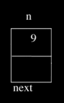

= Week 5
:author: Anna Whitney
:v: RsIP1gRneOs

[t=0m0s]
== Introduction

* We open with another 'enhance!' clip, in which investigators on a TV show are nonsensically able to extract a high-resolution image of the reflection in a suspect's glasses from a low-resolution ATM camera image of the suspect.

[t=1m15s]
== More On Pointers

* Last Wednesday, we watched http://www.cs.stanford.edu/cslibrary/PointerFunCBig.avi[Pointer Fun with Binky] and worked through this example that illustrates some of the gotchas associated with working with pointers:
+
[source, c]
----
int main(void)
{
    int* x;
    int* y;

    x = malloc(sizeof(int));

    *x = 42;

    *y = 13;

    y = x;

    *y = 13;
}
----
** We start with the lines `int* x;` and `int* y;`, in which we declare two variables of type `int*`, or pointers to `int` values. So far these variables don't point to anything, however.
** We then give `x` somewhere to point with the line `x = malloc(sizeof(int));`, which allocates enough memory to fit an `int` and stores the address of this chunk of memory in `x`. In other words, `x` is now pointing to that address.
** Next we store a value at the address of `x` with `pass:[*]x = 42;`, which dereferences `x` (goes to the address `x`) and sets the value in that chunk of memory we just allocated to be the number `42`.
** Then we try to do the same for `y` with `pass:[*]y = 13;`, but we haven't allocated any memory for `y` to point at, so this makes Binky's head explode. `y` contains some garbage value, which the program tries to interpret as an address somewhere in memory, but that location in memory doesn't belong to the program so we can't assign to it.
*** In real life, this results in a *segmentation fault* - you've touched a _segment_ of memory that isn't yours. This can also happen if you go too far in your array (i.e., trying to access indices beyond the bounds of your array).
** We then do `y = x;`, which sets the address stored in `y` to the address stored in `x`.
** Now `y` points to memory we can use, so now we can dereference `y` and store the value `13` there. Note that because `y` and `x` store the same address, if we check what the value at `x` is now, we'll also see `13`!

[t=7m56s]
== CS50 Library

* We've been using the functions `GetString()`, `GetInt()`, etc. We've started alluding to some of how these functions work under the hood, but now we have the tools to look at what's actually happening.
* Let's start by looking at http://cdn.cs50.net/2015/fall/lectures/5/m/src5m/scanf-0.c[`scanf-0.c`]:
+
[source, c, numbered]
----
#include <stdio.h>

int main(void)
{
    int x;
    printf("Number please: ");
    scanf("%i", &x);
    printf("Thanks for the %i!\n", x);
}
----
** It declares a variable `x` and ``printf``s a message asking for a number, but what about line 7?
** `scanf` "scans" the user's input in from the keyboard, using a format string just like `printf`: `%i` means we expect an integer. Then we pass in `&x`, because we want the input to be saved at that location (the address of the `int` variable `x`). If `scanf` didn't have access to the address of `x`, only a copy of `x` would be changed by `scanf`.
* So we can run it:
+
[source]
----
jharvard@ide50:~/workspace/src5m $ ./scanf-0
Number please: 50
Thanks for the 50!
jharvard@ide50:~/workspace/src5m $ ./scanf-0
Number please: no
Thanks for the 0!
jharvard@ide50:~/workspace/src5m $ ./scanf-0
Number please: ok
Thanks for the 0!
----
** Hm, seems to work until we don't cooperate and give it something that isn't an `int`. Clearly we need to implement some kind of error checking to make sure the user really did type in a number.
* Let's look at an attempt to replicate `GetString()` in http://cdn.cs50.net/2015/fall/lectures/5/m/src5m/scanf-1.c[`scanf-1.c`]:
+
[source, c, numbered]
----
#include <stdio.h>

int main(void)
{
    char* buffer;
    printf("String please: ");
    scanf("%s", buffer);
    printf("Thanks for the %s!\n", buffer);
}
----
** This time we don't say `&buffer`, because `buffer` is already an address.
** But we realize this is a bad example. We create a `char* buffer` and expect `scanf` to take some string and put it in memory at whatever address `buffer` points to. But `buffer` is some garbage value, so `scanf` will put the input at an address that could be anywhere in memory. And if the memory doesn't belong to us, then we'll probably cause a segmentation fault and crash our program.
* What if we did something like http://cdn.cs50.net/2015/fall/lectures/5/m/src5m/scanf-2.c[`scanf-2.c`]?
+
[source, c, numbered]
----
#include <stdio.h>

int main(void)
{
    char buffer[16];
    printf("String please: ");
    scanf("%s", buffer);
    printf("Thanks for the %s!\n", buffer);
}
----
** Note that when you see a video on YouTube or streaming elsewhere "buffering", that means that there's an array of memory - typically more than 16 bytes, maybe 1 MB or 10 MB - that the video is being read into, and the video player has reached the end of the array before the streaming service has been able to fill up the array with more bytes of the video (often because of a slow network connection). A *buffer* is simply this sort of array of memory, into which we read content from somewhere.
** Again, we don't need to use `&buffer`, because arrays are represented by pointers to the actual memory where the contents of the array are stored, so `buffer` is itself an address.
** Let's run it:
+
[source]
----
jharvard@ide50:~/workspace/src5m $ ./scanf-1
String please: helloworld
Thanks for the helloworld!
jharvard@ide50:~/workspace/src5m $ ./scanf-1
String please: [very long string of many more than 16 characters]
Segmentation fault
----
** This example is better, since we're declaring an array of characters, which sets aside memory, and works perfectly, until we type in 16, 17, or more characters. Then that string will partly end up in `buffer`, but overwrite whatever is beyond the boundary of that array, since we only asked for 16 bytes.
** We can support longer sentences by implementing a larger buffer, but that's a waste of space if we don't actually fill them. And even then, it's still possible for a user to enter an even longer string.
* So how do we do this in the CS50 Library? Let's look at the functions in http://cdn.cs50.net/2014/fall/lectures/5/m/src5m/cs50.c[`cs50.c`], in particular `GetString`:
+
[source, c]
----
...
/**
 * Reads a line of text from standard input and returns it as a
 * string (char*), sans trailing newline character.  (Ergo, if
 * user inputs only "\n", returns "" not NULL.)  Returns NULL
 * upon error or no input whatsoever (i.e., just EOF).  Leading
 * and trailing whitespace is not ignored.  Stores string on heap
 * (via malloc); memory must be freed by caller to avoid leak.
 */
string GetString(void)
{
    // growable buffer for chars
    string buffer = NULL;

    // capacity of buffer
    unsigned int capacity = 0;

    // number of chars actually in buffer
    unsigned int n = 0;
...
----
** Rather than assigning a buffer of a specific size, we're starting with an empty buffer, and we'll grow it to fit the user's input. This lets us fit long input without having to allocate a lot of memory right away or set a specific length that the string must be.
** We'll `malloc` new memory each time we make the buffer larger and `free` the old memory.
** Note that we're keeping track of how long our buffer has gotten and how many chars we've actually stored in the buffer using `unsigned int` variables. Because an `unsigned int` doesn't need to keep track of sign, it has one additional bit to use on the value (and thus twice as many possible values). Since sizes can't be negative, we don't need to use half our possible values on negative numbers.
+
[source, c]
----
...
    // character read or EOF
    int c;

    // iteratively get chars from standard input
    while ((c = fgetc(stdin)) != '\n' && c != EOF)
    {
...
----
** `c` is a `char`, although we're storing it as an `int` for reasons we won't go into now.
** You might've used `fgetc` on Problem Set 4, and certainly on Problem Set 5 it'll be of use. It gets one character at a time from a file - in this case `stdin`, the "file" consisting of what the user is typing at their keyboard.
+
[source, c]
----
...
        // grow buffer if necessary
        if (n + 1 > capacity)
        {
            // determine new capacity: start at 32 then double
            if (capacity == 0)
            {
                capacity = 32;
            }
            else if (capacity <= (UINT_MAX / 2))
            {
                capacity *= 2;
            }
            else
            {
                free(buffer);
                return NULL;
            }

            // extend buffer's capacity
            string temp = realloc(buffer, capacity * sizeof(char));
            if (temp == NULL)
            {
                free(buffer);
                return NULL;
            }
            buffer = temp;
        }

        // append current character to buffer
        buffer[n++] = c;
    }
...
----
** Note the line `string temp = realloc(buffer, capacity * sizeof(char));` - the function `realloc` works like `malloc`, but allows you to make an existing chunk of memory larger or smaller.
** This lets us grow the buffer as the user types more characters. Each time we run out of space, we double the size of our buffer to store what the user types.
*** We double the size of the buffer each time, rather than just increasing it by a fixed amount, to try to minimize the number of times we have to call `malloc` (or `realloc`, in this case). Asking the operating system for more memory can be slow, so we don't want to do it too many times if the user inputs a very long string.
** This is a subjective design decision, though - it means we're probably wasting a bit more space (e.g., if the string the user types in is one character longer than a power of 2, almost half the buffer will be empty) in order to be a little bit faster. These sorts of tradeoffs are the choices we often have to make when writing software.
** Note that the other functions in the CS50 Library, like `GetInt()`, call `GetString()` to deal with actually getting the characters the user typed, and then parse those characters into the type they're expecting:
+
[source, c, numbered]
----
...
/**
 * Reads a line of text from standard input and returns it as an
 * int in the range of [-2^31 + 1, 2^31 - 2], if possible; if text
 * does not represent such an int, user is prompted to retry.  Leading
 * and trailing whitespace is ignored.  For simplicity, overflow is not
 * detected.  If line can't be read, returns INT_MAX.
 */
int GetInt(void)
{
    // try to get an int from user
    while (true)
    {
        // get line of text, returning INT_MAX on failure
        string line = GetString();
        if (line == NULL)
        {
            return INT_MAX;
        }

        // return an int if only an int (possibly with
        // leading and/or trailing whitespace) was provided
        int n; char c;
        if (sscanf(line, " %i %c", &n, &c) == 1)
        {
            free(line);
            return n;
        }
        else
        {
            free(line);
            printf("Retry: ");
        }
    }
}
...
----
** We're using `sscanf`, a relative of `scanf` that lets us get values of particular types out of a string, rather than out of `stdin`.
** We won't go into why we're using a `%c` format string in our call to `sscanf` as well as the `%i` format string to actually get the `int`, but suffice it to say for now that it lets us check that the user actually typed an `int` without any other junk.
* We've been handling all these low-level details for you via the CS50 Library, but on Problem Set 4, Problem Set 5, and beyond, you'll need to take on some of these details yourself.

[t=27m38s]
== Memory and Valgrind

* It turns out that we've all been writing buggy code so far, even though it's passing `check50` and working as intended. We've been calling `GetString()`, `GetInt()` and so on, getting memory from the operating system, but we haven't been giving back that memory. This is called a *memory leak*.
** This hasn't been a huge problem because our programs automatically give back their memory when they exit, but a program that runs for a long time without exiting that has a memory leak will steadily use up your computer's memory, slowing everything down.
** If you've left your computer running for some time, opening lots of programs, and it gets slower, then the problem could be with certain programs asking for memory, and forgetting about it, taking it away from other programs and slowing everything else. (In particular, older versions of Firefox were often guilty of this.)
* We can use a tool called `valgrind` to help us figure out whether we're returning the memory we use correctly. Although not super user-friendly, `valgrind` is very useful - it can tell us not only if we have memory leaks, but also if we're touching memory that doesn't belong to us.
* We can run `valgrind` on a program called `program` in the current directory as follows:
+
[source]
----
valgrind --leak-check=full ./program
----
* If we run `valgrind` on a program we have called `memory`, we get the following output:
+
[source]
----
==15811== Memcheck, a memory error detector
==15811== Copyright (C) 2002-2013, and GNU GPL'd, by Julian Seward et al.
==15811== Using Valgrind-3.10.0.SVN and LibVEX; rerun with -h for copyright info
==15811== Command: ./memory
==15811==
==15811== Invalid write of size 4
==15811==    at 0x4005FF: f (memory.c:21)
==15811==    by 0x400623: main (memory.c:26)
==15811==  Address 0x5503068 is 0 bytes after a block of size 40 alloc'd
==15811==    at 0x4C2AB80: malloc (in /usr/lib/valgrind/vgpreload_memcheck-amd64-linux.so)
==15811==    by 0x4005F6: f (memory.c:20)
==15811==    by 0x400623: main (memory.c:26)
==15811==
==15811==
==15811== HEAP SUMMARY:
==15811==     in use at exit: 40 bytes in 1 blocks
==15811==   total heap usage: 1 allocs, 0 frees, 40 bytes allocated
==15811==
==15811== 40 bytes in 1 blocks are definitely lost in loss record 1 of 1
==15811==    at 0x4C2AB80: malloc (in /usr/lib/valgrind/vgpreload_memcheck-amd64-linux.so)
==15811==    by 0x4005F6: f (memory.c:20)
==15811==    by 0x400623: main (memory.c:26)
==15811==
==15811== LEAK SUMMARY:
==15811==    definitely lost: 40 bytes in 1 blocks
==15811==    indirectly lost: 0 bytes in 0 blocks
==15811==      possibly lost: 0 bytes in 0 blocks
==15811==    still reachable: 0 bytes in 0 blocks
==15811==         suppressed: 0 bytes in 0 blocks
==15811== Rerun with --leak-check=full to see details of leaked memory
==15811==
==15811== For counts of detected and suppressed errors, rerun with: -v
==15811== ERROR SUMMARY: 1 errors from 1 contexts (suppressed: 0 from 0)
----
* The important parts here are `Invalid write of size 4`, which is coming from `memory.c:21` (line 21 of the file `memory.c`), and `40 bytes in 1 blocks are definitely lost`, which is associated with line 20 in `memory.c`.
** `Invalid write` means we tried to touch memory that didn't belong to us, and `size 4` means that the section of memory that we touched was 4 bytes.
** Our other message, about memory being `definitely lost`, indicates that we allocated memory but didn't give it back. To give back memory, we use the function `free()`, which takes just one argument - the variable that you want to give back.
* Let's look at what's actually in http://cdn.cs50.net/2015/fall/lectures/5/m/src5m/memory.c[`memory.c`]:
+
[source, c, numbered]
----
/** 
 * memory.c
 *
 * david j. malan
 * malan@harvard.edu
 *
 * demonstrates memory-related errors.
 *
 * problem 1: heap block overrun
 * problem 2: memory leak -- x not freed
 *
 * adapted from
 * http://valgrind.org/docs/manual/quick-start.html#quick-start.prepare.
 */
        
#include <stdlib.h>

void f(void)
{
    int* x = malloc(10 * sizeof(int));
    x[10] = 0;
}

int main(void)
{
    f();
    return 0;
}
----
** In line 20, we declare a pointer variable `x` and assign to it the address returned by `malloc`, which allocates enough memory for 10 `int` values, or 40 bytes. This is giving us the `40 bytes in 1 blocks are definitely lost`, because we don't free this memory.
** In line 21, we try to write to `x[10]`, but the indices of `x` only go up to `9` (because it can contain 10 integers, we can access them as `x[0]` through `x[9]`). This gives us the `Invalid write of size 4`, because we're trying to put an `int` (4 bytes) somewhere we don't own.
** If we change line 21 to `x[9] = 0;` and add `free(x);` right before we exit the function `f`, then `valgrind` will show us that we have no memory errors.
* As an aside, you should now find http://xkcd.com/138[this xkcd] funny.

[t=35m56s]
== Linked Lists

* We've been using arrays to solve all kinds of problems, but what's one potential downside of an array? Arrays are of a fixed size, so if you want to put more things in your array than you have space for, you have to allocate a new array.
* Another data structure we can use to store lists of values is a *linked list*. Instead of memory all consecutively in a row, we have blocks of memory spread out:
+
image::linked_list.png[]
** The boxes look orderly in the image, but in reality they might be all over the place, with arrows that link each rectangle to the next.
** Because these boxes don't have to be next to each other in memory, we can add more boxes to our list or remove boxes from our list without copying everything over to a new list.
* We've used pointers to represent an arrow, so instead of an array that only stores numbers, we can store a pointer next to each number that weaves all of these rectangles together.
* If we wanted to implement this, we'd start by noticing that each of these rectangles aren't a single number, but rather an `int` (though they can store any sort of value) and a `pointer`:
+

* To create our own data structure, we just have to define a `struct` like we've seen before:
+
[source, c]
----
typedef struct
{
    string name;
    string house;
}
student;
----
* Now we can take that idea and do something like the following:
+
[source, c]
----
typedef struct node
{
    int n;
    struct node* next;
}
node;
----
** A *`node`* is a general computer science term for an element in a data structure.
* Our `node` will have the `int` and also a `struct node*`, or pointer to another node.
* `typedef struct node` is also at the top, for `node` to be able to refer to itself or another `node`, or self-referential. Notice how we didn't need that for `student` since they don't need to refer to another student.
* Let's think about this with help from volunteers from the audience.
* We line up people to represent each rectangle, with volunteer David on the far left to represent `first`, which is just a pointer that lets us keep track of where the beginning of our list is in memory:
+
[source]
----
[]----->[9]--->[17]--->[22]--->[26]--->[34]
                                        |
                                        V
----
** And we have everyone pointing to either the next `node`, or in the case of `34`, pointing downward to represent `NULL` (i.e., the end of the list).
* Now let's try to insert the element `55`, held by volunteer Rainbow. We want to keep the list sorted, so we'll move down the list, comparing each value to `55` and following the pointer to the next node. So we get to the end, and the pointer in the node of `55` will be `NULL` and the pointer of `34` will change to point to the node containing `55`:
+
[source]
----
[]----->[9]--->[17]--->[22]--->[26]--->[34]--->[55]
                                                |
                                                V
----
* Now let's say we have to insert to the beginning of the list, a number like `5`. We start by intializing our `ptr` to the point to the first element, `9`, and realize that `5` is less than `9`. So now volunteer David, `first`, needs to point to the node of `5` and the node of `5` will now point at `9`:
+
[source]
----
[]----->[5]--->[9]--->[17]--->[22]--->[26]--->[34]--->[55]
                                                       |
                                                       V
----
** In this case, we have to be careful about our order of operations: if we have `first` point to `5` before we have anything point at `9`, then we've lost our access to the rest of the list. So we have `5` point at `9` first, _then_ have `first` point at `5`.
* Now let's consider inserting a node into the middle, like the number `20`. We go through the list, and realize that `20` is less than `22`. We again need to be careful about order, making sure that `22` points to `26` before we change `20` to point at `22`.
+
[source]
----
[]----->[5]--->[9]--->[17]--->[20]--->[22]--->[26]--->[34]--->[55]
                                                               |
                                                               V
----
* So this seems awesome. Now we have a list that we can grow and shrink as needed. What tradeoffs are we paying for in exchange for this flexibility?
** Storing the same number of values in a linked list takes twice as much space as in an array - we're not just storing an `int` in each node, we're storing an `int` and a pointer to the next node.
** We have to traverse the linked list one node at a time, so we can't use the square bracket notation to go directly to a particular node in the list anymore. The ability to index directly into any element of an array is called *random access*. Without random access, for example, we can only use linear search (and not binary search), because we can't go straight to the middle of the list.

[t=49m18s]
== Stacks & Queues

* There are other data structures besides linked lists we can use to solve different problems, too.
* Think about a stack of dining hall trays, imagining that each represents a number. As we put down each tray, we put the next one on top of it, and so on. If we then take a tray off the stack, we get the most recently added number.
** This represents a data structure appropriately called a *stack*, or *LIFO*, for last in, first out (i.e., the last value added to the stack is the first value taken off it).
* We can instead think about the line in front of the Apple Store when a new iPhone comes out, where the first person to arrive is the first person to receive an iPhone.
** This represents a data structure called a *queue*, or *FIFO*, for first in, first out.
* Either a stack or a queue (or many other data structures) can be implemented on top of either an array or a linked list, with different time and space tradeoffs associated with each.
* On Wednesday, we'll look at another data structure that will again let us search in O(log _n_) time.
* We'll also be looking for the "holy grail" of a data structure that lets us search in O(1) (constant) time.

