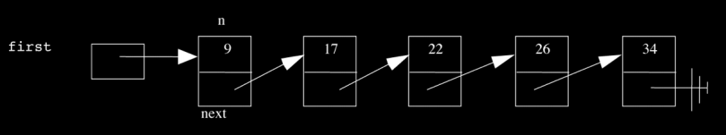
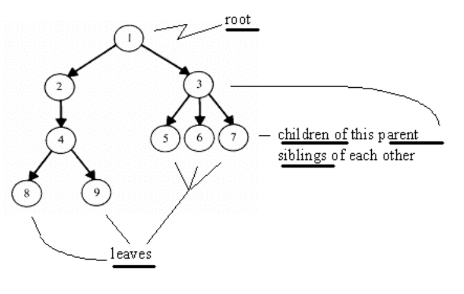
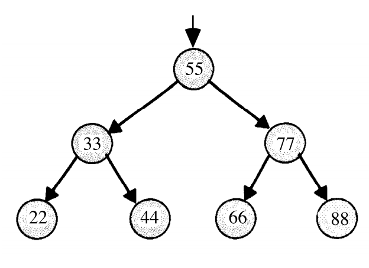
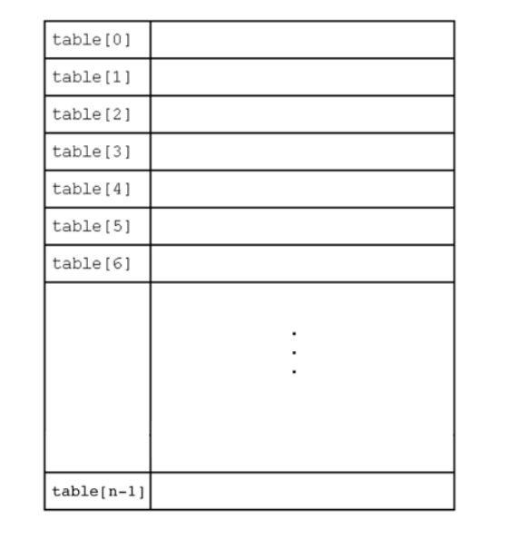
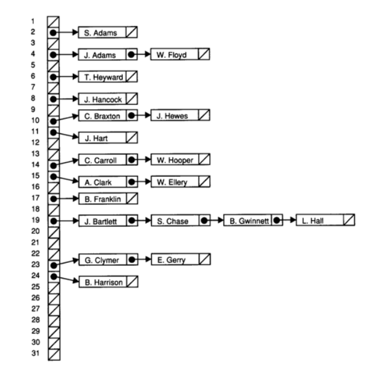
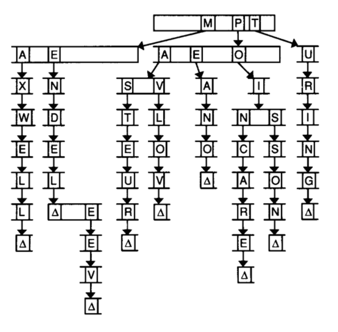

= Week 5, continued
:author: Anna Whitney
:v: 3p_Scm7qSfU

[t=0m0s]
== Linked Lists, continued

* Last time, we introduced this data structure called a *linked list*. This is a *singly linked list*, because there's only one pointer between any pair of nodes.
+

** We can also have a *doubly linked list*, where every node points both to the next node and to the previous node. (This makes some kinds of traversal easier, but requires more space for every node to have a second pointer.)
* Linked lists solve some of the problems we had with arrays - in particular, that arrays are fixed in size.
** If we want to make an array bigger, we have to create a whole new array, copy the values over, and `free` the old array, which is very inefficient.
** If we want to make a linked list bigger, we just add more nodes! We illustrated with volunteers last time how to add nodes to the beginning, middle, and end of a linked list.
* Linked lists do come with their own tradeoffs, though.
** They take up twice as much space (or more, if pointers on your system are 8 bytes rather than 4 bytes, as they are on the CS50 IDE).
** We give up random access (i.e., constant time lookup) of any element in the list.
* What are the operations that are important over a collection of items, like an array or a linked list? We need to be able to delete items, insert items, and search for items. How do we implement these on linked lists?

[t=3m26s]
=== Searching

* To implement search, we might start somewhere like this:
+
[source, c, numbered]
----
...
typedef struct node
{
    int n;
    struct node* next;
}
node;

...

bool search(int n, node* list)
{

}
----
** Recall that this `typedef` is defining a `node` type, that contains a value (`int n`) and a pointer to the next node (`struct node* next`).
* Let's assume that someone else has inserted a bunch of elements into the linked list, and we have a pointer to the beginning of the list (a `node*`). How do we implement search?
* We pass in the number we're looking for, and the pointer we have to the beginning of the list (like the pointer `first` held by volunteer David on Monday).
+
[source, c, numbered]
----
bool search(int n, node* list)
{
    node* ptr = list;
    while (ptr != NULL)
    {
        if (ptr->n == n)
        {
            return true;
        }
    }
}
----
** In line 3, we initialize a variable `ptr` to keep track of where in our list we are, and we start it pointing at the beginning of the list.
** We use a `while` loop because we want to keep going until we hit the end of the list, which will be represented by a `NULL` pointer.
** Then in line 6, we check if the number stored at `ptr`, `ptr\->n`, is what we're looking for.
*** We might expect to use the struct notation we used with the `student` type before, which would be `ptr.n`, but because `ptr` is actually a _pointer_ to a struct rather than a struct itself (`node*` vs `node`), we need different notation.
*** The `\->` is syntax for going to the location from pointer `ptr` and retrieving the variable `n` stored within that struct. (You could also use `(*ptr).n`, meaning go to `ptr` and then get the `n` field, since `*ptr` is a struct. And `ptr\->n` is exactly the same, just "syntactic sugar," or something that makes the code look better.)
* What if we don't find the value `n` in the node we're currently looking at?
+
[source, c, numbered]
----
bool search(int n, node* list)
{
    node* ptr = list;
    while (ptr != NULL)
    {
        if (ptr->n == n)
        {
            return true;
        }
        ptr = ptr->next;
    }
    return false;
}
----
** If the number isn't what we're looking for, then we set `ptr` to `ptr\->next`, which is moving our placeholder to the next `node` in the linked list.
** This lets us step through the list one node at a time, by following the `next` pointer associated with each node.
** If we get to the end of the linked list, as represented by reaching a `NULL` value, without finding the value, then we `return false` - the value `n` is not in our list.
* How long might it take to reach an element in this list? Ο(_n_), which isn't bad, but is linear. We've given up the random access that arrays allow, since `malloc` gives us memory from wherever it is available in the heap, and the addresses of each node could be spaced far apart.

[t=7m7s]
== Stacks & Queues

* Recall the stack data structure that we mentioned last time. A stack canonically supports two operations: *push* (add an element to the top of the stack) and *pop* (pull an element off the top of the stack).
* We can code up a stack as follows:
+
[source, c]
----
typedef struct
{
    int numbers[CAPACITY];
    int size;
}
stack;
----
** This is saying give me a structure with an array of size `CAPACITY` (some constant we've declared elsewhere), called `numbers`, and an `int`, called `size`, that represents the number of elements currently in the stack.
* So in memory, we then have the following (assume for the moment that the constant `CAPACITY` has been set with `#define` to 5, and `size` starts at 0 before we've put anything in the stack):
+
[source, subs=quotes]
----
~numbers~
---------------------
|   |   |   |   |   |
---------------------
~size~
-----
| 0 |
-----
----
* Now if we want to `push` the number 50, where should we put it in the array?
+
[source, subs=quotes]
----
~numbers~
----------------------
| 50 |   |   |   |   |
----------------------
~size~
-----
| 1 |
-----
----
** We insert it at the front, and increment `size` by 1.
* Let's add a few more:
+
[source, subs=quotes]
----
~numbers~
------------------------
| 50 | 51 | 61 |   |   |
------------------------
~size~
-----
| 3 |
-----
----
* Now what happens if we `pop` an element? `pop` takes no arguments, and should just return the most recently added element of the stack (which in this case is 61).
* We need to remove 61 from the `numbers` array, and decrement `size`.
** How do we find the element we need to remove? We look for `numbers[size - 1]`, and decrement `size`.
** We don't need to even actually remove 61 actively - once we've decremented `size`, our program has forgotten that 61 was ever there.
** This is analogous to some of what we talked about on the computer forensics problem set - computers rarely actually delete things; they can eventually be overwritten by other things, but the data is usually still there until that happens. The computer has just stopped keeping track of where the "deleted" information was kept.
* This stack implementation has a problem - we can't resize the `numbers` array, so it has a strict capacity of `CAPACITY`.
* Instead, we can implement a stack this way:
+
[source, c]
----
typedef struct
{
    int* numbers;
    int size;
}
stack;
----
** Now, we can `malloc` a chunk of memory of any size and store its address in `numbers`. We can even `realloc` if we want a larger or smaller chunk of memory.
** This adds complexity (programmer time), but increases our flexibility.
* You should also be familiar with queues, the other abstract data structure we introduced last time.
* Unlike a stack, which implements `push` and `pop` (values are added to the top and taken off the top), a queue has operations *enqueue* (add an element to the back of the queue) and *dequeue* (take an element off the front of the queue).
* We can implement a queue like this:
+
[source, c]
----
typedef struct
{
    int front;
    int numbers[CAPACITY];
    int size;
}
queue;
----
** We have a `numbers` array and a `size` as we did with the stack, but now we're also keeping track of the `front`.
* If we `enqueue` the same numbers as before, it looks similar:
+
[source, subs=quotes]
----
~numbers~
------------------------
| 50 | 51 | 61 |   |   |
------------------------
~size~
-----
| 3 |
-----
~front~
-----
| 0 |
-----
----
* So how do we dequeue? We want to remove 50 (`numbers[front]`) and decrease the size, but just decrementing the size no longer tells us exactly what's going on. We also need to keep track of where the front is, which we do by incrementing it:
+
[source, subs=quotes]
----
~numbers~
------------------------
| [line-through]#50# | 51 | 61 |   |   |
------------------------
~size~
-----
| 2 |
-----
~front~
-----
| 1 |
-----
----
* Suppose we add more values, so now our queue looks like this:
+
[source, subs=quotes]
----
~numbers~
----------------------------
| [line-through]#50# | 51 | 61 | 121 | 124 |
----------------------------
~size~
-----
| 4 |
-----
~front~
-----
| 1 |
-----
----
** Oh no, we're out of space! Except we aren't actually - we're not using `numbers[0]` anymore, so we can put another value there.
** Then we have this:
+
[source, subs=quotes]
----
~numbers~
-----------------------------
| *171* | 51 | 61 | 121 | 124 |
-----------------------------
~size~
-----
| 2 |
-----
~front~
-----
| 1 |
-----
----
** We can do this looping around with a modulo operator (`%`).
** But now we are really out of space, with the same problem as before.
* Just as with the stack, we can give ourselves more size flexibility by switching out the explicit array for instead a pointer that we can assign with `malloc`:
+
[source, c]
----
typedef struct
{
    int front;
    int* numbers;
    int size;
}
queue;
----
* We watch a short video in which Jack learns about queues and stacks.

[t=21m8s]
== Memory

* Now that we have pointers - addresses of locations in memory - let's look in more detail at what your computer's memory looks like.
* Each program is given its own area of memory (in fact, establishing the illusion that it has access to the entirety of your computer's memory, even if multiple programs are running at once), which is laid out like this:
+
[source]
----
-----------------------------
|                           |
|           text            |
|                           |
-----------------------------
|      initialized data     |
-----------------------------
|     uninitialized data    |
-----------------------------
|           heap            |
|             |             |
|             |             |
|             v             |
|                           |
|                           |
|                           |
|             ^             |
|             |             |
|             |             |
|           stack           |
-----------------------------
|   environment variables   |
-----------------------------
----
** Note that one of these segments of memory is called the *stack*, and it is in fact implemented as a stack as we discussed above.
*** We've talked before about how each function gets its own segment of memory on the stack, called a *stack frame*, so if we have our `main` function, and then `main` calls a function `swap`, on the bottom there will be the stack frame for `main`, and on top of that, a new stack frame for `swap`.
*** Every time we call a new function, we layer a new stack frame on top. 
*** Local variables within each function are also stored in the stack, which is why `swap` can't modify local variables in `main` unless it knows their addresses within the stack frame belonging to `main`.
* Today, we'll focus on the *heap*, another chunk of memory where variables are stored if assigned with `malloc` (or any of the `Get` functions from the CS50 Library, since those use `malloc` and the like under the hood).
** You can see that there's a problem if the heap and the stack collide if your program starts to use too much memory, and bad things will happen.
* Here's a program that illustrates one way bad things can happen, particularly if you have malicious users:
+
[source, c]
----
#include <string.h>

void f(char* bar)
{
    char c[12];
    strncpy(c, bar, strlen(bar));
}

int main(int argc, char* argv[])
{
    f(argv[1]);
}
----
** It has no functional purpose, other than to demonstrate how a poorly written program might lead to your whole computer being taken over. Notice `main` takes `argv[1]` and passes it in to `f`, so whatever word the user types in after the name of the program, and then `f` takes it, which we've called `bar`, and copies it into `c`, which can hold 12 characters. `c` is a local variable of 12 ``char``s so it will live on the stack. `strncpy` copies a string, but only `n` letters, in this case `strlen(bar)`, or the length of the user-inputted string.
** The problem is that we're not checking for the length of `bar`, so if it were 20 characters long, it would overflow and take up 8 more bytes than it should.
* The implication is this diagram of a zoomed-in version of the bottom of the program's stack:
+
[source]
----
|  unallocated stack space  |
-----------------------------
| c[0] |                    |
| ---- |                    |
|                           |
|         char c[12]        |
|                           |
|                   | ----- |
|                   | c[11] |
-----------------------------
|         char* bar         |
-----------------------------
|                           |
-----------------------------
|       return address      |
-----------------------------
|   parent routine's stack  |
----
** At the very bottom is the *parent routine's stack*, in this case `main`, or whichever function that called this one.
** The *return address* has always been there, which was copied over along with local variables when the function was called, and this is just where in memory the program should jump back to, once the function returns. In this case, it's somewhere in `main`.
** The top is the stack frame for the function. There's `bar`, an argument to the function, and `c`, an array of characters. And to be clear, on the top left would be `c[0]`, the first character, with the last, `c[11]`, on the bottom right corner.
* What happens if we pass in a `string` with `char* bar` longer than `c`? You would overwrite `char* bar` and, even worse, the return address. Then the program would go back to, well, anywhere in memory that `bar` specified. When bad guys are curious if a program is buggy or exploitable, they send lots of inputs of different lengths, and when it causes your program to crash, then they have discovered a bug.
* In particular, the best case might look something like this:
+
[source]
----
|  unallocated stack space  |
-----------------------------
|  h   |  e   |  l   |  l   |
| ---- | ---- | ---- | ---- |
|  o   |  \0  |             |
| ---- | ---- |             |
|         char c[12]        |
|                           |
|                           |
-----------------------------
|         char* bar         |
-----------------------------
|                           |
-----------------------------
|       return address      |
-----------------------------
|   parent routine's stack  |
----
** The string passed in is just `hello`, which fits in `c`.
* But what about "attack code" that looks like this?
+
[source]
----
                |  unallocated stack space  |
  Address       -----------------------------
  0x80C03508 -> |  A   |  A   |  A   |  A   |
                | ---- | ---- | ---- | ---- |
                |  A   |  A   |  A   |  A   |
                | ---- | ---- | ---- | ---- |     char c[]
                |  A   |  A   |  A   |  A   |
                -----------------------------
                |  A   |  A   |  A   |  A   |     char* bar
                -----------------------------
                |  A   |  A   |  A   |  A   |
                -----------------------------
                | 0x08 | 0x35 | 0xC0 | 0x80 |    return address
                -----------------------------
                |   parent routine's stack  |
----
** In this picture, the ``A``s are arbitrary zeroes and ones that can do anything, maybe `rm -rf` or send spam, and if that person includes those, but also has the last 4 bytes be the precise address of the first character of the `string`, you can trick a computer into going back to the beginning of the `string` and executing the code, instead of simply storing it. The return address, among other things, has been overwritten. (And if you've noticed, the return address is the address of the first `A`, with the order of the bytes reversed. This is called http://en.wikipedia.org/wiki/Endianness[little-endianness] -- an advanced topic we won't need to worry much about yet!)
* So in short, this bug came from not checking the boundaries of your array, and since the computer uses the stack from bottom up (think trays from Annenberg being stacked on a table), while arrays you push on the stack are written to from the top down, this is even more of a concern. And though there are ways and entire languages around this problem, the power of C comes with great responsibility and risk. If you ever read articles about "buffer-overflow attacks," then they're probably talking about this.

[t=31m41s]
== More Data Structures

* One problem with linked lists that we mentioned on Monday and earlier today is that we don't have random access to elements of the list, so searching for a value within a linked list requires O(_n_), linear time.
* We claimed that we can construct a data structure that will give us O(log _n_) (logarithmic) lookup time, and even one that will give us O(1) (constant) lookup time.
* If we have the numbers 22, 33, 44, 55, 66, 77, and 88, and we want to search for a value among them in logarithmic time, we can go back to what we learned in Week 2, throw them in an array, and use binary search:
+
[source]
----
------------------------------------
| 22 | 33 | 44 | 55 | 66 | 77 | 88 |
------------------------------------
----
* But we can store our data in a cleverer way that still leverages the power of binary search without restricting us to a fixed number of elements like an array does.
* Let's introduce the general idea of a *tree*, a data structure in which nodes are connected in descending layers of *children*, growing downward like a family tree:
+

* One specific kind of tree is a *binary search tree*:
+

** It's binary in the sense that every node has no more than two children.
** It's a search tree because the values of the nodes are arranged to make it possible to find values easily - specifically, a node's left child is always less than that node, while a node's right child is always greater than that node.
* We can implement a binary search tree with a `struct`, just as we did for previous data structures:
+
[source, c]
----
typedef struct node
{
    int n;
    struct node* left;
    struct node* right;
}
node;
----
** Each node contains a value (here an integer) and pointers to its left and right children.
* We can write a search function on a binary search tree like so:
+
[source, c]
----
bool search(int n, node* tree)
{
    if (tree == NULL)
    {
        return false;
    }
    else if (n < tree->n)
    {
        return search(n, tree->left);
    }
    else if (n > tree->n)
    {
        return search(n, tree->right);
    }
    else
    {
        return true;
    }
}
----
** If our pointer to the tree is `NULL`, the tree is empty, so clearly it doesn't contain the value `n`.
** Otherwise, we check the value at the node against the value we're looking for to determine whether we should go left, whether we should go right, or whether we've found our value and are done.
** This algorithm is recursive, because each level of the binary search tree is just another binary search tree.

[t=39m16s]
== Compression

* Stepping away from trees, consider the German flag - or any similarly simple flag. If we're storing this in an image format, it seems kind of a waste to store all the black pixels, then all the red pixels, then all the yellow pixels. What redundancy can we eliminate here?
* Rather than remember the color of every pixel, we could encode just the leftmost column of the flag, and somehow indicate that this column should be repeated as many times as necessary to fill in the rest of the flag.
* What about the French flag, where the bars are vertical rather than horizontal? We can imagine a similar approach, storing one row and repeating it as many times vertically as necessary to fill in the flag.
* This will result in somewhat better compression for the German flag than the French flag, because there's more horizontal redundancy.
* When we compress video, we can do similar removal of redundancy by remembering only "key frames" and in between storing only what's changed between those frames, throwing away the information that's the same between frames.
* But how do we compress text? Recall that text can be stored as ASCII, in which each character is 8 bits, or 1 byte. But not all characters are used equally frequently, so we might be able to get better information density if we use a smaller number of bits for more common characters (like `E`) and a larger number of bits for less common characters (like `W`).
** This is part of the logic behind Morse code - `E`, for example, is just a single dot - but Morse code has the problem that you have to leave space between letters to be able to tell the difference between, e.g., `I` and two consecutive `E` s.
* There's a method of compression called *Huffman coding* that uses the frequency of different characters while avoiding this problem of needing lots of extra space to separate characters. Imagine we have the following string that we want to compress:
+
[source]
----
"ECEABEADCAEDEEEECEADEEEEEDBAAEABDBBAAEAAAC
DDCCEABEEDCBEEDEAEEEEEAEEDBCEBEEADEAEEDAEBC
DEDEAEEDCEEAEEE"
----
** The frequencies of the five letters in this string are as follows:
+
[source]
----
-------------------------------------------
 character |  A  |  B  |  C  |  D   |  E 
-------------------------------------------
 frequency | 0.2 | 0.1 | 0.1 | 0.15 | 0.45 
-------------------------------------------
----
** Huffman developed a tree-based algorithm in which we start with a node for each character:
+
[source]
----
(0.1)     (0.1)     (0.15)    (0.2)    (0.45)
  B         C         D         A        E
----
** We then connect these nodes with new parents, if you will, by connecting the two smallest frequencies:
+
[source]
----
     (0.2)
     /   \
  0 /     \ 1
   /       \
(0.1)     (0.1)     (0.15)    (0.2)    (0.45)
  B         C         D         A        E
----
** We do the same thing again, connecting the next two smallest frequencies. We have two options here, since the node for A and the new node both have a frequency of 0.2, but let's keep going on top of this new node:
+
[source]
----
          (0.35)
          /    \
       0 /      \ 1
        /        \
     (0.2)        \
     /   \         \
  0 /     \ 1       \ 
   /       \         \
(0.1)     (0.1)     (0.15)    (0.2)    (0.45)
  B         C         D         A        E
----
** We do this two more times to connect all the leaf nodes into a single tree:
+
[source]
----
                    (1.0)
                    /    \
                 0 /      \ 1
                  /        \
               (0.55)       \
               /    \        \
            0 /      \ 1      \
             /        \        \
          (0.35)       \        \
          /    \        \        \
       0 /      \ 1      \        \
        /        \        \        \
     (0.2)        \        \        \
     /   \         \        \        \
  0 /     \ 1       \        \        \
   /       \         \        \        \
(0.1)     (0.1)     (0.15)    (0.2)    (0.45)
  B         C         D         A        E
----
** Notice that we've labeled all the edges as 0 or 1 (left edges 0, right edges 1).
** Now to store text using this tree, follow the path from the root to the character you want to store. This means that `B` can be encoded as `0000`, `C` as `0001`, `D` as `001`, `A` as `01`, and `E` as just `1`.
** This means that more common letters have shorter codes!
** There's no ambiguity as we had in Morse code, which is a useful consequence of the fact that all the letters are leaf nodes of the tree.
** We could implement this in C like so:
+
[source, c]
----
typedef struct node
{
    char symbol;
    float frequency;
    struct node* left;
    struct node* right;
}
node;
----

[t=47m6s]
== Hash Tables

* A *hash table* is a data structure divided into "buckets" - imagine we're sorting a deck of cards by suit; then our buckets would be hearts, diamonds, clubs, and spades.
** The idea is that we look at the input and make a decision based on that input (five of diamonds goes in this pile over here, two of clubs goes in that pile over there). This technique is known as *hashing*, or taking an input and computing a value, generally a number, that becomes the index into a storage container (like an array).
** During the CS50 Hackathon last year, we also separated nametags into piles by alphabet, so greeters could find them more easily as people arrived.
*** One TF made a clever sign reading "Hash Yourself (by First Name)."
* Let's consider a stack of blue books, like the ones used for exams; each has a student's name on it. We can hash the blue books by each student's first initial.
** We might map _A_ to 0, and _Z_ to 25, and place them into numbered piles that way.
** A C program could just use the ASCII value, but subtract 65 from a capital _A_, or 97 from a lowercase _a_, so we can place them in buckets starting from 0.
** So we put a blue book in the _A_ bin, one in the _D_ bin, another in the _B_ bin, and now imagine we have another blue book from a student with a name starting with _A_. Where do we put it?
** If we're building our hash table in an array, we're in trouble - there's already something in the array index for _A_, but we need somewhere to put this! This is called a *collision*.
** One way to deal with this is to look through all the buckets until we find an empty one. This strategy is called *linear probing*. One advantage is that if you have no students with names starting with _Q_ or _X_, you can still use that space. But there's a major disadvantage: we now can't guarantee that when we go to look for the blue book of a student named Anna, it will be in the _A_ bin.
* Let's formalize this idea. The following is an array with the index of each row on the left:
+

** This `array` has 26 elements and is named `table`.
* This is one implementation of a *hash table*, a higher-level data structure, which could use an array or linked list or some other fundamental ingredient as a building block to making a more useful   final result.
* We can simply declare a hash table with something like `char* table[CAPACITY];`, in which case it will be an array with size `CAPACITY`, but we might call a hash table an *abstract data type* that is layering on top of this array.
* Insertion starts by being _Ο_(_1_) since the array is empty and you can jump to the correct location immediately, but once your data set becomes larger, insertion becomes _Ο_(_n_) since we have to move down the array looking for a spot. If your array is big enough and your data is sparse enough, you get the advantage of constant time, but the risk makes linear probing imperfect.

[t=12m0s]
=== Separate Chaining

* We can do better by using linked lists. Let's look at this picture of *separate chaining*.
+

** This image, from some dusty textbook of David's era (as you can tell by the old-fashioned names), is an array of size 31, with strings hashed not by the letters they are made of, but the day of the month the person was born in, so the names might be spread out a bit more evenly.
* But this is still troublesome since people certainly have the same day of the month they were born on, so it looks like we have an array on the left side (drawn vertically), that looks like it's an array of linked lists.
** As we get more advanced, we can start combining fundamental ingredients into things like this, with basic blocks of arrays and linked lists and structs combined to create a more sophisticated data structure.
* The hash table above is an array with "chains" that can grow or shrink based on the elements you insert and remove.

[t=50m40s]
== Tries

* Instead of a hash table, we can use another type of tree, called a *trie* or retrieval tree.
+

** Each node (represented by a rectangle above) has 27 indices, one for each letter A-Z, plus one because we'll allow for a word to have an apostrophe.
** We also keep track of whether there's a word that ends at a given node.
* These tries use a lot of memory since each node allocates space for so many indices, and most of that space will be empty, at least initially when we have few strings.
* But we gain speed and spend less time, since insertion time will be _Ο_(1), since no one has an infinitely long name. The longest word in the dictionary for the problem set will be 40-something letters long, but it will be constant and not depend on how many other names are in this data structure. The running time will now depend on the length of the string, which is asymptotically _Ο_(1).
* Lookup of a name in a trie is equally fast regardless of how many other names are in the trie! It depends _only_ on the length of the name.

[t=53m10s]
== Announcements

* Quiz 0 is next Wednesday!
* There will be a lecture on Monday streamed live from Yale, because Monday is not a University holiday at Yale (although it is at Harvard).
