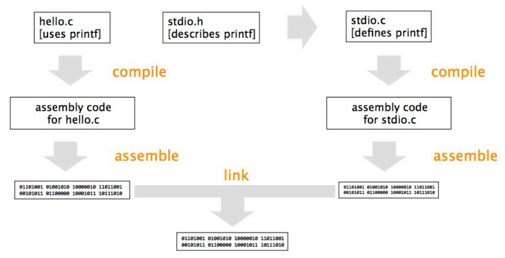
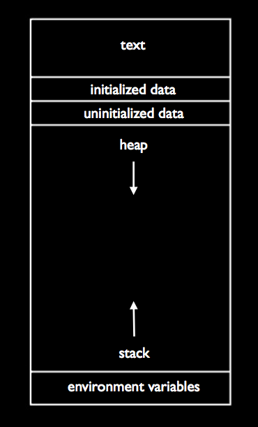

Lecture notes by Andrew Sellergren. [Watch the video.](http://cs50.tv/2013/fall/lectures/5/w/)

## Announcements and Demos

* No lecture on Monday 10/14 or Friday 10/18 (even though it says so in the
  syllabus)! There will be a quiz review session on Monday, though, which
  we’ll announce by e-mail and on the course website. Sections will meet on
  Monday, but you can attend another section or watch the video online if you
  want.

* Quiz 0 is on Wednesday 10/16.

* After Quiz 0, we’ll dive into the world of forensics. David and a few of
  the teaching fellows will walk around campus taking pictures, but
  unfortunately delete them from their memory card. It will be your job to
  recover them!

* In the coming weeks, we’ll also talk more about graphics and images. We’ll
  learn that "zoom and enhance" is not really as useful as TV shows and
  movies [would suggest](http://www.youtube.com/watch?v=Vxq9yj2pVWk).

## Compiling

What we call "compiling" a program actually consists of four steps:

* pre-processing
* compiling
* assembling
* linking

Lines of code that begin with `#`, such as `#define` and `#include` are
pre-processor directives. When you write `#include <stdio.h>`, it instructs
the compiler to fetch the contents of `stdio.h` and paste them into your
program before it begins translating into 0s and 1s. This occurs during the
pre-processing step.

Compiling actually involves translating C into assembly language. Assembling
translates assembly language to binary. Finally, linking combines the 0s and
1s of your program with 0s and 1s of other people’s code.

To see what’s going on during the compiling step, let’s run `clang -S` on our
`hello.c` program. This creates a file named `hello.S` written in assembly
language. If you open this up, you’ll see instructions like `pushl` and
`movl` that manipulate registers, very small memory containers. These
instructions vary between CPUs.

The following diagram shows how these four steps of compiling connect with
each other:

## Memory

### The Stack

Recall from last time our picture of a program’s memory:

At the top, the text segment contains the actual 0s and 1s of the program.
Below that are the initialized data and uninitialized data segments that
contain global variables. We’ll talk more about the heap later.

The stack is the segment of memory on which frames are layered for each
function call, including `main`. In `swap.c`, we saw that we could manipulate
the frame of main while within swap if we passed it pointers to variables in
the scope of main.

We also learned that if we don’t check the bounds of our arrays, we leave our
programs susceptible to stack overflows, or buffer overrun attacks. This is
an exploit by which an adversary passes input to a program that overwrites
memory it shouldn’t have access to.

### The Heap

Let’s look underneath the hood of a simple program:

	#include <cs50.h>
	#include <stdio.h>

	int main(void)
	{
	    printf("State your name: ");
	    string name = GetString();
	    printf("hello, %s\n", name);
	}

First, we know that a string is really just a `char *`:

	#include <cs50.h>
	#include <stdio.h>

	int main(void)
	{
	    printf("State your name: ");
	    char* name = GetString();
	    printf("hello, %s\n", name);
	}

Where is the memory for the string coming from? `GetString` is a function, so
it gets its own frame on the stack. However, if we stored the string there,
it would disappear as soon as `GetString` returned. Instead, we will store it
in the heap. This is where `malloc` allocates memory.

You can tell from the diagram that this design isn’t perfect. If the stack
grows upward and the heap grows downward, there’s a chance that they’ll
collide. We can see this with a simple program like the following:

	#include <stdio.h>

	void foo(void)
	{
	    foo();
	}

	int main(void)
	{
	    foo();
	}

Obviously, this is a poorly designed program since it has a function that
simply calls itself. If we compile and run this, we get a segmentation fault.
Every time `foo` is called, a new stack frame is allocated. Eventually, the
program runs out of memory with which to allocate these frames.

Normally, recursive functions have a base case in which they stop calling
themselves. Even if a base case is defined, though, a recursive function can
still exhaust all available memory if it calls itself too many times before
hitting the base case.

### Valgrind

One gotcha with allocating memory on the heap is that we need to explicitly
free it up when we’re not using it anymore. Thus far, we’ve not been doing
this when we call `GetString`. We can see that this memory is not being freed
by running a tool called Valgrind. Valgrind executes programs and assesses
them for these so-called memory leaks. You may have witnessed the effects of
memory leaks in your daily life if you’ve ever left many programs running on
your computer for a long time and noticed that the computer seems to slow
down.

When we run `valgrind ./hello-2` and type "David," we get a lot of output,
but one line in particular stands out:

	HEAP SUMMARY:
	    in use at exit: 6 bytes in 1 blocks

Those 6 bytes are the ones that were allocated to store the string "David."

If we pass the command-line flag `--leak-check=full` to Valgrind, we get a
more detailed report of where the memory leaks in our code are.

How do we fix this memory leak? We just need to add one line of code:

	#include <cs50.h>
	#include <stdio.h>

	int main(void)
	{
	    printf("State your name: ");
	    char* name = GetString();
	    printf("hello, %s\n", name);
	    free(name);
	}

Now when we run this through Valgrind, we see the following output:

	All heap blocks were freed -- no leaks are possible

Valgrind can also help identify programming errors related to overstepping
the bounds of arrays:

	#include <stdlib.h>

	void f(void)
	{
	    int* x = malloc(10 * sizeof(int));
	    x[10] = 0;
	}

	int main(void)
	{
	    f();
	}

Note that although `x` points to a chunk of memory (probably of size 40
bytes) that can store 10 int values, the array is zero-indexed, so `x[10]` is
actually overstepping the bounds of the array. When we run this program
through Valgrind, we get a line of output like so:

	Invalid write of size 4

This line refers to the fact that we tried to write 4 bytes (an `int`) to a
chunk of memory that doesn’t really belong to our program.

Valgrind also tells us that we’re not freeing the 40 bytes of memory that `x`
points to.

## The CS50 Library

The CS50 Library is a set of functions and types we provided you to make it
easier to get user input. In it, we also defined a string to be a `char*`
until we could reveal to you what a pointer is:

	typedef char* string;

Let’s peek at the definition of GetChar:

	/**
	 * Reads a line of text from standard input and returns the equivalent
	 * char; if text does not represent a char, user is prompted to retry.
	 * Leading and trailing whitespace is ignored.  If line can't be read,
	 * returns CHAR_MAX.
	 */
	char GetChar(void)
	{
	    // try to get a char from user
	    while (true)
	    {
	        // get line of text, returning CHAR_MAX on failure
	        string line = GetString();
	        if (line == NULL)
	        {
	            return CHAR_MAX;
	        }

	        // return a char if only a char (possibly with
	        // leading and/or trailing whitespace) was provided
	        char c1, c2;
	        if (sscanf(line, " %c %c", &c1, &c2) == 1)
	        {
	            free(line);
	            return c1;
	        }
	        else
	        {
	            free(line);
	            printf("Retry: ");
	        }
	    }
	}

Why do we return `CHAR_MAX` if we fail to get a line of text from the user?
`GetChar` returns a `char` according to its definition, so we need one `char`
value that signals failure. By convention, this sentinel value is 255, the
maximum possible value of a char. That means that we can’t distinguish the
case of an error from the case of the user typing the char 255, but since 255
is not something you can type on your keyboard, that’s okay.

`sscanf` is a function used for scanning formatted strings. Here, we pass it
the line of text we got from the user, a format string, and the address of
two char variables. `sscanf` will try to interpret the line of text as two
characters in a row and fill in `c1` and `c2` accordingly. What we’re hoping
is that only c1 will actually be populated. If both `c1` and `c2` are
populated, it means the user typed more than one character, which is not what
we asked for. If only `c1` is populated, then `sscanf` will return 1 and we
can return `c1`.

## Structs

Just like we used `typedef` to create the string type in the CS50 Library,
you can use it to define your own types:

	#include <cs50.h>

	// structure representing a student
	typedef struct
	{
	    int id;
	    string name;
	    string house;
	}
	student;

Here we’re defining a variable type named `student`. Inside of this type, which
is actually a `struct`, there are three variables representing the ID, name,
and house of the student. To access these variables within a student, we use
dot notation:

	#include <cs50.h>
	#include <stdio.h>
	#include <string.h>

	#include "structs.h"

	// class size
	#define STUDENTS 3

	int main(void)
	{
	    // declare class
	    student class[STUDENTS];

	    // populate class with user's input
	    for (int i = 0; i < STUDENTS; i++)
	    {
	        printf("Student's ID: ");
	        class[i].id = GetInt();

	        printf("Student's name: ");
	        class[i].name = GetString();

	        printf("Student's house: ");
	        class[i].house = GetString();
	        printf("\n");
	    }

	    // now print anyone in Mather
	    for (int i = 0; i < STUDENTS; i++)
	    {
	        if (strcmp(class[i].house, "Mather") == 0)
	        {
	            printf("%s is in Mather!\n\n", class[i].name);
	        }
	    }

	    // free memory
	    for (int i = 0; i < STUDENTS; i++)
	    {
	        free(class[i].name);
	        free(class[i].house);
	    }
	}

In line 13, we declare an array of student. We then loop through that array
and populate it with data from the user.

## Images

There are many different file formats used to store images. One such format
is a bitmap, or BMP. A very simple bitmap might use 0 to represent black and
1 to represent white, so a series of 0s and 1s could store a black-and-white
image.

More sophisticated file formats like JPEG store 0s and 1s for the image
itself but also metadata. In Problem Set 5, you’ll use this fact to detect
JPEGs that have been lost on David’s memory card.
