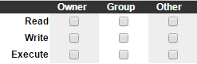
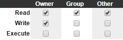

# Objectives

* Introduce the command line.
* Empower you to navigate through the filesystem and run programs from the command line.
* Have everything installed and ready to go for the following weeks.

# But first...

For the weeks to come you are going to be working in a version of Linux. Now hold your horses just yet, as we won't ask you to swap your operating system or create some kind of dual boot construction. Instead, you are going to be working in a virtual machine (the CS50 Appliance) while using a hypervisor (VMWare Workstation / Fusion). In this Appliance you can compile source code from lectures and implement problem sets yourself without having to figure out how to configure clang (a compiler), etc. Moveover, the CS50 Appliance lets you run Linux inside of a window on your own computer, even if you're already running Linux, Mac, or Windows.

# How to install?

## Windows / Linux

1. Download [VMWare Workstation 11](https://my.vmware.com/web/vmware/info/slug/desktop_end_user_computing/vmware_workstation/11_0).
2. Download the [CS50 Appliance](http://mirror.cs50.net/appliance50/2014/releases/29/appliance50-2014-vmware.ova).
3. Send an E-mail to help@mprog.nl and request a VMWare Workstation 11 key.
4. Follow instructions from step 3 [here](https://manual.cs50.net/appliance/2014/workstation/).

### Mac
1. Download [VMWare Fusion 7](https://my.vmware.com/web/vmware/info/slug/desktop_end_user_computing/vmware_fusion/7_0).
2. Download the [CS50 Appliance](http://mirror.cs50.net/appliance50/2014/releases/29/appliance50-2014-vmware.ova).
3. Send an E-mail to help@mprog.nl and request a VMWare Fusion 7 key.
4. Follow instructions from step 3 [here](https://manual.cs50.net/appliance/2014/fusion/).

If you run into any trouble installing do not hesitate to ask for help!

# Lets boot

With everything installed, we are ready to go and boot the CS50 Appliance for the first time. So go ahead, run your version of VMWare and from there boot the CS50 Appliance. Booting the Appliance might take a minute or so, please be patient! You should end up on John Harvard's desktop.

If the Appliance feels unbearably slow you might need to enable [hardware virtualization](https://manual.cs50.net/virtualization). Even with hardware virtualization enabled, though, virtual machines might feel slow if you are using an older machine. Alternatively you can crank up your virtual machine by allowing it to use more than one processor core and more RAM. Simply exit the Appliance and reboot VMWare. You should now be on the screen where you can boot the Appliance, instead of doing so, click **Edit virtual machine settings**. Here you can change the innards of the virtual machine! Be wary of the specifications of your physical machine though!

If your Appliance is running in a small window even though you clicked the fullscreen button (one of the top buttons in VMWare). You might want to increase your resolution as by default the Appliance runs a resolution of 800x600! To do this, select **Menu** > **Settings Manager** > **Display** within the Appliance, select a new value to the right of resolution and press close.

# Update

Before going any further, make sure your Appliance is up to date by opening the terminal (located on the taskbar within the Appliance). When you have the terminal open type: `update50`, and press enter. During this update process you will see many lines of text flying by. Just patiently wait it out before continueing with this assignment.

# Dropbox

To reduce the risk of you losing important files, and hopefully lessen the number of the-dog-ate-my-homework arguments, we strongly urge you to use Dropbox. Dropbox is a cloud service that has you store and synchronize files, such that if your Computer or Appliance breaks down your important files are still stored somewhere within the cloud. To install Dropbox on the Appliance follow [these instructions](https://manual.cs50.net/appliance/2014/#how_to_enable_dropbox).

# This is the CS50 Appliance

Lets start exploring the Appliance a bit. In the taskbar you will find three pre installed programs: Gedit, Google Chrome, and the Terminal.

Go ahead and run Gedit. You will see it is just a text editor (think Notepad, not Microsoft Word). You will use Gedit in the weeks to come to do your coding. Gedit also supports a few cool features such as a build-in terminal and syntax highlighting.

Now run Google Chrome, which as you probably already know is an internet browser. If all is correct, you should be able to browse the web now. So go ahead and open this page within your Appliance.

Welcome back! Okay, now lets run the terminal. The terminal is a text based interface to your computer, instead of a graphic interface which you are most likely used to. Go ahead and enter a simple command: 

	echo "Hello, World!"

You should now see a new line with Hello, World! printed. The command that was executed was echo, which as you might have guessed echos its parameter which is "Hello, World!".

# We need to go deeper

## Running programs

Lets explore the terminal a bit more, lets try running Gedit from the terminal. Close Gedit if you still have it open, and enter in the terminal:

	gedit

Gedit should now have popped up, and should be all set to text edit. Now instead of running a simple command such as echo, we are running an entire graphical program from the terminal. But you should notice a slight difference when returning to the terminal. You can no longer issue new commands! This is because you are still running Gedit. So go ahead and close Gedit. You should now see that you are able to enter commands once again.

Okay, lets run some more programs. Just a hint before we continue, copy-paste within the terminal is ctrl+shift+c for copy and ctrl+shift+v for paste. Now enter or rather copy-paste in the terminal:

	google-chrome https://www.youtube.com/watch?v=rfh4Mhp-a6U

Just like before we issued a command (google-chrome), passed it an argument (the URL) and are now running a program (Google Chrome). If you already had Google Chrome open, you should see it created a new tab, rather than creating a new window. As such the terminal is not occupied and we can continue entering commands. If you did not have Google Chrome open beforehand, simply close it now. 

## Navigating

So you have seen how to run programs from the terminal. So now lets explore the linux file system from within the terminal. As the terminal is text based you cannot simply click your way through the directories as you might do under Windows or under Mac. Instead you have to enter commands to navigate your way through. First things first, you should see the following line in the terminal:

	jharvard@appliance (~):

What this means is that you are on John Harvards desktop in the home directory (the ~). Now enter the following command:

	ls

You should see a new line printed with a list (ls = LiSt) of all the directories (in blue) and files (in white) within your home directory. Time to leave base, lets go to your Dropbox directory, which should be in the list printed by ls. If not, go back and install Dropbox! Now enter the command:

	cd Dropbox

You should now see a small change, namely ~ changed to ~/Dropbox. This essentially means you are now within the Dropbox directory which parent is the Home directory. So you changed your directory (cd = Change Directory) to Dropbox. Now lets head back. Enter the following command:

	cd ..

Here you used the change directory command to move to the .. directory, which is simply the parent directory. Hence, you are now back in the home directory again as this was the parent of the Dropbox directory. There are multiple ways to go to the home directory: cd, and cd ~ both work. Okay, back to the Dropbox folder. Getting tired of typing? Try the following, press tab once after entering the following:

	cd Dr

You should see that the terminal auto completes the directory name. This only works if there are no files which start with Dr in this directory. If there are files which start with Dr the terminal will auto-complete as far as it can, and leave the choice which directory or file to pick to the user, that is you. To see which directories or files the terminal is unsure about in such a case you can hit tab twice.

## Creating and Removing

Navigate over to your Desktop directory. Note that Desktop is a child directory of your Home directory. Once there, execute the following command:

	mkdir pset

This created a directory called pset within your Desktop directory. You can check this by simply executing ls as seen before. Now lets move pset from your Desktop directory to your Dropbox directory. There multiple ways to achieve this, but lets just pick one:

	mv pset ~/Dropbox

You have just executed the command mv (move) which takes in two arguments: a source (pset) and a target (~/Dropbox). By executing this we have effectively moved the directory pset from Desktop to Dropbox. Now navigate over to your Dropbox Directory. Check if pset is actually there. Then execute this command:

	mv pset "pset 0"

Okay, what just happened? Go ahead and execute ls. You should see that there is no directory called pset, but instead there is a directory called pset 0. This is the double nature of the command mv. You can use it to move directories and to rename them. But wait, why are the quotes there? Well, if the quotes were not there mv would receive three arguments, as arguments are seperated with spaces. The quotes simply indicate that pset 0 is one argument instead of two. Alternatively you can use the \ to escape the space. The command would then look like this: mv pset pset\ 0. Now lets put pset 0 to use, navigate your way to the pset 0 directory. Once inside, execute the following command:

	touch test.txt

Touch is a simple command that creates new and empty files, if they do not exist. As such, you have just created the file test.txt. Go ahead and check if it is actually empty by opening it with Gedit. Okay now lets get rid of this file. Execute the following:

	rm test.txt

You should see a prompt that asks if you are sure that you want to delete this file. It is a simple yes/no question and answering with either y or yes will remove the file. Be wary though, removed means removed. Recovering files removed by rm is quite a challenge. Now lets remove the pset 0 directory. To do this navigate to its parent directory and execute the following:

	rm pset\ 0

Eh, that did not quite work. This is because Linux makes a distinction between directories and files. To protect you from carelessly deleting directories. In order to remove a directory use the following command:

	rmdir pset\ 0

This is a command specifically for deleting directories, and as such the pset 0 directory is now gone. However, this command only works if the directory you are trying to delete is empty. If it is not, you have to use: rm -r directory_name, or rm -rf directory_name. The -r and -rf flags are optional arguments which you can pass to the rm command. The -r flag indicates remove all files and directories within the directory, but ask the user for every file/directory if it needs to be deleted. The -rf flag is similar, only now with no questions asked. Be very cautious when using the latter, as it will not ask if you actually want to delete the directory and each file in it, it will just do it. As such you can delete the entire Appliance with just a single command. Great power, comes with great responsibility.

## But wait, there is more

There are many more commands that you will use during this course, but by now you should understand the general structure of commands:

	command <optional flags> [arguments]

Instead of exhaustively listing whatever you might use during this course, we will leave you with a shortlist of commands which you may find usefull:

* `ls -a` (lists all files in the current directory, including hidden ones)
* `ls -R` (lists all files including those in subdirectories)
* `zip -r zip_file_name directory_name` (zips all files and subdirectores in directory_name into a new zip file called zip_file_name)
* `unzip zip_file_name` (unzips zip_file_name in the current directory)
* `wget resource` (downloads resource and saves it within the current directory)
* `cp file_name1 file_name2` (copies file_name1 to file_name2)
* `pwd` (print working directory)

# Can't touch this

Linux limits file and directory access on three permissions to three classes of users. The permissions are read, write and execute. The classes are owner, group and other.

The permissions are rather self explanatory, depening on the what is set, you may or may not read, write or execute the file/directory. The classes of users are a bit more tricky. Essentially each file/directory has an owner class which is set by the owner of the file/directory. Each file/directory is assigned to a group, permissions than affect all members of this group. Users who are in neither class, belong to the others class. 

Lets dive into an example. For instance, lets make the file read only for every user, except the owner who also gets write permission.

To achieve this we assigned the owners class the read/write permission and all other classes only read permission. What we achieved by this is allow only you, the owner of the file, to modify its contents. All other users can only read it. Such restrictions can be very usefull when dealing with for instance remote users, or other users using your machine. 

Lets go back a bit, and see how we can restrict file access for a file from the terminal. First note that there are no checkboxes, we have to do this with text commands. So lets first rewrite the previous example in text, we will use the following notation:

	rw-r--r--

The first three characters stand for the owner class, the second three for the group class and the final three for the others class. Each character represents either the (r)ead, (w)rite, (e)xecute permission respectively or - which stands for not allowed. Now go ahead, and create a file called `test.txt` and then execute the following command:

	ls -l test.txt

You should now see a print which will tell you the permissions set for the file you just created. These permissions are most likely `rw-------`. Which means read, write for the user, no access for anyone else. In order to change this, we are going to have to go one step further, and indicate file permission using numbers. Our example would then look like this:

	644

How does this work? It is binary! When you write this out in binary it should read 110,100,100. Now compare this to `rw-r--r--` and the pattern should become clear. Essentially whenever there is a 1, it means this permission is set and a 0 means it is not. It thus requires a bit of puzzling with binary numbers, but that is all there is to it. In order to now change the permissions of your test.txt file, you can use the chmod command. Execute the following:

	chmod 644 test.txt

Go ahead and check the permissions for test.txt using that ls command you used earlier. What chmod does is it takes in a file as first argument, and the permissions for that file as second argument, and simply modifies the permissions. So there you go, you just modified the permissions for test.txt. 

Want to see what happens if you do not have write permission? Go ahead and change the permission to read only for the owner, and see what happens if you try to change the file in Gedit and then try to save it.

# The assignment

For this assignment you have to download a zip file which contains the directory hierarchy as seen below:

	dir1
		dir1_1
			file1.txt
		dir1_2
			file2.txt
			file3.txt
		dir1_3
			dir1_3_1
				file4.txt
			dir1_3_2
	dir2
		dir2_1
			file5.txt
			file6.txt
			file7.txt
			file8.txt
			file9.txt
			file10.txt

Now it is your assignment to transform the above into the below.

	dir1
		file1.txt
		file2.txt
	dir2
		file3.txt
		file4.txt
	dir3
		file5.txt
		file6.txt
	dir4
		file7.txt
		file8.txt
	dir5
		file9.txt
		file10.txt

Furthermore, all access permissions should be set to read only for the owner, and no permissions for any other class. Once finished, zip the new directory hierarchy in a zip file called `answer.zip`. 

While doing this assignment keep track of all the commands you execute within a text file called `commands.txt`, and briefly eleborate why you executed these commands.

You are not limited to using only the commands introduced in this text. Google is your friend!

As always, do not hesitate to ask for help!

Download the assignments zip file [here](linux intro.zip). The zip file will be downloaded in ~/Downloads. 

## How to submit
Head on over to the submit tab on this page, and submit `answer.zip` and `commands.txt`.