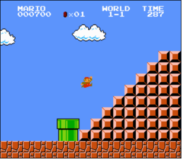

# Problem set 1 (Mario)

## Getting started

* This text assumes you have the appliance up and running. If not, head back to the "Appliance" page for instructions on how to do so.

* To ensure your appliance remains up to date, be sure to update your appliance every now and then. To do so, open up your **Terminal** and type

		update50

  which will then proceed to download any updates and install them.

* Know that, whenever your appliance has internet issues, you can type

		connect50

  to have the appliance automatically fix these issues for you! You might need to restart the appliance after you've ran `connect50` for the changes to take effect.

* Now, let's start on the problem set. First, create a new directory for your problem set's files to live in. Open up your **terminal** and type

		cd Desktop

  which will move you from your current position to your Desktop. Once there, you should see that your prompt has changed from
  
		jharvard@appliance (~):

  to

		jharvard@appliance (~/Desktop):

* Next, create a new directory named `pset1` by executing

		mkdir pset1

* Now, you can move yourself to this newly created directory by executing

		cd pset1

  which should change your prompt to

		jharvard@appliance (~/Desktop/pset1):

* Using the `touch` command, you can create a new file, not unlike how you've just created a new directory. To create a file called `hello.c`, type

		touch hello.c

* To change the contents of this new and empty file, type

		gedit hello.c

  to open the file in an editor that might be reminiscent of Notepad. This will be the program you'll be using to write your code during the course. For now, just close the file again without writing anything to it.

* Up until now, we have just used only the **terminal** to navigate through the appliance. You can also navigate through the appliance in the way you're probably used to when using Windows or MAC OS (as per using your mouse to navigate through a Guided User Interface), but it's best to get comfortable with using the terminal as soon as possible. You'll definitely need it for certain other tasks soon enough!

<iframe width="711" height="400" src="http://www.youtube.com/embed/HkQD6aw7oDc" frameborder="0" allowfullscreen></iframe>

* Navigate to your `pset1` folder using the **terminal** and then type

		gedit hello.c

  to open up your `hello.c` file in a text editor.

* Go ahead and write your first program by typing these lines into the file:

		#include <stdio.h>
		
		int main(void)
		{
			printf("hello, world\n");
		}

* Notice how gedit adds syntax highlighting (color) as you type. Those colors are not actually saved inside of the file itself; they are just added by gedit to make certain syntax stand out. Had you not saved the file as `hello.c` from the start, gedit would not know (per the extension) that you are writing C code, in which case those colors would be absent.

* Do be sure that you type in this program just right, else youre about to experience your first bug! In particular, capitalization matters, so don't accidentally capitalize words (unless theyre between those two quotes). And don't overlook that one semicolon. C is quite nitpicky!

* When done typing, select **File > Save** (or hit ctrl-s), but don't quit. Recall that the leading asterisk in the tabs name should then disappear.

* As you can see, gedit itself also has a **terminal** window, although it initially rests in your home directory. Type

		cd Desktop/pset1

  to immediately move yourself from your home directory to your `pset1` directory. You can then use

		ls

  to confirm that your `hello.c` file is indeed there. `ls` stands for "list", and provides a listing of the contents of the current directory, whereas `cd` stands for "change directory".

* Assuming `ls` indeed shows `hello.c`, you can type

		make hello

  to compile your textual code into binary code that the computer can execute. If you just receive the same prompt, you're succesful! You can then type

		./hello

  to execute the binary code you just generated.

* If, though, upon running `make`, you instead see some error(s), its time to debug! (If the terminal windows too small to see everything, click and drag its top border upward to increase its height.) If you see an error like expected declaration or something no less mysterious, odds are you made a syntax error (a typo) by omitting some character or adding something in the wrong place. Scour your code for any differences vis-a-vis the template above. Its easy to miss the slightest of things when learning to program, so  do compare your code against ours character by character; odds are the mistake(s) will jump out! Anytime you make changes to your own code, just remember to re-save via **File > Save** (or ctrl-s), then re-click inside of the terminal window, and then re-type

		make hello

  at your prompt, followed by Enter. (Just be sure that you are inside of `~/Desktop/pset1` within your terminal window, as your prompt will confirm or deny.) If you see no more errors, try running your program by typing

		./hello

  at your prompt! Hopefully you now see precisely the below?

		hello, world

## Using check50

* Now lets see if the program you just wrote is correct! Included in the CS50 Appliance is `check50`, a command-line program with which you can check the correctness of (some of) your programs.

* To check your implementation of `hello.c` which you've just written, navigate to your folder as per

		cd Desktop/pset1

  and then execute

		check50 2013.pset1.hello hello.c

  to perform `check50` over your program. If all commentary is green-colored, your program is fully correct. If one or more yellow or red commentaries appear, you've made a mistake. Best to retrace your steps, or ask an assistant for help!

## Using style50

* In addition to `check50`, the CS50 Appliance comes with `style50`, a tool with which you can evaluate your codes style. To run it on, say, `hello.c`, execute the below:

		style50 hello.c

* You should see zero or more lines of suggestions. Yellow smilies indicate warnings that you should consider addressing. Red smilies indicate errors that you should definitely address.

* Know that `style50` does not scour your code for all possible style flaws. For example, it cannot understand the comments you type. In other words, having a flawless output from `style50` does not in fact mean that your code style itself is also flawless.

## Shorts

* 

* Be sure you're comfortable with answering the following questions:

  "What is a library?"
  
  "What role does `#include <cs50.h>` play when you write it atop some program?"
  
  "What role does `-lcs50` play when you pass it as a command-line argument to `clang`?"
  
* Then, watch these video's: [Clang and Make](http://cs50.tv/2012/fall/shorts/make_clang/make_clang-720p.mp4), [code style](http://cs50.tv/2012/fall/shorts/style/style-720p.mp4).

## `mario.c`

* Toward the end of World 1-1 in Nintendo's Super Mario Brothers, Mario must ascend a "half-pyramid" of blocks before leaping (if he wants to maximize his score) toward a flag pole. Below is a screenshot.

  

* Write, in a file called `mario.c` in your `~/Desktop/pset1` directory, a program that recreates this half-pyramid using hashes (#) for blocks. However, to make things more interesting, first prompt the user for the half-pyramids height, a non-negative integer no greater than 23. (The height of the half-pyramid pictured above happens to be 8.) If the user fails to provide a non-negative integer no greater than 23, you should re-prompt for the same again. Then, generate (with the help of printf and one or more loops) the desired half-pyramid. Take care to align the bottom-left corner of your half-pyramid with the left-hand edge of your terminal window, as in the sample output below.

		jharvard@appliance (~/Desktop/pset1): ./mario
		Height: 8
		       ##
		      ###
		     ####
		    #####
		   ######
		  #######
		 ########
		#########

* Note that the rightmost two columns of blocks must be of the same height. No need to generate the pipe, clouds, numbers, text, or Mario himself.

* By contrast, if the user fails to provide a non-negative integer no greater than 23, your programs output should instead resemble the below (Recall that `GetInt` will handle some, but not all, re-prompting for you.)

		jharvard@appliance (~/Dropbox/pset1): ./mario
		Height: -2
		Height: -1
		Height: foo
		Retry: bar
		Retry: 1
		##

* Remember that you can use

		make mario

  to compile your program and then

		./mario

  to run it.

* You can check the correctness of your program with

		check50 2013.pset1.mario mario.c

  and/or run our own example implementation (for comparison) with:

		~cs50/pset1/mario

* To get you on your way,
  [watch this video](http://www.youtube.com/watch?v=z32BxNe2Sfc).

## Final steps

* When you are done with `mario.c`, submit it by going over to the **Submit** tab. Be sure to compile and test one last time before you submit. (Note that you do not have to submit `hello.c`.)

* All done!
