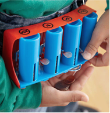

# Greedy

## `greedy.c`

* "Counting out change is a blast (even though it boosts mathematical skills) with this spring-loaded changer that you wear on your belt to dispense quarters, dimes, nickels, and pennies into your hand." Or so says the website on which we found this here accessory (for ages 5 and up).

  

* Of course, the novelty of this thing quickly wears off, especially when someone pays for a newspaper with a big bill. Fortunately, computer science has given cashiers everywhere ways to minimize numbers of coins due: greedy algorithms.

* According to the National Institute of Standards and Technology (NIST), a greedy algorithm is one "that always takes the best immediate, or local, solution while finding an answer. Greedy algorithms find the overall, or globally, optimal solution for some optimization problems, but may find less-than-optimal solutions for some instances of other problems."

* Whats all that mean? Well, suppose that a cashier owes a customer some change and on that cashiers belt are levers that dispense quarters, dimes, nickels, and pennies. Solving this "problem" requires one or more presses of one or more levers. Think of a "greedy" cashier as one who wants to take, with each press, the biggest bite out of this problem as possible. For instance, if some customer is owed 41 cents, the biggest first (i.e., best immediate, or local) bite that can be taken is 25 cents (in the case of dollars, that is). Note that a bite of this size would whittle what was a 41 cent problem down to a 16 cent problem, since 41 - 25 = 16. That is, the remainder is a similar but smaller problem. Needless to say, another 25 cent bite would be too big (assuming  the cashier prefers not to lose money), and so our greedy cashier would move on to a bite of size 10 cents, leaving him or her with a 6 cent problem. At that point, greed calls for one 5 cent bite followed by one 1 cent bite, at which point the problem is solved. The customer receives one quarter, one dime, one nickel, and one penny: four coins in total.

* It turns out that this greedy approach (i.e., algorithm) is not only locally optimal but also globally so for Americas currency (and also the European Unions). That is, so long as a cashier has enough of each coin, this largest-to-smallest approach will yield the fewest coins possible.

* How few? Well, you tell us. Write, in a file called `greedy.c` in your `~/Dropbox/pset2` directory, a program that first asks the user how much change is owed and then spits out the minimum number of coins with which said change can be made. Use `GetFloat` from the CS50 Library to get the users input and printf from the Standard I/O library to output your answer. Assume that the only coins available are quarters (0,25), dimes (0,10), nickels (0,05), and pennies (0,01). **Do not write your program using European currency!**

* We ask that you use `GetFloat` so that you can handle dollars and cents, albeit sans dollar sign. In other words, if some customer is owed $9,75 (as in the case where a newspaper costs $0,25 but the customer pays with a $10 bill), assume that your programs input will be 9.75 and not $9.75 or 975. However, if some customer is owed $9 exactly, assume that your programs input will be 9.00 or just 9 but, again, not $9 or 900. Of course, by nature of floating-point values, your program will likely work with inputs like 9.0 and 9.000 as well; you need not worry about checking whether the users input is "formatted" like money should be. And you need not try to check whether a users input is too large to fit in a float. But you should check that the users input makes cents! Er, sense. Using `GetFloat` alone will ensure that the users input is indeed a floating-point (or integral) value but not that it is non-negative. If the user fails to provide a non-negative value, your program should re-prompt the user for a valid amount again and again until the user complies.

* Incidentally, do beware the inherent imprecision of floating-point values. For instance, 0.01 cannot be represented exactly as a float. Try printing its value to, say, 50 decimal places, with code like the below:

		float f = 0.01;
		printf("%.50f\n", f);

* Before doing any math, then, you'll probably want to convert the users input entirely to cents (i.e., from a `float` to an `int`) to avoid tiny errors that might otherwise add up! Of course, dont just cast the users input from a `float` to an int! After all, how many cents does one dollar equal? And be careful to round and not truncate your pennies!

* If you need some help getting started, you can watch the video below.

<iframe width="711" height="400" src="http://www.youtube.com/embed/9dZzyl7dCuw" frameborder="0" allowfullscreen></iframe>

* Remember that you can use `check50` to check the correctness of your solution. The `check50` command for this particular program is

		check50 2013.pset1.greedy greedy.c

  To have your program pass the tests, it should only output one integer, which is the amount of coins to return. In other words, do not seperately print the amount of, say, pennies, in addition to this number. Your solutions should always be compliant with `check50`; address any yellow and red warnings you receive from `check50` if you can! And when in doubt, ask the assistants to help you!

## Final steps

* When you are done with `greedy.c`, submit it by going over to the **Submit** tab. Be sure to compile and test one last time before you submit.

* All done!