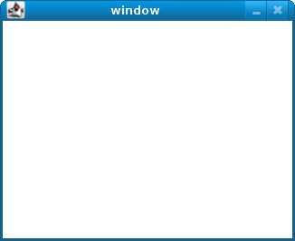
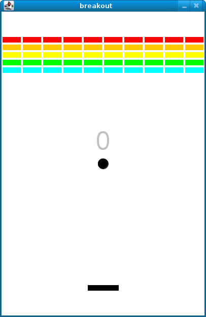
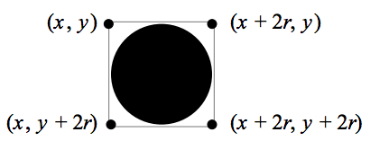

# Objectives

* Accustom you to reading someone else’s code.
* Introduce you to an API.
* Acquaint you with event handling.
* Impress your friends.

# Getting started

* Let's ensure that the Appliance is up to date by running `update50` from a Terminal before starting.

Recall that, for Problem Sets 1 and 2, you started writing programs from scratch, creating your own **pset1** and **pset2** directories with **mkdir**. For Problem Set 3, you’ll instead download "distribution code" (otherwise known as a "distro"), written by us, and add your own lines of code to it. You’ll first need to read and understand our code, though, so this problem set is as much about learning to read someone else’s code as it is about writing your own!

Let’s get you started. Go ahead and open a terminal window if not open already (whether by opening gedit via *Menu* > *Accessories* > *gedit* or by opening Terminal itself via *Menu* > *Accessories* > *Terminal*). Then execute

	update50

to make sure your appliance is up-to-date. Then close the terminal window (or gedit) and re-open it. Then execute

	cd ~/Dropbox

followed by

	wget http://cdn.cs50.net/2014/fall/psets/3/pset3/pset3.zip

to download a ZIP of this problem set’s distro into your appliance (with a command-line program called **wget**). You should see a bunch of output followed by:

	'pset3.zip' saved

If you instead see

	unable to resolve host address

your appliance probably doesn’t have Internet access (even if your laptop does), in which case the simplest fix is probably to restart your appliance via *Menu* > *Log Off*, after which you can try **wget** again.

Ultimately, confirm that you’ve indeed downloaded **pset3.zip** by executing:

	ls

Then, run

	unzip pset3.zip

to unzip the file. If you then run **ls** again, you should see that you have a newly unzipped directory called **pset3** as well. Proceed to execute

	cd pset3

followed by

	ls

and you should see that the directory contains two "subdirectories":

	breakout  find

How fun!

# Searching

Okay, let’s dive into one of those subdirectories. Execute the command below in a terminal window.

	cd ~/Dropbox/pset3/find

If you list the contents of this directory (remember how?), you should see the below.

	helpers.c  helpers.h  Makefile  find.c  generate.c

Wow, that’s a lot of files, eh? Not to worry, we’ll walk you through them.

Implemented in **generate.c** is a program that uses a "pseudorandom-number generator" (via a function called **drand48**) to generate a whole bunch of random (well, pseudorandom, since computers can’t actually generate truly random) numbers, one per line. Go ahead and compile this program by executing the command below.

	make generate

Now run the program you just compiled by executing the command below.

	./generate

You should be informed of the program’s proper usage, per the below.

	Usage: generate n [s]

As this output suggests, this program expects one or two command-line arguments. The first, **n**, is required; it indicates how many pseudorandom numbers you’d like to generate. The second, **s**, is optional, as the brackets are meant to imply; if supplied, it represents the value that the pseudorandom-number generator should use as its "seed." A seed is simply an input to a pseudorandom-number generator that influences its outputs. For instance, if you seed **drand48** by first calling **srand48** (another function whose purpose is to "seed" **drand48**) with an argument of, say, **1**, and then call **drand48** itself three times, **drand48** might return **2728**, then **29785**, then **54710**. But if you instead seed **drand48** by first calling **srand48** with an argument of, say, **2**, and then call **drand48** itself three times, **drand48** might instead return **59797**, then **10425**, then **37569**. But if you re-seed **drand48** by calling **srand48** again with an argument of **1**, the next three times you call **drand48**, you’ll again get **2728**, then **29785**, then **54710**! See, not so random.

Go ahead and run this program again, this time with a value of, say, **10** for **n**, as in the below; you should see a list of 10 pseudorandom numbers.

	./generate 10

Now run that same command again:

	./generate 10 0

Bet you saw the same "random" sequence of ten numbers again? Yup, that’s what happens if you don’t vary a pseudorandom number generator’s initial seed.

Now take a look at **generate.c** itself with **gedit**. (Remember how?) Comments atop that file explain the program’s overall functionality. But it looks like we forgot to comment the code itself. Read over the code carefully until you understand each line and then comment our code for us, replacing each **TODO** with a phrase that describes the purpose or functionality of the corresponding line(s) of code. (Know that an **unsigned int** is just an **int** that cannot be negative.) And for more details on **rand** and **srand**, recall that you can execute:

	man drand48

and

	man srand48

(Those functions aren’t in [CS50 Reference](https://reference.cs50.net/)).

Once done commenting **generate.c**, re-compile the program to be sure you didn’t break anything by re-executing the command below.

	make generate

If **generate** no longer compiles properly, take a moment to fix what you broke!

Now, recall that **make** automates compilation of your code so that you don’t have to execute **clang** manually along with a whole bunch of switches. Notice, in fact, how **make** just executed a pretty long command for you, per the tool’s output. However, as your programs grow in size, **make** won’t be able to infer from context anymore how to compile your code; you’ll need to start telling **make** how to compile your program, particularly when they involve multiple source (i.e., **.c**) files. And so we’ll start relying on "Makefiles," configuration files that tell **make** exactly what to do.

How did **make** know how to compile generate in this case? It actually used a configuration file that we wrote. Using **gedit**, go ahead and look at the file called **Makefile** that’s in the same directory as **generate.c**. This **Makefile** is essentially a list of rules that we wrote for you that tells make how to build generate from **generate.c** for you. The relevant lines appear below.

	generate: generate.c clang -ggdb3 -O0 -std=c99 -Wall -Werror -o generate generate.c

The first line tells **make** that the "target" called **generate** should be built by invoking the second line’s command. Moreover, that first line tells **make** that **generate** is dependent on **generate.c**, the implication of which is that **make** will only re-build generate on subsequent runs if that file was modified since **make** last built **generate**. Neat time-saving trick, eh? In fact, go ahead and execute the command below again, assuming you haven’t modified **generate.c**.

	make generate

You should be informed that generate is already up-to-date. Incidentally, know that the leading whitespace on that second line is not a sequence of spaces but, rather, a tab. Unfortunately, **make** requires that commands be preceded by tabs, so be careful not to change them to spaces with **gedit** (which automatically converts tabs to four spaces), else you may encounter strange errors! The **-Werror** flag, recall, tells **clang** to treat warnings (bad) as though they’re errors (worse) so that you’re forced (in a good, instructive way!) to fix them.

Now take a look at **find.c** with **gedit**. Notice that this program expects a single command-line argument: a "needle" to search for in a "haystack" of values. Once done looking over the code, go ahead and compile the program by executing the command below.

	make find

Notice, per that command’s output, that **make** actually executed the below for you.

	clang -ggdb3 -O0 -std=c99 -Wall -Werror -o find find.c helpers.c -lcs50 -lm

Notice further that you just compiled a program comprising not one but two **.c** files: **helpers.c** and **find.c**. How did **make** know what to do? Well, again, open up **Makefile** to see the man behind the curtain. The relevant lines appear below.

	find: find.c helpers.c helpers.h clang -ggdb3 -O0 -std=c99 -Wall -Werror -o find find.c helpers.c -lcs50 -lm

Per the dependencies implied above (after the colon), any changes to **find.c**, **helpers.c**, or **helpers.h** will compel **make** to rebuild find the next time it’s invoked for this target.

Go ahead and run this program by executing, say, the below.

	./find 13

You’ll be prompted to provide some hay (i.e., some integers), one "straw" at a time. As soon as you tire of providing integers, hit ctrl-d to send the program an **EOF** (end-of-file) character. That character will compel **GetInt** from the CS50 Library to return **INT_MAX**, a constant that, per **find.c**, will compel **find** to stop prompting for hay. The program will then look for that needle in the hay you provided, ultimately reporting whether the former was found in the latter. In short, this program searches an array for some value. At least, it should, but it won’t find anything yet! That’s where you come in. More on your role in a bit.

It turns out you can automate this process of providing hay, though, by "piping" the output of **generate** into **find** as input. For instance, the command below passes 1,000 pseudorandom numbers to **find**, which then searches those values for **42**.

	./generate 1000 | ./find 42

Note that, when piping output from **generate** into **find** in this manner, you won’t actually see **generate**'s numbers, but you will see **find**'s prompts.

Alternatively, you can "redirect" **generate**'s output to a file with a command like the below.

	./generate 1000 > numbers.txt

You can then redirect that file’s contents as input to **find** with the command below.

	./find 42 < numbers.txt

Let’s finish looking at that **Makefile**. Notice the line below.

	all: find generate

This target implies that you can build both **generate** and **find** simply by executing the below.

	make all

Even better, the below is equivalent (because **make** builds a **Makefile**'s first target by default).

	make

If only you could whittle this whole problem set down to a single command! Finally, notice these last lines in **Makefile**:

	clean: rm -f *.o a.out core find generate

This target allows you to delete all files ending in **.o** or called **core** (more on that soon!), **find**, or **generate** simply by executing the command below.

	make clean

Be careful not to add, say, **\*.c** to that last line in **Makefile**! (Why?) Any line, incidentally, that begins with **#** is just a comment.

## search

And now the fun begins! Notice that **find.c** calls **search**, a function declared in **helpers.h**. Unfortunately, we forgot to implement that function fully in **helpers.c**! (To be sure, we could have put the contents of **helpers.h** and **helpers.c** in **find.c** itself. But it’s sometimes better to organize programs into multiple files, especially when some functions are essentially utility functions that might later prove useful to other programs as well, much like those in the CS50 Library.) Take a peek at **helpers.c** with **gedit**, and you’ll see that **search** always returns **false**, whether or not **value** is in **values**. Re-write **search** in such a way that it uses linear search, returning **true** if **value** is in **values** and **false** if **value** is not in **values**. Take care to return **false** right away if **n** isn’t even positive.

When ready to check the correctness of your program, try running the command below.

	./generate 1000 50 | ./find 127

Because one of the numbers outputted by **generate**, when seeded with **50**, is **127**, your code should find that "needle"! By contrast, try running the command below as well.

	./generate 1000 50 | ./find 128

Because **128** is not among the numbers outputted by **generate**, when seeded with **50**, your code shouldn’t find that needle. Best to try some other tests as well, as by running **generate** with some seed, taking a look at its output, then piping that same output to **find**, looking for a "needle" you know to be among the "hay".

Incidentally, note that **main** in **find.c** is written in such a way that **find** returns **0** if the needle is found, else it returns **1**. You can check the so-called "exit code" with which **main** returns by executing

	echo $?

after running some other command. For instance, assuming your implementation of **search** is correct, if you run

	./generate 1000 50 | ./find 127
	echo $?

you should see **0**, since **127** is, again, among the 1,000 numbers outputted by **generate** when seeded with **50**, and so **search** (written by you) should return **true**, in which case **main** (written by us) should return (i.e., exit with) **0**. By contrast, assuming your implementation of **search** is correct, if you run

	./generate 1000 50 | ./find 128
	echo $?

you should see **1**, since **128** is, again, not among the 1,000 numbers outputted by **generate** when seeded with **50**, and so **search** (written by you) should return **false**, in which case **main** (written by us) should return (i.e., exit with) **1**. Make sense?

When ready to check the correctness of your program officially with **check50**, you may execute the below. Be sure to run the command inside of **~/Dropbox/pset3/find**.

	check50 2014.fall.pset3.find helpers.c

Incidentally, be sure not to get into the habit of testing your code with **check50** before testing it yourself. (And definitely don’t get into an even worse habit of only testing your code with **check50**!) Suffice it to say **check50** doesn’t exist in the real world, so running your code with your own sample inputs, comparing actual output against expected output, is the best habit to get into sooner rather than later. Truly, don’t do yourself a long-term disservice!

Anyhow, if you’d like to play with the staff’s own implementation of **find** in the appliance, you may execute the below.

	~cs50/pset3/find/find

# Sorting

Alright, linear search is pretty meh. Recall from Week 0 that we can do better, but first we’d best sort that hay.

## sort

Notice that **find.c** calls **sort**, a function declared in **helpers.h**. Unfortunately, we forgot to implement that function fully too in **helpers.c**! Take a peek at **helpers.c** with **gedit**, and you’ll see that **sort** returns immediately, even though **find**'s **main** function does pass it an actual array.

Now, recall the syntax for declaring an array. Not only do you specify the array’s type, you also specify its size between brackets, just as we do for **haystack** in **find.c**:

	int haystack[MAX];

But when passing an array, you only specify its name, just as we do when passing **haystack** to **sort** in **find.c**:

	sort(haystack, size);

(Why do you think we pass in the size of that array separately?)

When declaring a function that takes a one-dimensional array as an argument, though, you don’t need to specify the array’s size, just as we don’t when declaring **sort** in **helpers.h** (and **helpers.c**):

	void sort(int values[], int n);

Go ahead and implement **sort** so that the function actually sorts, from smallest to largest, the array of numbers that it’s passed, in such a way that its running time is in O(n^2), where n is the array’s size. Odds are you’ll want to implement bubble sort, selection sort, or insertion sort, if only because we discussed them in Week 3. Just realize that there’s no one "right" way to implement any of those algorithms; variations abound. In fact, you’re welcome to improve upon them as you see fit, so long as your implementation remains in O(n^2). However, take care not to alter our declaration of **sort**. Its prototype must remain:

	void sort(int values[], int n);

As this return type of **void** implies, this function must not return a sorted array; it must instead "destructively" sort the actual array that it’s passed by moving around the values therein. As we’ll discuss in Week 4, arrays are not passed "by value" but instead "by reference," which means that **sort** will not be passed a copy of an array but, rather, the original array itself.

Although you may not alter our declaration of **sort**, you’re welcome to define your own function(s) in **helpers.c** that **sort** itself may then call.

We leave it to you to determine how best to test your implementation of **sort**. But don’t forget that **printf** and, per Week 4’s first lecture, **gdb** are your friends. And don’t forget that you can generate the same sequence of pseudorandom numbers again and again by explicitly specifying **generate**'s seed. Before you ultimately submit, though, be sure to remove any such calls to **printf**, as we like our programs' outputs just the way they are!

Here’s Zamyla with some tips:

<iframe width="711" height="400" src="http://www.youtube.com/embed/U8k-0StE1Ik" frameborder="0" allowfullscreen></iframe>

Again, if you’d like to play with the staff’s own implementation of **find** in the appliance, you may execute the below.

	~cs50/pset3/find/find

No **check50** for this one!

## search

Now that **sort** (presumably) works, it’s time to improve upon **search**, the other function that lives in **helpers.c**. Recall that your first version implemented linear search. Rip out the lines that you wrote earlier (sniff) and re-implement **search** as Binary Search, that divide-and-conquer strategy that we employed in Week 0. You are welcome to take an iterative approach (as with a loop) or a recursive approach (wherein a function calls itself). If you pursue the latter, though, know that you may not change our declaration of **search**, but you may write a new, recursive function (that perhaps takes different parameters) that **search** itself calls. When it comes time to submit this problem set, it suffices to submit this new-and-improved version of **search**; you needn’t submit your original version that used linear search.

Here’s Zamyla again:

<iframe width="711" height="400" src="http://www.youtube.com/embed/7DSRJj7qfP8" frameborder="0" allowfullscreen></iframe>

# Backstory

One day in the late summer of 1975, Nolan Bushnell [founder of Atari and, um, Chuck E. Cheese’s], defying the prevailing wisdom that paddle games were over, decided to develop a single-player version of Pong; instead of competing against an opponent, the player would volley the ball into a wall that lost a brick whenever it was hit. He called [Steve] Jobs into his office, sketched it out on his little blackboard, and asked him to design it. There would be a bonus, Bushnell told him, for every chip fewer than fifty that he used. Bushnell knew that Jobs was not a great engineer, but he assumed, correctly, that he would recruit [Steve] Wozniak, who was always hanging around. "I looked at it as a two-for-one thing," Bushnell recalled. "Woz was a better engineer."

Wozniak was thrilled when Jobs asked him to help and proposed splitting the fee. "This was the most wonderful offer in my life, to actually design a game that people would use," he recalled. Jobs said it had to be done in four days and with the fewest chips possible. What he hid from Wozniak was that the deadline was one that Jobs had imposed, because he needed to get to the All One Farm to help prepare for the apple harvest. He also didn’t mention that there was a bonus tied to keeping down the number of chips.

"A game like this might take most engineers a few months," Wozniak recalled. "I thought that there was no way I could do it, but Steve made me sure that I could." So he stayed up four nights in a row and did it. During the day at HP, Wozniak would sketch out his design on paper. Then, after a fast-food meal, he would go right to Atari and stay all night. As Wozniak churned out the design, Jobs sat on a bench to his left implementing it by wire-wrapping the chips onto a breadboard. "While Steve was breadboarding, I spent time playing my favorite game ever, which was the auto racing game Gran Trak 10," Wozniak said.

Astonishingly, they were able to get the job done in four days, and Wozniak used only forty-five chips. Recollections differ, but by most accounts Jobs simply gave Wozniak half of the base fee and not the bonus Bushnell paid for saving five chips. It would be another ten years before Wozniak discovered (by being shown the tale in a book on the history of Atari titled Zap) that Jobs had been paid this bonus….

Steve Jobs
— Walter Isaacson '74

# Breaking Out

Your final challenge for this problem set is to implement the same game that Steve and Steve did, albeit in software rather than hardware. That game is Breakout.

Whereas all of your C programs to date have only had "command-line interfaces" (CLIs), this one will have a graphical user interface (GUI), not unlike Scratch! You’ll be building Breakout atop the Stanford Portable Library (SPL), which is similar in spirit to the CS50 Library but includes an "application programming interface" (API) for GUI programming and more.

Let’s take a look at what you can do with SPL by way of some of Week 4’s examples. Go ahead and execute the below.

	cd ~/Dropbox
	wget http://cdn.cs50.net/2014/fall/lectures/4/m/src4m.zip
	unzip src4m.zip
	rm -f src4m.zip
	cd src4m

If you then execute **ls**, among the files you see should be **bounce.c**, **button.c**, **checkbox.c**, **click.c**, **cursor.c**, **label.c**, **slider.c**, **text.c**, and **window.c**. Go ahead and compile the last of those files as follows:

	make window

And then execute it as follows:

	./window

A window quite like the below should appear and then disappear after 5 seconds.

Neat, eh? Go ahead and open up **window.c** with **gedit**. Let’s take a tour together:

How did we know how to call **newGWindow** like that? Well, there aren’t **man** pages for SPL, but you can peruse the relevant "header file" (i.e., **gwindow.h**) by executing:

	gedit /usr/include/spl/gwindow.h

What’s with **/usr/include/spl/gwindow.h**? That just means that **gwindow.h** lives deep in the appliance in a directory called **spl**, which lives in a directory called **include**, which lives in a directory called **usr**, which lives in the "root" (aka **/**) of the appliance’s (virtual) hard drive.

Anyhow, if you poke around **gwindow.h** with **gedit**, odds are you’ll be a bit overwhelmed. No biggee. Because SPL’s author has commented the code in a standard way, it turns out that you can generate more user-friendly, web-based documentation as a result! Indeed, take a look now at [http://cdn.cs50.net/2014/fall/psets/3/pset3/spl/doc/gwindow.html](here), and you’ll see a much friendlier format. (Well, relatively speaking.) Click **newGWindow** under *Functions*, and you’ll see its prototype:

	GWindow newGWindow(double width, double height);

That’s how we knew! See [http://cdn.cs50.net/2014/fall/psets/3/pset3/spl/doc/index.html](here) for an index into SPL’s documentation, though we’ll point out more specific places to look.

In the interests of full disclosure, we should mention that SPL is still in beta, so there may be some bugs in its documentation. When in doubt, best to consult those raw header files instead!

Incidentally, even though I included **gwindow.h** with

	#include "gwindow.h"

on video, we’ve since installed SPL deep inside the appliance (for convenience), so you should now include that header file (and other SPL header files) with code like:

	#include <spl/gwindow.h>

Anyhow, now open up **click.c** (in **~/Dropbox/src4m**) with **gedit**. This one’s a bit more involved but it’s representative of how to "listen" for "events", quite like those you could "broadcast" in Scratch. Let’s take a look.

<iframe width="711" height="400" src="https://www.youtube.com/embed/BStiekPFKWI" frameborder="0" allowfullscreen></iframe>

See [http://cdn.cs50.net/2014/fall/psets/3/pset3/spl/doc/gevents.html](here) for SPL’s documentation of **GEvent**.

Now open up **cursor.c** (in **~/Dropbox/src4m**) with **gedit**. This program, too, handles events, but it also responds to those events by moving a circle (well, a **GOval**) in lockstep. Let’s take a look.

<iframe width="711" height="400" src="https://www.youtube.com/embed/xsB0v8GtVMw" frameborder="0" allowfullscreen></iframe>

See [http://cdn.cs50.net/2014/fall/psets/3/pset3/spl/doc/gobjects.html](here) for SPL’s documentation of **GOval** and other types of objects.

Next open **bounce.c** (in **~/Dropbox/src4m**) with **gedit**. This one uses a bit of arithmetic to bounce a circle back and forth between a window’s edges. Let’s take a look.

<iframe width="711" height="400" src="https://www.youtube.com/embed/8RMHJe1ZpKM" frameborder="0" allowfullscreen></iframe>

Finally, take a look at **button.c**, **checkbox.c**, **label.c**, **slider.c**, and **text.c** in any order with **gedit**. And feel free to join me on a tour:

<iframe width="711" height="400" src="https://www.youtube.com/embed/uFnsMLEgajQ" frameborder="0" allowfullscreen></iframe>

And, of course, feel free to compile (as with **make**) and run any of those programs.

Phew, that was a lot. Not to worry! Even though all this might feel like a lot, all we’ve really done is introduce you to some Scratch-like puzzle pieces, albeit in C! Arcane puzzle pieces, to be sure, so do ask lots of questions of classmates and staff as needed.

## Breakout

Okay, let’s see what the distribution code for **breakout** itself does. Go ahead and execute

	cd ~/Dropbox/pset3/breakout

followed by

	make breakout

or, more simply,

	make

to compile the distro. Then execute

	./breakout

to run the program as is. A window like the below should appear.

Hm, not much of a game. Yet!

Now try out the staff’s solution by executing the below.

	~cs50/pset3/breakout

A window like the below should appear.

Wow! Go ahead and click somewhere inside that window in order to play. (You might need to enlarge your appliance’s window in order to see the entirety of the game’s window.) The goal, quite simply, is to bounce the ball off of the paddle so as to hit bricks with it. If you break all the bricks, you win! But if you miss the ball three times, you lose! To quit the game, hit control-c back in the terminal window.

Nice. Let’s make your implementation look more like that one. But, first, a tour!

Open up **breakout.c** with **gedit** and take a moment to scroll through it to get a sense of what lies ahead. Let’s walk through it from top to bottom.

* 	Atop the file you’ll see some familiar header files. We’ve also included some header files from SPL.

* 	Next up are some constants, values that you don’t need to change, but because the code we’ve written (and that you’ll write) needs to know these values in a few places, we’ve factored them out as constants so that we or you could, theoretically, change them in one convenient location. By contrast, hard-coding the same number (pejoratively known as a "magic number") into your code in multiple places is considered bad practice, since you’d have to remember to change it, potentially, in all of those places.

* 	Below those constants are a bunch of prototypes for functions that are defined below **main**. More on each of those soon.

* 	Next up is our old friend, **main**. It looks like the first thing that **main** does is "seed" that so-called PRNG with the current time. (See **man srand48** and **man 2 time** if curious.) Again, to seed a PRNG simply means to initialize it in such a way that the numbers it will eventually spit out will appear to be random. It’s deliberate, then, that we’re initializing the PRNG with the current time: time’s always changing. Were we instead to initialize the PRNG with some hard-coded value, it’d always spit out the same sequence of "random" numbers.

	After that call to **srand48**, it looks like **main** calls **newGWindow**, passing in a desired **WIDTH** and **HEIGHT**. That function "instantiates" (i.e., creates) a new graphical window, returning some sort of reference thereto. (It’s technically a pointer, but that detail, and the accompanying **\***, is, again, hidden from us by SPL.) That function’s return value is apparently stored in a variable called **window** whose type is **GWindow**, which happens to be declared in a **gwindow.h** header file that you may have glimpsed earlier.

	Next, **main** calls **initBricks**, a function written partly by us (and, soon, mostly by you!) that instantiates a grid of bricks atop the game’s window.

	Then **main** calls **initBall**, which instantiates the ball that will be used to play Breakout. Passed into that function is **window** so that the function knows where to "place" (i.e., draw) the ball. The function returns a **GOval** (graphical oval) whose width and height will simply be equal (ergo a circular ball).

	Called by **main** next is **initPaddle**, which instantiates the game’s paddle; it returns a **GRect** (graphical rectangle).

	Then **main** calls **initScoreboard**, which instantiates the game’s scoreboard, which is simply a **GLabel** (graphical label).

	Below all those function calls are a few definitions of variables, namely **bricks**, **lives**, and **points**. Below those is a loop, which is meant to iterate again and again so long as the user has lives left to live and bricks left to break. Of course, there’s not much code in that loop now!

	Below the loop is a call to **waitForClick**, a function that does exactly that so that the window doesn’t close until the user intends.

	Not too bad, right? Let’s next take a closer look at those functions.

*	In **initBricks**, you’ll eventually write code that instantiates a grid of bricks in the window. Those constants we saw earlier, **ROWS** and **COLS**, represent that grid’s dimensions. How to draw a grid of bricks on the screen? Well, odds are you’ll want to employ a pair of **for** loops, one nested inside of the other. And within that innermost loop, you’ll likely want to instantiate a **GRect** of some width and height (and color!) to represent a brick.

*	In **initBall**, you’ll eventually write code that instantiates a ball (that is, a circle, or really a **GOval**) and somehow center it in the window.

*	In **initPaddle**, you’ll eventually write code that instantiates a paddle (just a **GRect**) that’s somehow centered in the bottom-middle of the game’s window.

*	Finally, in **initScoreboard**, you’ll eventually write code that instantiates a scoreboard as, quite simply, a **GLabel** whose value is a number (well, technically, a **char\***, which we once knew as a **string**).

*	Now, we’ve already implemented **updateScoreboard** for you. All that function does, given a **GWindow**, a **GLabel**, and an **int**, is convert the **int** to a **string** (okay, **char\***) using a function called **sprintf**, after which it sets the label to that value and then re-centers the label (in case the **int** has more digits than some previous **int**). Why did we allocate an array of size **12** for our representation of that **int** as a **string**? No worries if the reason’s non-obvious, but give some though as to how wide the most positive (or most negative!) **int** might be. You’re welcome to change this function, but you’re not expected to.

*	Last up is **detectCollision**, another function that we’ve written for you. (Phew!) This one’s a bit more involved, so do spend some time reading through it. This function’s purpose in life, given the ball as a **GOval**, is to determine whether that ball has collided with (i.e., is overlapping) some other object (well, **GObject**) in the game. (A **GRect**, **GOval**, or **GLabel** can also be thought of and treated as a **GObject**, per [http://cdn.cs50.net/2013/fall/lectures/5/m/src5m/spl/doc/gobjects.html.](here)) To do so, it cuts some corners (figuratively but also kind of literally) by checking whether any of the ball’s "corners," as defined by the ball’s "bounding box", per the below (wherein *x* and *y* represent coordinates, and *r* represents the ball’s radius) are touching some other **GObject** (which might be a brick or a paddle or even something else).

Alright, ready to break out Breakout?

If you’re like me, odds are you’ll find it easiest to implement Breakout via some baby steps, each of which will get you closer and closer to a great outcome. Rather than try to implement the whole game at once, allow me to suggest that you proceed as follows:

1.	Try out the staff’s solution again (via **~cs50/pset3/breakout/breakout**) to remind yourself how our implementation behaves. Yours doesn’t need to be identical. In fact, all the better if you personalize yours. But playing with our implementation should help guide you toward yours.

2.	Implement **initPaddle**. Per the function’s return value, your paddle should be implemented as a **GRect**. Odds are you’ll first want to decide on a width and height for your paddle, perhaps declaring them both atop **breakout.c** with constants. Then calculate coordinates (*x* and *y*) for your paddle, keeping in mind that it should be initially aligned in the bottom-middle of your game’s window. We leave it to you to decide exactly where. Odds are some arithmetic involving the window’s width and height and the paddle’s width and height will help you center it. Keep in mind that *x* and *y* refer to a **GRect**'s top-left corner, not its own middle. Your paddle’s size and location doesn’t need to match the staff’s precisely, but it should be perfectly centered, near the window’s bottom. You’re welcome to choose a color for it too, for which **setColor** and **setFilled** might be of interest. Finally, instantiate your paddle with **newGRect**. (Take note of that function’s prototype at [http://cdn.cs50.net/2014/fall/psets/3/pset3/spl/doc/gobjects.html](here).) Then return the **GRect** returned by **newGRect** (rather than **NULL**, which the distribution code returns only so that the program will compile without **initPaddle** fully implemented).

3. 	Now, **initPaddle**'s purpose in life is only to instantiate and return a paddle (i.e., **GRect**). It shouldn’t handle any of the paddle’s movement. For that, turn your attention to the **TODO** up in **main**. Proceed to replace that **TODO** with some lines of code that respond to a user’s mouse movements in such a way that the paddle follows the movements, but only along its (horizontal) x-axis. Look back at **cursor.c** for inspiration, but keep in mind that **cursor.c** allowed that circle to move along a (vertical) y-axis as well, which we don’t want for Breakout, else the paddle could move anywhere (which might be cool but not exactly Breakout).

4.	Now turn your attention to the **TODO** in **initBricks**. Implement that function in such a way that it instantiates a grid of bricks (with **ROWS** rows and **COLS** columns), with each such brick implemented as a **GRect**. Drawing a **GRect** (or even a bunch of them) isn’t all that different from drawing a **GOval** (or circle). Odds are, though, you’ll want to instantiate them within a **for** loop that’s within a **for** loop. (Think back to **mario**, perhaps!) Be sure to leave a bit of a gap between adjacent bricks, just like we did; exactly how many pixels is up to you. And we leave it to you to select your bricks' colors.

5.	Now implement **initBall**, whose purpose in life is to instantiate a ball in the window’s center. (Another opportunity for a bit of arithmetic!) Per the function’s prototype, be sure to return a **GOval**.

6.	Then, back in **main**, where there used to be a **TODO**, proceed to write some additional code (within that same **while** loop) that compels that ball to move. Here, too, take baby steps. Look to **bounce.c** first for ideas on how to make the ball bounce back and forth between your window’s edges. (Not the ultimate goal, but it’s a step toward it!) Then figure out how to make the ball bounce up and down instead of left and right. (Closer!) Then figure out how to make the ball move at an angle. Then, utilize **drand48** to make the ball’s initial velocity random, at least along its (horizontal) x-axis. Note that, per its **man** page, **drand48** returns "nonnegative double-precision floating-point values uniformly distributed between [0.0, 1.0)." In other words, it returns a **double** between 0.0 (inclusive) and 1.0 (exclusive). If you want your velocity to be faster than that, simply add some constant to it and/or multiply it by some constant!

	Ultimately, be sure that the ball still bounces off edges, including the window’s bottom for now.

7.	When ready, add some additional code to **main** (still somewhere inside of that **while** loop) that compels the ball to bounce off of the paddle if it collides with it on its way downward. Odds are you’ll want to call that function we wrote, **detectCollision**, inside that loop in order to detect whether the ball’s collided with something so that, if so, you can somehow handle such an event. Of course, the ball could collide with the paddle or with any one of those bricks. Keep in mind, then, that **detectCollision** could return any such **GObject**; it’s left to you to determine what has been struck. Know, then, that if you store its return value, as with

	`GObject object = detectCollision(window, ball);`

	you can determine whether that **object** is your game’s paddle, as with the below.

	`if (object == paddle) { // TODO }`

	Once it comes time to add a **GLabel** to your game (for its scoreboard), you can similarly determine if that **object** is **GLabel**, in which case it might be a collision you want to ignore. (Unless you want your scoreboard to be something the ball can bounce off of. Ours isn’t.)

	`if (strcmp(getType(object), "GLabel") == 0) { // TODO }`

8. 	Once you have the ball bouncing off the paddle (and window’s edges), focus your attention again on that **while** loop in **main** and figure out how to detect if the ball’s hit a brick and how to remove that brick from the grid if so. Odds are you’ll find **removeGWindow** of interest, per [http://cdn.cs50.net/2014/fall/psets/3/pset3/spl/doc/gwindow.html](here). SPL’s documentation incorrectly refers to that function as **remove**, but it’s indeed **removeGWindow** you want, whose prototype, to be clear, is the below.

	`void removeGWindow(GWindow gw, GObject gobj);`

9.	Now decide how to determine whether the ball has zoomed past the paddle and struck the window’s bottom edge, in which case the user should lose a life and gameplay should probably pause until the user clicks the mouse button, as in the staff’s implementation. Odds are detecting this situation isn’t all that different from the code you already wrote for bouncing; you just don’t want to bounce off that bottom edge anymore!

10.	Lastly, implement **initScoreboard** in such a way that the function instantiates and positions a **GLabel** somewhere in your game’s window. Then, enhance **main** in such a way that the text of that **GLabel** is updated with the user’s score anytime the user breaks a brick. Indeed, be sure that your program keeps track of how many lives remain and how many bricks remain, the latter of which is inversely related to how many points you should give the user for each brick broken; our solution awards one point per brick, but you’re welcome to offer different rewards. A user’s game should end (i.e., the ball should stop moving) after a user runs out of lives or after all bricks are broken. We leave it to you to decide what to do in both cases, if anything more!

Because this game expects a human to play, no **check50** for this one! Best to invite some friends to find bugs!

# Final steps

* When you are done with `find` and `breakout.c`, submit it by going over to the **Submit** tab. Be sure to compile and test one last time before you submit.

* All done!