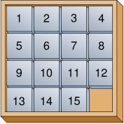
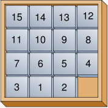

**Please consult your teaching fellow before attempting any hacker edition!**

# Fifteen

* Let's ensure that the Appliance is up to date by running `update50` from a Terminal before starting.

## The Game of Fifteen

* Now it's time to play. The Game of Fifteen is a puzzle played on a square, two-dimensional board with numbered tiles that slide. The goal of this puzzle is to arrange the board's tiles from smallest to largest, left to right, top to bottom, with an empty space in board's bottom-right corner, as in the below.
  
  
  
  Sliding any tile that borders the board's empty space in that space constitutes a "move." Although the configuration above depicts a game already won, notice how the tile numbered 12 or the tile numbered 15 could be slid into the empty space. Tiles may not be moved diagonally, though, or forcibly removed from the board.

  Although other configurations are possible, we shall assume that this game begins with the board's tiles in reverse order, from largest to smallest, left to right, top to bottom, with an empty space in the board's bottom-right corner. If, however, and only if the board contains an odd number of tiles (i.e., the height and width of the board are even), the positions of tiles numbered 1 and 2 must be swapped, as in the below. The puzzle is solvable from this configuration.
  
  
  
* Note that the package you downloaded for the previous problem set also contains the materials needed for this problem set. Navigate your way to `~/Dropbox/pset3/fifteen/`, and take a look at `fifteen.c` with `gedit`. Within this file is an entire framework for the Game of Fifteen. The challenge up next is to complete this game's implementation.

* First implement `init` in such a way that the board is initialized to a pseudorandom but solvable configuration. Then complete the implementation of `draw`, `move`, and `won` so that a human can actually play the game. (If you're having a hard time, there are a few handy video's over at the normal edition to help you on your way.)

* Then, implement a cheat. If the user types `GOD`, it tells "the computer" to take control of the game and solve it (using any strategy, optimal or non-optimal), making, say, only four moves per second so that the human can actually watch. Presumably, you'll need to swap out `GetInt` for something more versatile. You are not allowed to implement Godmode by remembering how `init` initialized the board.

* To test your implementation, you can certainly try playing it yourself, with or without Godmode enabled. (Know that you can quit your program by hitting ctrl-c.) Be sure that you (and we) cannot crash your program, as by providing bogus tile numbers. And know that, much like you automated input into `find`, so can you automate execution of this game via input redirection if you store in some file a winning sequence of moves for some configuration.
  
  In addition, you can try out our own implementation:

		~cs50/hacker3/fifteen

* Speaking of Godmode, where to begin? Well, first read up on the Game of Fifteen. [Wikipedia is probably a good starting point.](http://en.wikipedia.org/wiki/N-puzzle)
  
  Then dive a bit deeper, perhaps reading up on [an algorithm called A* ](http://en.wikipedia.org/wiki/A*_search_algorithm).

  Consider using "Manhattan distance" (aka "city-block distance") as your implementation's heuristic. If you find that A* takes up too much memory (particularly for d >= 4), though, you might want to take a look at [iterative deepening A* (IDA*)](http://webdocs.cs.ualberta.ca/~tony/RecentPapers/pami94.pdf) instead.

  The staff's own implementation, meanwhile, utilizes an algorithm like that in [this paper](http://larc.unt.edu/ian/pubs/saml.pdf).

## Final steps

* When you are done with `fifteen.c`, submit it by going over to the **Submit** tab. Be sure to compile and test one last time before you submit.

* All done!
