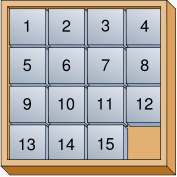
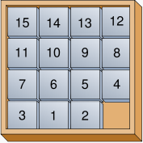

# Problem set 6 (Fifteen)

## The Game of Fifteen

* Now it's time to play. The Game of Fifteen is a puzzle played on a square, two-dimensional board with numbered tiles that slide. The goal of this puzzle is to arrange the board's tiles from smallest to largest, left to right, top to bottom, with an empty space in board's bottom-right corner, as in the below.
  
  
  
  Sliding any tile that borders the board's empty space in that space constitutes a "move." Although the configuration above depicts a game already won, notice how the tile numbered 12 or the tile numbered 15 could be slid into the empty space. Tiles may not be moved diagonally, though, or forcibly removed from the board.

  Although other configurations are possible, we shall assume that this game begins with the board's tiles in reverse order, from largest to smallest, left to right, top to bottom, with an empty space in the board's bottom-right corner. If, however, and only if the board contains an odd number of tiles (i.e., the height and width of the board are even), the positions of tiles numbered 1 and 2 must be swapped, as in the below. The puzzle is solvable from this configuration.
  
  
  
* Note that the package you downloaded for the previous problem set also contains the materials needed for this problem set. Navigate your way to `~/Desktop/pset5/fifteen/`, and take a look at `fifteen.c` with `gedit`. Within this file is an entire framework for the Game of Fifteen. The challenge up next is to complete this game's implementation.

  But first go ahead and compile the framework. (Can you figure out how?) And, even though it`s not yet finished, go ahead and run the game. (Can you figure out how?) Odds are you'll want to run it in a separate terminal window, as by opening **Menu > Programming > Terminal**, so that the game fits in your window.

  Phew. It appears that the game is at least partly functional. Granted, it's not much of a game yet. But that's where you come in.

  Read over the code and comments in `fifteen.c` and be sure you can answer the questions below before proceeding further:

  "Besides 4 × 4 (which are the Game of Fifteen`s dimensions), what other dimensions does the framework allow?"

  "With what sort of data structure is the game's board represented?"

  "What function is called to greet the player at game's start?"

  "What functions do you apparently need to implement?"

* Alright, get to it, implement this game. Remember, take "baby steps." Don't try to bite off the entire game at once. Instead, implement one function at a time and be sure that it works before forging ahead. In particular, we suggest that you implement the framework's functions in this order: `init`, `draw`, `move`, `won`. Any design decisions not explicitly prescribed herein (e.g., how much space you should leave between numbers when printing the board) are intentionally left to you. Presumably the board, when printed, should look something like the below, but we leave it to you to implement your own vision.

		15 14 13 12
		
		11 10  9  8
		
		 7  6  5  4
    
		 3  1  2  _

* If you need some help, you can watch these video's on how to implement the game's functions: [init](http://www.youtube.com/watch?v=xPa4Wb5Uyhc), [draw](http://www.youtube.com/watch?v=k4P0SojW9oM), [move](http://www.youtube.com/watch?v=gxMHcoBMiq4), and  [won](http://www.youtube.com/watch?v=6KSq4JUfhIk).

* There's no `check50` for the Game of Fifteen, so to test it, you can try to play it. Know that you can force your program to quit by hitting ctrl-c. And be sure that you (and we) cannot crash your program, as by providing bogus tile numbers. But know that, much like you automated input into `find`, you can automate execution of this game. In fact, in `~cs50/pset3` are `3x3.txt` and `4x4.txt`, both of which contain a winning sequence of moves for a 3x3 or a 4x4 board, respectively. To test your program with, say, the first of those inputs, execute the below.

		./fifteen 3 < ~cs50/pset3/3x3.txt

  Feel free to speed up (or slow down) the animation rate by altering the value passed to `usleep`. You're free to alter the aesthetics of this game. For example, see [ANSI escape sequences](http://en.wikipedia.org/wiki/ANSI_escape_code), which allow you to, amongst other things, print colored text to the terminal.
  
* If you'd like to play with the staff's own solution in the appliance, you may execute the below.

		~cs50/hacker3/fifteen

  Type `GOD` while in our game for a neat surprise! Note that you do not need to implement `GOD` yourself, unless you're doing the hacker's edition!

## Final steps

* When you are done with `fifteen.c`, submit it by going over to the **Submit** tab. Be sure to compile and test one last time before you submit.

* All done!
