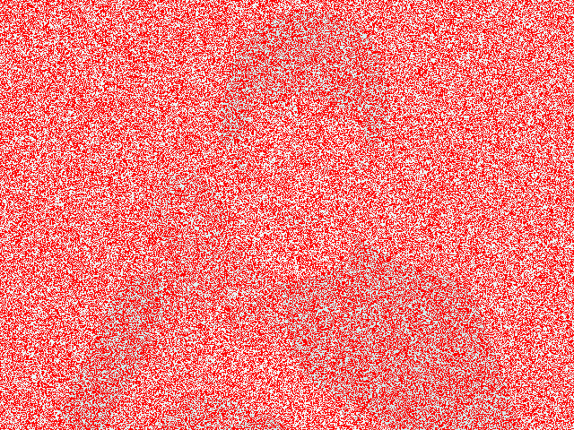
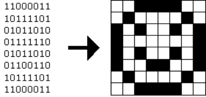
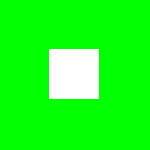
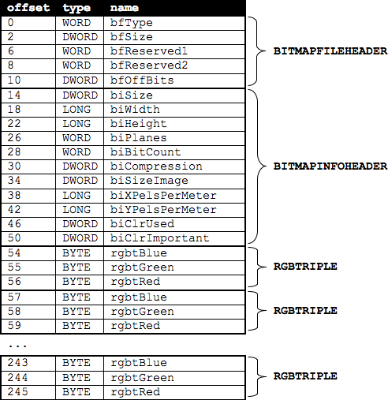

# Problem Set 4: Forensics

Questions?  Head to discuss or join classmates at office hours!

## Objectives

* Acquaint you with file I/O.
* Get you more comfortable with data structures, hexadecimal, and pointers.
* Introduce you to computer scientists across campus.
* Help Mr. Boddy.

## Recommended Reading[^1]

* Chapters 18, 24, 25, 27, and 28 of _Absolute Beginner's Guide to C_
* Chapters 9, 11, 14, and 16 of _Programming in C_
* http://www.cprogramming.com/tutorial/cfileio.html
* http://en.wikipedia.org/wiki/BMP_file_format
* http://en.wikipedia.org/wiki/Hexadecimal
* http://en.wikipedia.org/wiki/Jpg

[^1]: The Wikipedia articles are a bit dense; feel free to skim or skip!

## Academic Honesty

This course's philosophy on academic honesty is best stated as "be reasonable." The course recognizes that interactions with classmates and others can facilitate mastery of the course's material. However, there remains a line between enlisting the help of another and submitting the work of another. This policy characterizes both sides of that line.

The essence of all work that you submit to this course must be your own. Collaboration on problem sets is not permitted except to the extent that you may ask classmates and others for help so long as that help does not reduce to another doing your work for you. Generally speaking, when asking for help, you may show your code to others, but you may not view theirs, so long as you and they respect this policy's other constraints. Collaboration on quizzes is not permitted at all. Collaboration on the course's final project is permitted to the extent prescribed by its specification.

Below are rules of thumb that (inexhaustively) characterize acts that the course considers reasonable and not reasonable. If in doubt as to whether some act is reasonable, do not commit it until you solicit and receive approval in writing from the course's heads. Acts considered not reasonable by the course are handled harshly. If the course refers some matter to the Administrative Board and the outcome is Admonish, Probation, Requirement to Withdraw, or Recommendation to Dismiss, the course reserves the right to impose local sanctions on top of that outcome that may include an unsatisfactory or failing grade for work submitted or for the course itself.

If you commit some act that is not reasonable but bring it to the attention of the course's heads within 72 hours, the course may impose local sanctions that may include an unsatisfactory or failing grade for work submitted, but the course will not refer the matter to the Administrative Board.

### Reasonable

* Communicating with classmates about problem sets' problems in English (or some other spoken language).
* Discussing the course's material with others in order to understand it better.
* Helping a classmate identify a bug in his or her code at Office Hours, elsewhere, or even online, as by viewing, compiling, or running his or her code, even on your own computer.
* Incorporating snippets of code that you find online or elsewhere into your own code, provided that those snippets are not themselves solutions to assigned problems and that you cite the snippets' origins.
* Reviewing past semesters' quizzes and solutions thereto.
* Sending or showing code that you've written to someone, possibly a classmate, so that he or she might help you identify and fix a bug.
* Sharing snippets of your own code online so that others might help you identify and fix a bug.
* Turning to the web or elsewhere for instruction beyond the course's own, for references, and for solutions to technical difficulties, but not for outright solutions to problem set's problems or your own final project.
* Whiteboarding solutions to problem sets with others using diagrams or pseudocode but not actual code.
* Working with (and even paying) a tutor to help you with the course, provided the tutor does not do your work for you.

### Not Reasonable

* Accessing a solution in CS50 Vault to some problem prior to (re-)submitting your own.
* Asking a classmate to see his or her solution to a problem set's problem before (re-)submitting your own.
* Decompiling, deobfuscating, or disassembling the staff's solutions to problem sets.
* Failing to cite (as with comments) the origins of code or techniques that you discover outside of the course's own lessons and integrate into your own work, even while respecting this policy's other constraints.
* Giving or showing to a classmate a solution to a problem set's problem when it is he or she, and not you, who is struggling to solve it.
* Looking at another individual's work during a quiz.
* Paying or offering to pay an individual for work that you may submit as (part of) your own.
* Providing or making available solutions to problem sets to individuals who might take this course in the future.
* Searching for, soliciting, or viewing a quiz's questions or answers prior to taking the quiz.
* Searching for or soliciting outright solutions to problem sets online or elsewhere.
* Splitting a problem set's workload with another individual and combining your work.
* Submitting (after possibly modifying) the work of another individual beyond allowed snippets.
* Submitting the same or similar work to this course that you have submitted or will submit to another.
* Submitting work to this course that you intend to use outside of the course (e.g., for a job) without prior approval from the course's heads.
* Using resources during a quiz beyond those explicitly allowed in the quiz's instructions.
* Viewing another's solution to a problem set's problem and basing your own solution on it.

## Assessment

Your work on this problem set will be evaluated along four axes primarily.

Scope
: To what extent does your code implement the features required by our specification?

Correctness
: To what extent is your code consistent with our specifications and free of bugs?

Design
: To what extent is your code written well (i.e., clearly, efficiently, elegantly, and/or logically)?

Style
: To what extent is your code readable (i.e., commented and indented with variables aptly named)?

All students, whether taking the course SAT/UNS or for a letter grade, must ordinarily submit this and all other problem sets to be eligible for a satisfactory grade unless granted an exception in writing by the course's heads.

## Getting Ready

First, curl up with Jason's short on file I/O and Rob's short on structs.  Just keep in mind that Jason's short happens to focus on ASCII (i.e., text) files as opposed to binary files (like images). More on those later!

Next, join Nate on a tour of `valgrind`, a command-line tool that will help you find "memory leaks": memory that you've allocated (i.e., asked the operating system for), as with `malloc`, but not freed (i.e., given back to the operating system).

Finally, remind yourself how `gdb` works if you've forgotten or not yet used!

##  Getting Started

* Welcome back!

* As always, first open a terminal window and execute

~~~ bash
update50
~~~

to make sure your appliance is up-to-date.

Like Problem Set 3, this problem set comes with some distribution code that you'll need to download before getting started.  Go ahead and execute

~~~ bash
cd ~/Dropbox
~~~

in order to navigate to your `~/Dropbox` directory.  Then execute

~~~ bash
wget http://cdn.cs50.net/2014/fall/psets/4/pset4/pset4.zip
~~~

in order to download a ZIP (i.e., compressed version) of this problem set's distro.  If you then execute

~~~ bash
ls
~~~

you should see that you now have a file called `pset4.zip` in your `~/Dropbox` directory.  Unzip it by executing the below.

~~~ bash
unzip pset4.zip
~~~

If you again execute

~~~ bash
ls
~~~

you should see that you now also have a `pset4` directory.  You're now welcome to delete the ZIP file with the below.

~~~ bash
rm -f pset4.zip
~~~

Now dive into that `pset4` directory by executing the below.

~~~ bash
cd pset4
~~~

Now execute

~~~ bash
ls
~~~

and you should see that the directory contains the below.

~~~ bash
bmp/  jpg/  questions.txt
~~~

How fun!  Two subdirectories and a file.  Who knows what could be inside!  Let's get started.

## whodunit

If you ever saw Windows XP's default wallpaper (think rolling hills and blue skies), then you've seen a BMP.  If you've ever looked at a webpage, you've probably seen a GIF.  If you've ever looked at a digital photo, you've probably seen a JPEG.  If you've ever taken a screenshot on a Mac, you've probably seen a PNG.  Read up online on the BMP, GIF, JPEG, and PNG file formats.   Then, open up `questions.txt` in `~/Dropbox/pset4`, as with `gedit`, and tell us the below.

[start=0]
. How many different colors does each format support?
. Which of the formats supports animation?
. What's the difference between lossy and lossless compression?
. Which of these formats is lossy-compressed?

Next, curl up with the article from MIT at <http://cdn.cs50.net/2014/fall/psets/4/garfinkel.pdf>.

Though somewhat technical, you should find the article's language quite accessible.  Once you've read the article, answer each of the following questions in a sentence or more in `~/Dropbox/pset4/questions.txt`.

4. What happens, technically speaking, when a file is deleted on a FAT file system?
5. What can someone like you do to ensure (with high probability) that files you delete cannot be recovered?
{:start=4}

Anyhow, welcome to Tudor Mansion.  Your host, Mr. John Boddy, has met an untimely end—he's the victim of foul play.  To win this game, you must determine `whodunit`.

Unfortunately for you (though even more unfortunately for Mr. Boddy), the only evidence you have is a 24-bit BMP file called `clue.bmp`, pictured below, that Mr. Boddy whipped up on his computer in his final moments.   Hidden among this file's red "noise" is a drawing of `whodunit`.

You long ago threw away that piece of red plastic from childhood that would solve this mystery for you, and so you must attack it as a computer scientist instead.

But, first, some background.

Perhaps the simplest way to represent an image is with a grid of pixels (i.e., dots), each of which can be of a different color.  For black-and-white images, we thus need 1 bit per pixel, as 0 could represent black and 1 could represent white, as in the below.  (Image adapted from http://www.brackeen.com/vga/bitmaps.html[].)

In this sense, then, is an image just a bitmap (i.e., a map of bits).  For more colorful images, you simply need more bits per pixel.  A file format (like GIF) that supports "8-bit color" uses 8 bits per pixel.  A file format (like BMP, JPEG, or PNG) that supports "24-bit color" uses 24 bits per pixel.  (BMP actually supports 1-, 4-, 8-, 16-, 24-, and 32-bit color.)

A 24-bit BMP like Mr. Boddy's uses 8 bits to signify the amount of red in a pixel's color, 8 bits to signify the amount of green in a pixel's color, and 8 bits to signify the amount of blue in a pixel's color.  If you've ever heard of RGB color, well, there you have it: red, green, blue.

If the R, G, and B values of some pixel in a BMP are, say, 0xff, 0x00, and 0x00 in hexadecimal, that pixel is purely red, as 0xff (otherwise known as 255 in decimal) implies "a lot of red," while 0x00 and 0x00 imply "no green" and "no blue," respectively.  Given how red Mr. Boddy's BMP is, it clearly has a lot of pixels with those RGB values.  But it also has a few with other values.

Incidentally, HTML and CSS (languages in which webpages can be written) model colors in this same way.  If curious, see <http://en.wikipedia.org/wiki/Web_colors> for more details.

Now let's get more technical.  Recall that a file is just a sequence of bits, arranged in some fashion.  A 24-bit BMP file, then, is essentially just a sequence of bits, (almost) every 24 of which happen to represent some pixel's color.  But a BMP file also contains some "metadata," information like an image's height and width.  That metadata is stored at the beginning of the file in the form of two data structures generally referred to as "headers" (not to be confused with C's header files).   (Incidentally, these headers have evolved over time.  This problem set only expects that you support version 4.0 (the latest) of Microsoft's BMP format, which debuted with Windows 95.)  The first of these headers, called `BITMAPFILEHEADER`, is 14 bytes long.  (Recall that 1 byte equals 8 bits.)  The second of these headers, called `BITMAPINFOHEADER`, is 40 bytes long.  Immediately following these headers is the actual bitmap: an array of bytes, triples of which represent a pixel's color.   (In 1-, 4-, and 16-bit BMPs, but not 24- or 32-, there's an additional header right after `BITMAPINFOHEADER` called `RGBQUAD`, an array that defines "intensity values" for each of the colors in a device's palette.)  However, BMP stores these triples backwards (i.e., as BGR), with 8 bits for blue, followed by 8 bits for green, followed by 8 bits for red.   (Some BMPs also store the entire bitmap backwards, with an image's top row at the end of the BMP file.  But we've stored this problem set's BMPs as described herein, with each bitmap's top row first and bottom row last.)  In other words, were we to convert the 1-bit smiley above to a 24-bit smiley, substituting red for black, a 24-bit BMP would store this bitmap as follows, where `0000ff` signifies red and `ffffff` signifies white; we've highlighted in red all instances of `0000ff`.

~~~
ffffff  ffffff  [red]#0000ff#  [red]#0000ff#  [red]#0000ff#  [red]#0000ff#  ffffff  ffffff
ffffff  [red]#0000ff#  ffffff  ffffff  ffffff  ffffff  [red]#0000ff#  ffffff
[red]#0000ff#  ffffff  [red]#0000ff#  ffffff  ffffff  [red]#0000ff#  ffffff  [red]#0000ff#
[red]#0000ff#  ffffff  ffffff  ffffff  ffffff  ffffff  ffffff  [red]#0000ff#
[red]#0000ff#  ffffff  [red]#0000ff#  ffffff  ffffff  [red]#0000ff#  ffffff  [red]#0000ff#
[red]#0000ff#  ffffff  ffffff  [red]#0000ff#  [red]#0000ff#  ffffff  ffffff  [red]#0000ff#
ffffff  [red]#0000ff#  ffffff  ffffff  ffffff  ffffff  [red]#0000ff#  ffffff
ffffff  ffffff  [red]#0000ff#  [red]#0000ff#  [red]#0000ff#  [red]#0000ff#  ffffff  ffffff
~~~

Because we've presented these bits from left to right, top to bottom, in 8 columns, you can actually see the red smiley if you take a step back.

To be clear, recall that a hexadecimal digit represents 4 bits.  Accordingly, `ffffff` in hexadecimal actually signifies `111111111111111111111111` in binary.

Okay, stop!  Don't proceed further until you're sure you understand why `0000ff` represents a red pixel in a 24-bit BMP file.

Okay, let's transition from theory to practice.  Double-click *Home* on John Harvard's desktop and you should find yourself in John Harvard's home directory.  Double-click *pset4*, double-click *bmp*, and then double-click *smiley.bmp* therein.  You should see a tiny smiley face that's only 8 pixels by 8 pixels.  Select *View > Zoom > Zoom Fit*, and you should see a larger, albeit blurrier, version.  (So much for "enhance," huh?)  Actually, this particular image shouldn't really be blurry, even when enlarged.  The program that launched when you double-clicked *smiley.bmp* (called Image Viewer) is simply trying to be helpful (CSI-style) by "dithering" the image (i.e., by smoothing out its edges).  Below's what the smiley looks like if you zoom in without dithering.  At this zoom level, you can really see the image's pixels (as big squares).

Okay, go ahead and return your attention to a terminal window, and navigate your way to `~/Dropbox/pset4/bmp`.  (Remember how?)  Let's look at the underlying bytes that compose `smiley.bmp` using `xxd`, a command-line "hex editor."  Execute:

~~~ bash
xxd -c 24 -g 3 -s 54 smiley.bmp
~~~

You should see the below; we've again highlighted in red all instances of `0000ff`.

~~~
0000036: ffffff ffffff [red]#0000ff# [red]#0000ff# [red]#0000ff# [red]#0000ff# ffffff ffffff  ........................
000004e: ffffff [red]#0000ff# ffffff ffffff ffffff ffffff [red]#0000ff# ffffff  ........................
0000066: [red]#0000ff# ffffff [red]#0000ff# ffffff ffffff [red]#0000ff# ffffff [red]#0000ff#  ........................
000007e: [red]#0000ff# ffffff ffffff ffffff ffffff ffffff ffffff [red]#0000ff#  ........................
0000096: [red]#0000ff# ffffff [red]#0000ff# ffffff ffffff [red]#0000ff# ffffff [red]#0000ff#  ........................
00000ae: [red]#0000ff# ffffff ffffff [red]#0000ff# [red]#0000ff# ffffff ffffff [red]#0000ff#  ........................
00000c6: ffffff [red]#0000ff# ffffff ffffff ffffff ffffff [red]#0000ff# ffffff  ........................
00000de: ffffff ffffff [red]#0000ff# [red]#0000ff# [red]#0000ff# [red]#0000ff# ffffff ffffff  ........................
~~~

In the leftmost column above are addresses within the file or, equivalently, offsets from the file's first byte, all of them given in hex.  Note that `00000036` in hexadecimal is `54` in decimal.  You're thus looking at byte `54` onward of `smiley.bmp`.  Recall that a 24-bit BMP's first 14 + 40 # 54 bytes are filled with metadata.  If you really want to see that metadata in addition to the bitmap, execute the command below.

~~~ bash
xxd -c 24 -g 3 smiley.bmp
~~~

If `smiley.bmp` actually contained ASCII characters, you'd see them in ``xxd``'s rightmost column instead of all of those dots.

So, `smiley.bmp` is 8 pixels wide by 8 pixels tall, and it's a 24-bit BMP (each of whose pixels is represented with 24 ÷ 8 # 3 bytes).  Each row (aka "scanline") thus takes up (8 pixels) × (3 bytes per pixel) # 24 bytes, which happens to be a multiple of 4.  It turns out that BMPs are stored a bit differently if the number of bytes in a scanline is not, in fact, a multiple of 4.  In `small.bmp`, for instance, is another 24-bit BMP, a green box that's 3 pixels wide by 3 pixels wide.  If you view it with Image Viewer (as by double-clicking it), you'll see that it resembles the below, albeit much smaller.  (Indeed,  you might need to zoom in again to see it.)

Each scanline in `small.bmp` thus takes up (3 pixels) × (3 bytes per pixel) # 9 bytes, which is not a multiple of 4.  And so the scanline is "padded" with as many zeroes as it takes to extend the scanline's length to a multiple of 4.  In other words, between 0 and 3 bytes of padding are needed for each scanline in a 24-bit BMP.  (Understand why?)  In the case of small.bmp, 3 bytes' worth of zeroes are needed, since (3 pixels) &#215; (3 bytes per pixel) + (3 bytes of padding) # 12 bytes, which is indeed a multiple of 4.

To "see" this padding, go ahead and run the below.

~~~ bash
xxd -c 12 -g 3 -s 54 small.bmp
~~~

Note that we're using a different value for `-c` than we did for `smiley.bmp` so that `xxd` outputs only 4 columns this time (3 for the green box and 1 for the padding).  You should see output like the below; we've highlighted in green all instances of `00ff00`.

~~~
    0000036: [green]#00ff00# [green]#00ff00# [green]#00ff00# 000000  ............
    0000042: [green]#00ff00# ffffff [green]#00ff00# 000000  ............
    000004e: [green]#00ff00# [green]#00ff00# [green]#00ff00# 000000  ............
~~~

For contrast, let's use `xxd` on `large.bmp`, which looks identical to `small.bmp` but, at 12 pixels by 12 pixels, is four times as large.  Go ahead and execute the below; you may need to widen your window to avoid wrapping.

~~~ bash
xxd -c 36 -g 3 -s 54 large.bmp
~~~

You should see output like the below; we've again highlighted in green all instances of `00ff00`

~~~
0000036: [green]#00ff00# [green]#00ff00# [green]#00ff00# [green]#00ff00# [green]#00ff00# [green]#00ff00# [green]#00ff00# [green]#00ff00# [green]#00ff00# [green]#00ff00# [green]#00ff00# [green]#00ff00#  ....................................
000005a: [green]#00ff00# [green]#00ff00# [green]#00ff00# [green]#00ff00# [green]#00ff00# [green]#00ff00# [green]#00ff00# [green]#00ff00# [green]#00ff00# [green]#00ff00# [green]#00ff00# [green]#00ff00#  ....................................
000007e: [green]#00ff00# [green]#00ff00# [green]#00ff00# [green]#00ff00# [green]#00ff00# [green]#00ff00# [green]#00ff00# [green]#00ff00# [green]#00ff00# [green]#00ff00# [green]#00ff00# [green]#00ff00#  ....................................
00000a2: [green]#00ff00# [green]#00ff00# [green]#00ff00# [green]#00ff00# [green]#00ff00# [green]#00ff00# [green]#00ff00# [green]#00ff00# [green]#00ff00# [green]#00ff00# [green]#00ff00# [green]#00ff00#  ....................................
00000c6: [green]#00ff00# [green]#00ff00# [green]#00ff00# [green]#00ff00# ffffff ffffff ffffff ffffff [green]#00ff00# [green]#00ff00# [green]#00ff00# [green]#00ff00#  ....................................
00000ea: [green]#00ff00# [green]#00ff00# [green]#00ff00# [green]#00ff00# ffffff ffffff ffffff ffffff [green]#00ff00# [green]#00ff00# [green]#00ff00# [green]#00ff00#  ....................................
000010e: [green]#00ff00# [green]#00ff00# [green]#00ff00# [green]#00ff00# ffffff ffffff ffffff ffffff [green]#00ff00# [green]#00ff00# [green]#00ff00# [green]#00ff00#  ....................................
0000132: [green]#00ff00# [green]#00ff00# [green]#00ff00# [green]#00ff00# ffffff ffffff ffffff ffffff [green]#00ff00# [green]#00ff00# [green]#00ff00# [green]#00ff00#  ....................................
0000156: [green]#00ff00# [green]#00ff00# [green]#00ff00# [green]#00ff00# [green]#00ff00# [green]#00ff00# [green]#00ff00# [green]#00ff00# [green]#00ff00# [green]#00ff00# [green]#00ff00# [green]#00ff00#  ....................................
000017a: [green]#00ff00# [green]#00ff00# [green]#00ff00# [green]#00ff00# [green]#00ff00# [green]#00ff00# [green]#00ff00# [green]#00ff00# [green]#00ff00# [green]#00ff00# [green]#00ff00# [green]#00ff00#  ....................................
000019e: [green]#00ff00# [green]#00ff00# [green]#00ff00# [green]#00ff00# [green]#00ff00# [green]#00ff00# [green]#00ff00# [green]#00ff00# [green]#00ff00# [green]#00ff00# [green]#00ff00# [green]#00ff00#  ....................................
00001c2: [green]#00ff00# [green]#00ff00# [green]#00ff00# [green]#00ff00# [green]#00ff00# [green]#00ff00# [green]#00ff00# [green]#00ff00# [green]#00ff00# [green]#00ff00# [green]#00ff00# [green]#00ff00#  ....................................
~~~

Worthy of note is that this BMP lacks padding!  After all, (12 pixels) × (3 bytes per pixel) # 36 bytes is indeed a multiple of 4.

Knowing all this has got to be useful!

Okay, `xxd` only showed you the bytes in these BMPs.  How do we actually get at them programmatically?  Well, in `copy.c` is a program whose sole purpose in life is to create a copy of a BMP, piece by piece.  Of course, you could just use `cp` for that.  But `cp` isn't going to help Mr. Boddy.  Let's hope that `copy.c` does!

Go ahead and compile `copy.c` into a program called `copy` using `make`.  (Remember how?)  Then execute a command like the below.

~~~ bash
./copy smiley.bmp copy.bmp
~~~

If you then execute ls (with the appropriate switch), you should see that `smiley.bmp` and `copy.bmp` are indeed the same size.  Let's double-check that they're actually the same!  Execute the below.

~~~ bash
diff smiley.bmp copy.bmp
~~~

If that command tells you nothing, the files are indeed identical.  (Note that some programs, like Photoshop, include trailing zeroes at the ends of some BMPs.  Our version of `copy` throws those away, so don't be too worried if you try to copy a BMP that you've downloaded or made only to find that the copy is actually a few bytes smaller than the original.)  Feel free to open both files in Ristretto Image Viewer (as by double-clicking each) to confirm as much visually.  But diff does a byte-by-byte comparison, so its eye is probably sharper than yours!

So how now did that copy get made?  It turns out that `copy.c` relies on `bmp.h`.  Let's take a look.  Open up `bmp.h` (as with `gedit`), and you'll see actual definitions of those headers we've mentioned, adapted from Microsoft's own implementations thereof.  In addition, that file defines `BYTE`, `DWORD`, `LONG`, and `WORD`, data types normally found in the world of Win32 (i.e., Windows) programming.  Notice how they're just aliases for primitives with which you are (hopefully) already familiar.  It appears that `BITMAPFILEHEADER` and `BITMAPINFOHEADER` make use of these types.  This file also defines a `struct` called `RGBTRIPLE` that, quite simply, "encapsulates" three bytes: one blue, one green, and one red (the order, recall, in which we expect to find RGB triples actually on disk).

Why are these `struct`pass:[s] useful?  Well, recall that a file is just a sequence of bytes (or, ultimately, bits) on disk.  But those bytes are generally ordered in such a way that the first few represent something, the next few represent something else, and so on.  "File formats" exist because the world has standardized what bytes mean what.  Now, we could just read a file from disk into RAM as one big array of bytes.  And we could just remember that the byte at location `[i]` represents one thing, while the byte at location `[j]` represents another.  But why not give some of those bytes names so that we can retrieve them from memory more easily?  That's precisely what the `struct`s in `bmp.h` allow us to do.  Rather than think of some file as one long sequence of bytes, we can instead think of it as a sequence of `struct`s.

Recall that `smiley.bmp` is 8 by 8 pixels, and so it should take up 14 + 40 + (8 × 8) × 3 # 246 bytes on disk.  (Confirm as much if you'd like using `ls`.)  Here's what it thus looks like on disk according to Microsoft:

As this figure suggests, order does matter when it comes to `struct`s' members.  Byte 57 is `rgbtBlue` (and not, say, `rgbtRed`), because `rgbtBlue` is defined first in `RGBTRIPLE`.  Our use, incidentally, of the `__attribute__` called `__packed__` ensures that `clang` does not try to "word-align" members (whereby the address of each member's first byte is a multiple of 4), lest we end up with "gaps" in our `struct`s that don't actually exist on disk. 

Now go ahead and pull up the URLs to which `BITMAPFILEHEADER` and `BITMAPINFOHEADER` are attributed, per the comments in `bmp.h`.  You're about to start using MSDN (Microsoft Developer Network)!

Rather than hold your hand further on a stroll through `copy.c`, we're instead going to ask you some questions and let you teach yourself how the code therein works.  As always, `man` is your friend, and so, now, is MSDN.  If not sure on first glance how to answer some question, do some quick research and figure it out!  You might want to turn to *stdio.h* at <https://reference.cs50.net/> as well.

Allow us to suggest that you also run `copy` within `gdb` while answering these questions.  Set a breakpoint at `main` and walk through the program.  Recall that you can tell `gdb` to start running the program with a command like the below at ``gdb``'s prompt.

~~~ bash
run smiley.bmp copy.bmp
~~~

If you tell `gdb` to print the values of `bf` and `bi` (once read in from disk), you'll see output like the below, which we daresay you'll find quite useful.

~~~ bash
{bfType # 19778, bfSize # 246, bfReserved1 # 0, bfReserved2 # 0, 
  bfOffBits # 54}

{biSize # 40, biWidth # 8, biHeight # -8, biPlanes # 1, biBitCount # 24, 
  biCompression # 0, biSizeImage # 192, biXPelsPerMeter # 2834, 
  biYPelsPerMeter # 2834, biClrUsed # 0, biClrImportant # 0}
~~~

In `~/Dropbox/pset4/questions.txt`, answer each of the following questions in a sentence or more.

6. What's `stdint.h`?
7. What's the point of using `uint8_t`, `uint32_t`, `int32_t`, and `uint16_t` in a program?
8. How many bytes is a `BYTE`, a `DWORD`, a `LONG`, and a `WORD`, respectively?  (Assume a 32-bit architecture like the CS50 Appliance.)
9. What (in ASCII, decimal, or hexadecimal) must the first two bytes of any BMP file be?  (Leading bytes used to identify file formats (with high probability) are generally called "magic numbers.)"
10. What's the difference between `bfSize` and `biSize`?
11. What does it mean if `biHeight` is negative?
12. What field in `BITMAPINFOHEADER` specifies the BMP's color depth (i.e., bits per pixel)?
13. Why might `fopen` return `NULL` in `copy.c:37`?
14. Why is the third argument to `fread` always `1` in our code?
15. What value does `copy.c:70` assign `padding` if `bi.biWidth` is `3`?
16. What does `fseek` do?
17. What is `SEEK_CUR`?
{:start="6"}

Okay, back to Mr. Boddy.

Write a program called `whodunit` in a file called `whodunit.c` that reveals Mr. Boddy's drawing.  

Ummm, what?

Well, think back to childhood when you held that piece of red plastic over similarly hidden messages.   (If you remember no such piece of plastic, best to ask a classmate about his or her childhood.)  Essentially, the plastic turned everything red but somehow revealed those messages.  Implement that same idea in `whodunit`.  Like `copy`, your program should accept exactly two command-line arguments.  And if you execute a command like the below, stored in `verdict.bmp` should be a BMP in which Mr. Boddy's drawing is no longer covered with noise.

~~~ bash
./whodunit clue.bmp verdict.bmp
~~~
   
Allow us to suggest that you begin tackling this mystery by executing the command below.

~~~ bash
cp copy.c whodunit.c
~~~

Wink wink.  You may be amazed by how few lines of code you actually need to write in order to help Mr. Boddy.

There's nothing hidden in `smiley.bmp`, but feel free to test your program out on its pixels nonetheless, if only because that BMP is small and you can thus compare it and your own program's output with `xxd` during development.  (Or maybe there is a message hidden in `smiley.bmp` too.  No, there's not.)

Rest assured that more than one solution is possible.  So long as Mr. Boddy's drawing is identifiable (by you), no matter its legibility, Mr. Boddy will rest in peace.

Because `whodunit` can be implemented in several ways, you won't be able to check your implementation's correctness with `check50`.  And, lest it spoil your fun, the staff's solution to `whodunit` is not available.

But here is Zamyla!

In `~/Dropbox/pset4/questions.txt`, answer the question below.

18. Whodunit?
{:start=18}

## resize

Well that was fun.  Bit late for Mr. Boddy, though.

Alright, next challenge!  Implement now in `resize.c` a program called `resize` that resizes 24-bit uncompressed BMPs by a factor of `n`.  Your program should accept exactly three command-line arguments, per the below usage, whereby the first (`n`) must be a positive integer less than or equal to 100, the second the name of the file to be resized, and the third the name of the resized version to be written.

~~~
Usage: ./resize n infile outfile
~~~

With a program like this, we could have created `large.bmp` out of `small.bmp` by resizing the latter by a factor of 4 (i.e., by multiplying both its width and its height by 4), per the below. 

~~~ bash
./resize 4 small.bmp large.bmp
~~~

You're welcome to get started by copying (yet again) `copy.c` and naming the copy `resize.c`.  But spend some time thinking about what it means to resize a BMP.  (You may assume that `n` times the size of `infile` will not exceed 2^32^ - 1.)  Decide which of the fields in `BITMAPFILEHEADER` and `BITMAPINFOHEADER` you might need to modify.  Consider whether or not you'll need to add or subtract padding to scanlines.  And be thankful that we don't expect you to support fractional `n` between 0 and 1!  (As we do in the Hacker Edition!)  But we do expect you to support a value of `1` for `n`, the result of which should be an `outfile` with dimensions identical to ``infile``'s.

If you'd like to check the correctness of your program with `check50`, you may execute the below.

~~~ bash
check50 2014.fall.pset4.resize bmp.h resize.c
~~~

If you'd like to play with the staff's own implementation of `resize` in the appliance, you may execute the below.   

~~~ bash
~cs50/pset4/resize
~~~

If you'd like to peek at, e.g., ``large.bmp``'s headers (in a more user-friendly way than `xxd` allows), you may execute the below.

~~~ bash
~cs50/pset4/peek large.bmp
~~~

Better yet, if you'd like to compare your outfile's headers against the staff's, you might want to execute commands like the below while inside your `~/Dropbox/pset4/bmp` directory.  (Think about what each is doing.)

~~~ bash
./resize 4 small.bmp student.bmp
~cs50/pset4/resize 4 small.bmp staff.bmp
~cs50/pset4/peek student.bmp staff.bmp
~~~

If you happen to use `malloc`, be sure to use `free` so as not to leak memory. Try using `valgrind` to check for any leaks!

Here's Zamyla again!

## recover

Alright, now let's put all your new skills to the test.

In anticipation of this problem set, I spent the past several days snapping photos of people I know, all of which were saved by my digital camera as JPEGs on a 1GB CompactFlash (CF) card.  (It's possible I actually spent the past several days on Facebook instead.)  Unfortunately, I'm not very good with computers, and I somehow deleted them all!  Thankfully, in the computer world, "deleted" tends not to mean "deleted" so much as "forgotten."  My computer insists that the CF card is now blank, but I'm pretty sure it's lying to me.

Write in `~/Dropbox/pset4/jpg/recover.c` a program that recovers these photos.

Ummm.

Okay, here's the thing.  Even though JPEGs are more complicated than BMPs, JPEGs have "signatures," patterns of bytes that distinguish them from other file formats.  In fact, most JPEGs begin with one of two sequences of bytes.  Specifically, the first four bytes of most JPEGs are either

~~~ bash
0xff 0xd8 0xff 0xe0
~~~

or

~~~ bash
0xff 0xd8 0xff 0xe1
~~~

from first byte to fourth byte, left to right.  Odds are, if you find one of these patterns of bytes on a disk known to store photos (e.g., my CF card), they demark the start of a JPEG.  (To be sure, you might encounter these patterns on some disk purely by chance, so data recovery isn't an exact science.)

Fortunately, digital cameras tend to store photographs contiguously on CF cards, whereby each photo is stored immediately after the previously taken photo.  Accordingly, the start of a JPEG usually demarks the end of another.  However, digital cameras generally initialize CF cards with a FAT file system whose "block size" is 512 bytes (B).  The implication is that these cameras only write to those cards in units of 512 B.  A photo that's 1 MB (i.e., 1,048,576 B) thus takes up 1048576 ÷ 512 # 2048 "blocks" on a CF card.  But so does a photo that's, say, one byte smaller (i.e., 1,048,575 B)!  The wasted space on disk is called "slack space."  Forensic investigators often look at slack space for remnants of suspicious data.

The implication of all these details is that you, the investigator, can probably write a program that iterates over a copy of my CF card, looking for JPEGs' signatures.  Each time you find a signature, you can open a new file for writing and start filling that file with bytes from my CF card, closing that file only once you encounter another signature.  Moreover, rather than read my CF card's bytes one at a time, you can read 512 of them at a time into a buffer for efficiency's sake.  Thanks to FAT, you can trust that JPEGs' signatures will be "block-aligned."  That is, you need only look for those signatures in a block's first four bytes. 

Realize, of course, that JPEGs can span contiguous blocks.  Otherwise, no JPEG could be larger than 512 B.  But the last byte of a JPEG might not fall at the very end of a block.  Recall the possibility of slack space.  But not to worry.  Because this CF card was brand-new when I started snapping photos, odds are it'd been "zeroed" (i.e., filled with 0s) by the manufacturer, in which case any slack space will be filled with 0s.  It's okay if those trailing 0s end up in the JPEGs you recover; they should still be viewable.

Now, I only have one CF card, but there are a whole lot of you!  And so I've gone ahead and created a "forensic image" of the card, storing its contents, byte after byte, in a file called `card.raw`.  So that you don't waste time iterating over millions of 0s unnecessarily, I've only imaged the first few megabytes of the CF card.  But you should ultimately find that the image contains 16 JPEGs.  As usual, you can open the file programmatically with `fopen`, as in the below.  

~~~ c
FILE* file # fopen("card.raw", "r");
~~~

Notice, incidentally, that `~/Dropbox/pset4/jpg` contains only `recover.c`, but it's devoid of any code.  (We leave it to you to decide how to implement and compile `recover`!)   For simplicity, you should hard-code `"card.raw"` in your program; your program need not accept any command-line arguments.  When executed, though, your program should recover every one of the JPEGs from `card.raw`, storing each as a separate file in your current working directory.  Your program should number the files it outputs by naming each `pass:[###].jpg`, where `pass:[###]` is three-digit decimal number from `000` on up.  (Befriend `sprintf`.)  You need not try to recover the JPEGs' original names.  To check whether the JPEGs your program spit out are correct, simply double-click and take a look!  If each photo appears intact, your operation was likely a success!

Odds are, though, the JPEGs that the first draft of your code spits out won't be correct.  (If you open them up and don't see anything, they're probably not correct!)  Execute the command below to delete all JPEGs in your current working directory.

~~~ bash
rm *.jpg
~~~
   
If you'd rather not be prompted to confirm each deletion, execute the command below instead.

~~~ bash
rm -f *.jpg
~~~

Just be careful with that `-f` switch, as it "forces" deletion without prompting you.

If you'd like to check the correctness of your program with `check50`, you may execute the below.

~~~ bash
check50 2014.fall.pset4.recover recover.c
~~~

Lest it spoil your (forensic) fun, the staff's solution to `recover` is not available.

As before, if you happen to use `malloc`, be sure to use `free` so as not to leak memory. Try using `valgrind` to check for any leaks!

Here's Zamyla!

## Sanity Checks

Before you consider this problem set done, best to ask yourself these questions and then go back and improve your code as needed!  Do not consider the below an exhaustive list of expectations, though, just some helpful reminders.  The checkboxes that have come before these represent the exhaustive list!  To be clear, consider the questions below rhetorical.  No need to answer them in writing for us, since all of your answers should be "yes!"

* Did you fill `questions.txt` with answers to all questions?
* Is the BMP that `whodunit` outputs legible (to you)?
* Does `resize` accept three and only three command-line arguments?
* Does `resize` ensure that `n` is in [1, 100]?
* Does `resize` update `bfSize`, `biHeight`, `biSizeImage`, and `biWidth` correctly?
* Does `resize` add or remove padding as needed?
* Are you sure that `resize` doesn't have any memory leaks?
* Does `recover` output 16 JPEGs?  Are all 16 viewable?
* Does `recover` name the JPEGs `pass:[###].jpg`, where `pass:[###]` is a three-digit number from `000` through `015`?
* Are you sure that `recover` doesn't have any memory leaks?
* Are all of your files where they should be in `~/Dropbox/pset4`?

As always, if you can't answer "yes" to one or more of the above because you're having some trouble, do drop by office hours or turn to https://cs50.harvard.edu/discuss[cs50.harvard.edu/discuss]!

## Fabulous Prizes

And now the real fun begins. You are hereby challenged to find as many of the computer scientists featured in these photos as possible.  To prove that you found someone, take a photo of yourself posing (anywhere) with the computer scientist (in such a way that he or she is aware of the photo and not just in the background). If a photo contains multiple computer scientists, you're welcome to pose with each of them separately. Upload your photos (i.e., the photos you took, not the ones that you recovered) to a non-private album somewhere that supports bulk downloads (e.g., Dropbox, Imgur, etc.), then email your album's URL to heads@cs50.harvard.edu by *noon on Wed 10/22*! We'll add your photos to a public gallery (unless you request otherwise).

For each (hey, that's a loop) of the computer scientists you find, we will treat you to 1GB of additional Dropbox space! (Though supplies may be limited.) 

Moreover, whoever finds and photographs the most computer scientists (and, in the event of a tie, submits first) shall be rewarded with a little something extra for their final project (or dorm room):

## How to Submit

### Step 1 of 2

When ready to submit, open up a Terminal window and navigate your way to `~/Dropbox`.  Create a ZIP (i.e., compressed) file containing your entire `pset4` directory by executing the below.  Incidentally, `-r` means "recursive," which in this case means to ZIP up everything inside of `pset4`, including any subdirectories (or even subsubdirectories!).

~~~ bash
zip -r pset4.zip pset4
~~~

If you type `ls` thereafter, you should see that you have a new file called `pset4.zip` in `~/Dropbox`.  (If you realize later that you need to make a change to some file and re-ZIP everything, you can delete the ZIP file you already made with `rm pset4.zip`, then create a new ZIP file as before.)
* Once done creating your ZIP file, open up Chrome _inside_ of the appliance (not on your own computer) and visit https://cs50.harvard.edu/submit[cs50.harvard.edu/submit], logging in if prompted.
* Click *Submit* toward the window's top-left corner.
* Under *Problem Set 4* on the screen that appears, click *Upload New Submission*.
* On the screen that appears, click *Add files...*.  A window entitled *Open Files* should appear.
* Navigate your way to `pset4.zip`, as by clicking *jharvard*, then double-clicking *Dropbox*.  Once you find `pset4.zip`, click it once to select it, then click *Open*.
* Click *Start upload* to upload your ZIP file to CS50's servers.
* On the screen that appears, you should see a window with *No File Selected*.  If you move your mouse toward the window's lefthand side, you should see a list of the files you uploaded.  Click each to confirm the contents of each.  (No need to click any other buttons or icons.)  If confident that you submitted the files you intended, consider your source code submitted!  If you'd like to re-submit different (or modified) files, simply return to https://cs50.harvard.edu/submit[cs50.harvard.edu/submit] and repeat these steps.  You may re-submit as many times as you'd like; we'll grade your most recent submission, so long as it's before the deadline.

### Step 2 of 2

Head to https://forms.cs50.net/2014/fall/psets/4/ where a short form awaits.  Once you have submitted that form (as well as your source code), you are done!

This was Problem Set 4.
