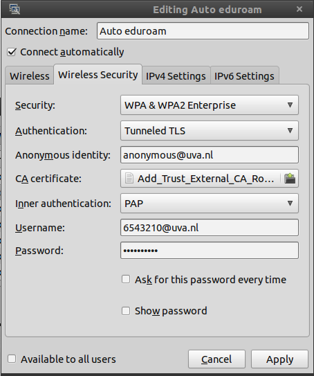

These instructions are for setting up an internet connection with eduroam on
a Unix-based operating system such as Ubuntu. (This guide is not meant for
users on Windows or OS X.)

Your settings should look like this (with your own student number and password,
of course!)

For more information, see [here](https://linuxatuva.wordpress.com/wireless/).