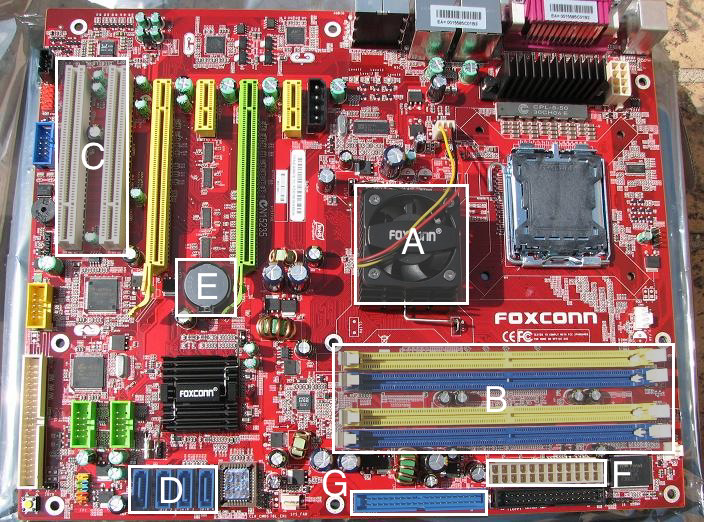

### Lecture <!-- pset1 Hardware -->

* [HD Lecture Video](http://cse1.net/video?v=lectures/1/lecture1)

### Recaps
* [Power Up](http://cse1.net/recaps/1-powerup.html)
* [Binary, ASCII, and Everything in Bit-ween](http://cse1.net/recaps/2-binary.html)

### References
* [First Look: iPhone 5](https://www.youtube.com/watch?v=rdIWKytq_q4)
* [HDMI Cables](https://www.mint.com/blog/trends/the-rip1/)

# What to submit?
Answer the questions below and collect your answers in a .pdf called hardware.pdf. Be sure to include your name and studentnumber!

# Questions

## 1. Mother, I'm bored.
1. Below is a motherboard with 7 unlabeled parts (lettered A–G, to be clear). For each of these letters, tell us:
    * What the component is called
    * What the component is used for (e.g., what devices plug into it)

    

2. In a succinct but technically detailed paragraph, what happens when you turn on your
computer?

## 2. Windows Explorer
3. Time for some exploring! Let's get to know your computer a little better. Tell us the
following about the computer you have at home or at work:
    * Brand and model
    * Hard drive capacity
    * Amount of RAM
    * Model and speed of CPU
    * Display resolution and size
    * Operating system

4. More exploring! Dora would be proud. Now, take a look at the various ports on
your computer. If on a laptop, your ports are probably located around the perimeter of the bottom
half of your computer. If on a desktop, ports are probably located in the back of the tower,
and perhaps a few can be found on the front. For each of your computer's ports, give us a picture or
sketch as well as a description of what the port is called and what can plug into it.

## 3. Power Shopping
5. Your dad just came home with a brand new printer from Better Buy, but unfortunately,
it looks like it came only with a power cable! From what you can see, there's no way of connecting
the printer to his computer. How exactly would you figure out what he needs to purchase in order
to use his new printer? Suggest what you think he needs to buy, explaining your thought process.
Be specific.

6. I just purchased a new computer monitor with only a DVI port. Sadly, my laptop
only has a slot for an HDMI cable. Am I out of luck? Why or why not? My sister's laptop, on the
other hand, has a slot for a VGA cable, should I just give the monitor to her? Why or why not?

7. So, should you spend $250 on an HDMI cable? Why or why not?

## 4. A Bit of Binary
8. Convert the following numbers from decimal to binary, showing each step.
    * 50
    * 164

9. Convert the following numbers from binary to decimal, showing each step.
    * 0101010
    * 010101111

10. What do all binary numbers ending in 1 have in common?

11. What's the largest (positive) number we can represent with 16 bits? How about
32 bits? Give your answers as decimal numbers, and don't worry about taking negative numbers
into account!

12. We've seen that decimal uses ten different digits and binary uses two different digits.
The octal system instead uses eight different digits, but works in exactly the same way. What is the
decimal value of the octal number 0644? How about 0755?
