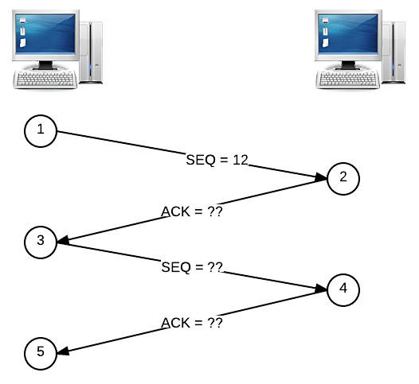
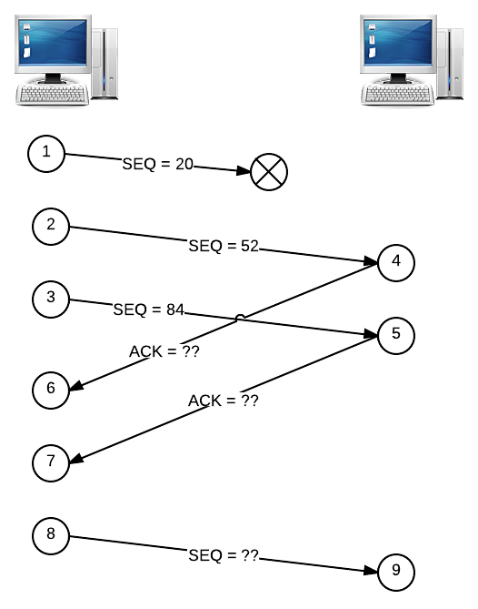

### Lecture <!-- pset4 Internet, continued -->

* [HD Lecture Video](http://cse1.net/video?v=lectures/4/lecture4)

### Recaps
* [Protocol Me, Maybe](http://cse1.net/recaps/9-protocols.html)
* [Snail Mail](http://cse1.net/recaps/10-email.html)
* [Manual Transmission](http://cse1.net/recaps/11-tcpip.html)

### References
* [Base64 Encoder/Decoder](http://www.base64encode.org/)
* [Google Data Centers](http://www.google.com/about/datacenters/)
* [Know Your Meme](http://knowyourmeme.com/)
* [Warriors of the Net](https://www.youtube.com/watch?v=Ve7_4ot-Dzs)

### Sections
* [Buying a Domain Name (Ben)](http://cse1.net/video?v=sections/4/buying_a_domain_name/buying_a_domain_name)
* [Discussing Web Browsers (Ben and R.J.)](http://cse1.net/video?v=sections/4/discussing_web_browsers/discussing_web_browsers)
* [TCP/IP Packet Sniffing (R.J.)](http://cse1.net/video?v=sections/4/tcp_ip_packet_sniffing/tcp_ip_packet_sniffing)

# What to submit?
Answer the questions below and collect your answers in a .pdf called internet2.pdf. Be sure to include your name and studentnumber!

# Questions

## 1. Protocolor by Numbers
1. We've seen a whole lot of acronyms that end in the letter “P”: DHCP, HTTP, SMTP,
POP, IMAP, TCP, and IP. All the other letters of the alphabet must be getting jealous. What do
we mean when we say something is a protocol? That is, what do all of these technologies have in
common?

2. What's a web browser? If you've ever contacted the support email address for a
website, you were probably asked what web browser you were using. Why might this information
be helpful to diagnose a problem with a website?

## 2. One Small Request
3. Write an HTTP request (using the GET method) that gets the content of the web
page at http://www.catgifpage.com/. Also explain what each line in your HTTP request means!

4. Write an HTTP request (using the POST method) that sends the key email with
the value unicodelovehotel@gmail.com to the web page at http://raspberrycats.wordpress.com/.
Also explain what each line in your HTTP request means!

5. I made a request to a web page, but my browser received the below HTTP response.
What's the meaning of this response?

	HTTP/1.1 500 Internal Server Error 
	Server: Apache 
	Date: Mon, March 4 2013 00:00:00 GMT

6. I tried a different URL, and this time, I got the below HTTP response. What
does this mean, and what will my web browser most likely do?

	HTTP/1.1 301 Moved Permanently 
	Server: Apache 
	Date: Mon, March 4 2013 00:01:00 GMT 
	Location: http://cse1.net

## 3. Inbox Zero
7. Using my primary email address, unicodelovehotel@gmail.com, I sent a message
to someone@example.com. In a succinct but technically detailed paragraph, describe how my email
ultimately reaches someone@example.com's inbox.

8. What's the difference between a stack and a queue? What's a situation where a stack
would be more appropriate than a queue? How about a situation (other than the line at the Rock
'n' Roller Coaster or other amusement park rides) where a queue would be more appropriate than
a stack?

9. Unlike HTTP headers, email headers can be repeated several times with different
values. Why is the Received header usually found more than once in an email once it's been delivered?

10. What are some differences between POP3 and IMAP? What are some features
IMAP provides that POP3 doesn't?

11. What's a phishing attack? Since I don't have access to Bill Gates's inbox, I could
never send email from billg@microsoft.com, right?

## 4. Mission Control
12. When we say that TCP ensures reliable data transfer, what two guarantees are we
making about the delivery of segments? What's an ACK, and how does it relate to these guarantees?
Similarly, what is a sequence number, and how does it relate to these guarantees?

13. The below depicts two TCP segments being transmitted from one host to another.
Both segments are 32 bytes in size. Fill in the 3 blanks below, and explain your reasoning for the
numbers you choose!

	

14. This time, we want to send three TCP segments, but one of the segments got dropped
on its way from one host to another. Again, all segments are 32 bytes in size. Fill in the 3 blanks
below, and explain your reasoning for the numbers you choose!

	
