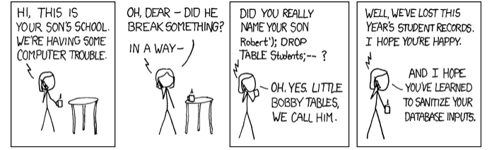

### Lecture <!-- pset6 Security -->

* [HD Lecture Video](http://cse1.net/video?v=lectures/6/lecture6)

### Recaps
* [Safety .net](http://cse1.net/recaps/14-onlinesec.html)
* [Security Blanket](http://cse1.net/recaps/15-datasec.html)

### Sections
* [Computer Viruses (Ben)](http://cse1.net/video?v=sections/6/computer_viruses/computer_viruses)
* [Topics From Discuss (Ben and R.J.)](http://cse1.net/video?v=sections/6/topics_from_discuss_week_6/topics_from_discuss_week_6)
* [Web Security (R.J.)](http://cse1.net/video?v=sections/6/web_security/web_security)

# What to submit?
Answer the questions below and collect your answers in a .pdf called security.pdf. Be sure to include your name and studentnumber!

# Questions

## 1. Jam Session
1. As an avid Twitter user, it would be devastating for me to have to log in every time I
wanted to share another 140 characters of wisdom with the world. How is it that Twitter is able to
remember who I am as I go on my tweeting rampage? Be specific as to exactly where information
is stored as well as what is exchanged between my web browser and a server.

2. Why might a server want to expire its session cookies after some amount of time?

## 2. Securitas
3. How is HTTPS different from HTTP? Why does the “S” in HTTPS make sites
more secure?

4. You and a friend are both using the same wireless network to browse the web. The
network is encrypted using WPA2. Is it possible for you to see the network traffic generated by
your friend? Why or why not?

## 3. Attack of the Show
5. You're running for class president at your high school, and your school has set up
an online voting system. After logging in via your school's secure authentication system, students
are taken to a form where they can select a candidate to vote for. You notice that after voting (for
yourself of course), you were taken to the URL http://school.edu/vote?for=you. The next
day, you find out that someone else has won the election by a landslide, but you suspect foul play
is afoot. How could your opponent have taken advantage of the system? Propose a solution that
would have thwarted your opponent's villainy.

6. What's the difference between CSRF and XSS? How are XSS and session hijacking
related?

7. What is a SQL injection attack? What kind of damage might an attacker be able to
incur via a SQL injection? How can we prevent SQL injections?

8. What's so funny about the below?
  

## 4. Hail Caesar! 
9. Give the ROT13 encryption of this message: “That's one small step for man; one
giant leap for mankind.” Assume that you can leave any punctuation as is , so you don't need to
worry about encrypting those characters.

10. The following message has been encrypted with ROT5 encryption. What does it
say? ”Mtzxyts, Ywfsvznqnyd Gfxj mjwj. Ymj Jflqj mfx qfsiji.”

11. How are the Caesar cipher and Vigenère cipher similar and different? Why is the
Vigenère cipher more secure than the Caesar cipher?

12. Using the Vigenère cipher and the key ”ALICE”, encrypt this message: “Sentence
first—verdict afterwards.” Just like last time, you can leave any punctuation as is.

13. What's the difference between symmetric key cryptography and asymmetric key
cryptography? Why might we want to combine the two approaches in some cases?

14. Explain the roles of the public key and the private key in asymmetric key cryptography.
