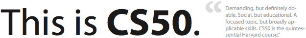

*Edition: September 2014 (5.0)*

Introduction to the intellectual enterprises of computer science and the art of
programming. This course teaches students how to think algorithmically and
solve problems efficiently. Topics include abstraction, algorithms, data
structures, encapsulation, resource management, security, software engineering,
and web development. Languages include C and Python. Problem sets inspired by
real-world domains of biology, cryptography, finance, forensics, and gaming.
Designed for concentrators and non-concentrators alike, with or without prior
programming experience.

## Staff

The course's staff consists of your instructor and many student assistants. Due
to the size of the course, we can't usually respond to email inquiries about
your problem sets. You are encouraged to speak to an assistant or the
instructor at the lab.

Martijn Stegeman  
*instructor*  
General: <help@mprog.nl>  
Personal: <m.stegeman@uva.nl>

Ben Witzen  
*head teaching assistant*  
for all things C

Jelle van Assema  
*head teaching assistant*  
for Python and Understanding Computers and the Internet

## Prerequisites

This course is aimed at students with little or no prior programming experience
but a desire to understand computational approaches to problem solving. So, by
definition, none of you are under-qualified for this course.

## Expectations

You are expected to watch all lectures and sections, submit seven problem sets,
six written assignments, and take a quiz. You are also expected to attend a
minimum amount of lab sessions in order to get you moving quickly through the
course.

## Grades

You will receive a number grade for the course if you've attended lab sessions as agreed upon; you've submitted every problem set working and on time; you've submitted all understanding assignments complete and on time; and you've passed the quiz.

Your grade will be determined using the following guidelines:

| Problem Sets  | 90% |
| Understanding | 10% |

Although you must submit all problem sets, your lowest score among those
problem sets on which you received perfect scores for the axis of scope will be
dropped when final grades are determined.

Know that this course draws quite the spectrum of students, including "those
less comfortable", "those more comfortable", and those somewhere in between.
However, what ultimately matters in this course is not so much where you end up
relative to your classmates but where you end up relative to yourself in Week 0.

The course is not graded on a curve. The course does not have pre-determined
cutoffs for final grades. Those less comfortable and somewhere in between are
not at a disadvantage vis-à-vis those more comfortable. Each student's final
grade is individually determined at term's end after input from the teaching
fellows. Remarkable effort and upward trending do not go unnoticed.

## Books

No books are required for this course. However, we do have a number of books
available for you to use in the lab. You are welcome to pick up one of
these and read them as a preparation for or review of one of the lectures.

If one seeks additional reference, here are some good suggestions:

> *For Those Less Comfortable*
> 
> C Programming Absolute Beginner’s Guide, Third Edition  
> Greg Perry, Dean Miller  
> Pearson Education, 2014  
> ISBN 0-789-75198-4
> 
> *For Those More Comfortable*
> 
> Programming in C, Fourth Edition  
> Stephen G. Kochan  
> Pearson Education, 2015  
> ISBN 0-321-77641-0

The book below is recommended for those interested in understanding how their
own computers work for personal edification.

> How Computers Work, Ninth Edition  
> Ron White  
> Que Publishing, 2008  
> ISBN 0-7897-3613-6

This last book below is recommended for aspiring hackers, those interested in
programming tricks and low-level optimization of code for applications beyond
the scope of this course.

> Hacker’s Delight, Second Edition  
> Henry S. Warren Jr.  
> Pearson Education, 2013  
> ISBN 0-321-84268-5
